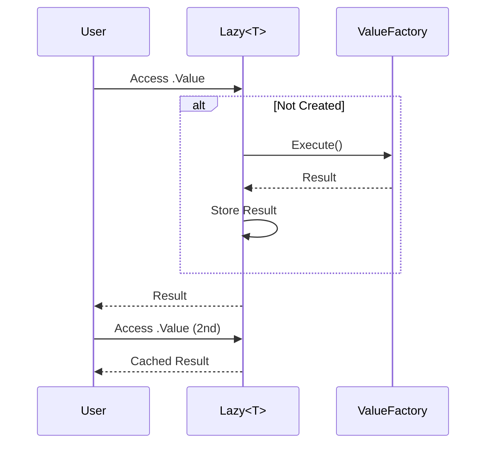

# 第53章：Proxy ②：.NET定番（Lazy<T> / DispatchProxy）⏳🧙

## ねらい 🎯✨

* Proxy（プロキシ）を **「遅延（Lazy）」** と **「横断処理の差し込み（DispatchProxy）」** の2系統で理解するよ〜😊
* .NET標準のAPIを読んで、「呼び出し側が何を知らなくて済むか？」を見抜けるようにするよ👀📚
* “パターンっぽいクラス”を増やさず、**必要なときだけ最小で使う感覚**を身につけるよ🧩🌸

---

## 到達目標 🧠✅

* `Lazy<T>` の役割を **Virtual Proxy（遅延プロキシ）** として説明できる💡
* `LazyThreadSafetyMode` を見て、「どのスレッド安全性が必要か」を選べる🔒🧵 ([Microsoft Learn][1])
* `DispatchProxy` で **インターフェース呼び出しを横取り**して、ログなどを差し込む最小例を書ける📝✨ ([Microsoft Learn][2])
* `DispatchProxy` の制約（インターフェース必須・動的コード生成など）を知って、**使わない判断**もできる🙅‍♀️⚠️ ([Microsoft Learn][2])

---

## 手順 🪜✨

### 1) Proxyを「2種類」で覚えるのがコツだよ🧠💞

* **遅延プロキシ（Virtual Proxy）**：重いものを *必要になるまで作らない*（＝`Lazy<T>`）⏳
* **動的プロキシ（Dynamic Proxy）**：呼び出しの前後に *共通処理を挟む*（＝`DispatchProxy`）🪄

この2つを混ぜずに覚えると、採用判断が一気にラクになるよ〜😆✨

---

### 2) `Lazy<T>`：.NETの「遅延プロキシ」ド本命⏳🌟


`Lazy<T>` は **“必要になるまで初期化しない”** を安全にやるための標準クラスだよ😊
アクセスは `Value` で行うのが基本ね🔑✨




#### ✅ 最小で体感：Valueを触るまで作られない

```csharp
using System;
using Microsoft.VisualStudio.TestTools.UnitTesting;

[TestClass]
public class LazyBasicsTests
{
    [TestMethod]
    public void Lazy_is_created_only_when_Value_accessed()
    {
        int created = 0;

        var lazy = new Lazy<int>(() =>
        {
            created++;
            return 42;
        });

        Assert.AreEqual(0, created);      // まだ作られてない🙂
        Assert.AreEqual(42, lazy.Value);  // ここで初期化✨
        Assert.AreEqual(1, created);

        Assert.AreEqual(42, lazy.Value);  // 2回目は使い回し😊
        Assert.AreEqual(1, created);
    }
}
```

#### 🔒 スレッド安全性：`LazyThreadSafetyMode` を知っておく

`Lazy<T>` は「複数スレッドから触られる可能性」があるとき、どの安全性が必要かで挙動が変わるよ🧵🔐
その選択肢が `LazyThreadSafetyMode` だよ〜 ([Microsoft Learn][1])

たとえば、明示的に指定するならこんな感じ👇

```csharp
using System;
using System.Collections.Generic;
using System.IO;
using System.Threading;

public sealed class PriceTable
{
    private readonly Lazy<Dictionary<string, decimal>> _prices;

    public PriceTable(string csvPath)
    {
        _prices = new Lazy<Dictionary<string, decimal>>(
            () => Load(csvPath),
            LazyThreadSafetyMode.ExecutionAndPublication);
    }

    public decimal GetPrice(string sku) => _prices.Value[sku];

    private static Dictionary<string, decimal> Load(string path)
    {
        // 例：CSVを読む（ここはサンプルだから簡略）
        var dict = new Dictionary<string, decimal>(StringComparer.OrdinalIgnoreCase);

        foreach (var line in File.ReadLines(path))
        {
            var parts = line.Split(',');
            dict[parts[0]] = decimal.Parse(parts[1]);
        }

        return dict;
    }
}
```

ポイント💡

* `Lazy<T>` は **「重い初期化の場所」を “Valueの裏側” に押し込める** のが強いんだよね😊
* だから呼び出し側は「いつロードされるか」を気にしなくて済む🙌✨

---

### 3) `DispatchProxy`：呼び出し前後に処理を挟む“動的プロキシ”🪄📣

`DispatchProxy` は **インターフェースの呼び出しを横取り**して、`Invoke` で好きな処理を差し込める仕組みだよ🧙✨ ([Microsoft Learn][3])

ただし制約があるから、そこを先に押さえるよ〜⚠️

#### ✅ まず「制約」を読む（ここ超大事）📌

`DispatchProxy.Create` のドキュメントに、かなり重要なことがまとまってるよ👇 ([Microsoft Learn][2])

* **プロキシが実装できるのは “インターフェース”**（クラスはNG）
* プロキシ用の型（`TProxy`）は **`DispatchProxy` を継承**して、**sealed/abstract不可**、**引数なしコンストラクタが必要**
* **実行時にコード生成**する（`RequiresDynamicCode` が付く）→ AOT系は要注意⚠️ ([Microsoft Learn][2])

#### ✅ 最小例：支払い処理にログを差し込む📝✨

**“本体（Real Subject）”** は普通に実装するよ🙂

```csharp
using System;
using System.Threading;
using System.Threading.Tasks;

public interface IPaymentGateway
{
    Task ChargeAsync(string orderId, decimal amount, CancellationToken ct);
}

public sealed class DummyPaymentGateway : IPaymentGateway
{
    public Task ChargeAsync(string orderId, decimal amount, CancellationToken ct)
        => Task.CompletedTask;
}
```

次に **プロキシ（Proxy）** を作るよ。`Invoke` で呼び出しを横取りする感じ🪄

```csharp
using System;
using System.Diagnostics;
using System.Reflection;
using System.Threading.Tasks;

public sealed class PaymentGatewayLoggingProxy : DispatchProxy
{
    private IPaymentGateway? _target;

    public static IPaymentGateway Create(IPaymentGateway target)
    {
        var proxy = DispatchProxy.Create<IPaymentGateway, PaymentGatewayLoggingProxy>();
        ((PaymentGatewayLoggingProxy)proxy)._target = target;
        return proxy;
    }

    protected override object? Invoke(MethodInfo? targetMethod, object?[]? args)
    {
        if (targetMethod is null) throw new ArgumentNullException(nameof(targetMethod));
        if (_target is null) throw new InvalidOperationException("Target is not set.");

        var start = Stopwatch.GetTimestamp();

        object? result;
        try
        {
            result = targetMethod.Invoke(_target, args);
        }
        catch (TargetInvocationException ex) when (ex.InnerException is not null)
        {
            // 反射Invokeは例外がラップされがちなので、実務では中身を見る癖をつけると◎🙂
            throw ex.InnerException;
        }

        // asyncメソッドに対応（ログが“すぐ出ちゃう”事故を防ぐ）
        if (result is Task task)
        {
            return LogAfterAsync(task, targetMethod.Name, start);
        }

        LogNow(targetMethod.Name, start);
        return result;
    }

    private static async Task LogAfterAsync(Task task, string name, long start)
    {
        try
        {
            await task.ConfigureAwait(false);
        }
        finally
        {
            LogNow(name, start);
        }
    }

    private static void LogNow(string name, long start)
    {
        var elapsed = Stopwatch.GetElapsedTime(start);
        Console.WriteLine($"[LOG] {name} took {elapsed.TotalMilliseconds:F1} ms");
    }
}
```

使う側はこう👇（呼び出し側は“本体の中身”を知らないまま）😊✨

```csharp
using System.Threading;
using System.Threading.Tasks;

public static class Demo
{
    public static async Task RunAsync()
    {
        IPaymentGateway real = new DummyPaymentGateway();
        IPaymentGateway proxy = PaymentGatewayLoggingProxy.Create(real);

        await proxy.ChargeAsync("ORD-0001", 1200m, CancellationToken.None);
    }
}
```

ここで起きてること🌸

* 呼び出し側は `IPaymentGateway` しか見てない（＝疎結合）😊
* ログという横断処理は Proxy に押し込められる📝✨
* `Invoke` が “フックポイント” になってる ([Microsoft Learn][3])
* プロキシ作成は `DispatchProxy.Create` がやってくれる ([Microsoft Learn][2])

---

### 4) 使い分けの超まとめ（迷子防止）🧭💕

* 「重い初期化を遅らせたい」→ **`Lazy<T>`** が第一候補⏳
* 「呼び出し前後に処理（ログ/計測/権限制御など）を入れたい」→ **`DispatchProxy`** を検討🪄
* でも「HTTPのログ/リトライ」みたいに **既に定番の仕組み（パイプライン等）がある領域**は、そっちが優先になりやすいよ🙂✨

---

## よくある落とし穴 🕳️⚠️

### `Lazy<T>` 編 ⏳

* **“重いもの”を閉じ込めたつもりが、`Lazy` を持つオブジェクトの寿命が長すぎてメモリを圧迫**😵
* `IDisposable` を中で作る場合、**いつDisposeされる？** が曖昧になりがち🧹💦（必要なら外で寿命管理する）
* スレッド安全性をなんとなくで選ぶ（`LazyThreadSafetyMode` を先に見よう）🔐 ([Microsoft Learn][1])

### `DispatchProxy` 編 🪄

* **インターフェースじゃないと作れない**（クラスに直接は無理）🙅‍♀️ ([Microsoft Learn][2])
* `Invoke` の中で async を雑に扱って、**ログが先に出る/例外が握りつぶされる**😱
* 反射経由なので **オーバーヘッド**はある（細かいホットパスには向かないことも）🐢
* 実行時コード生成が必要なので、AOT系では注意⚠️（ドキュメントに明記）([Microsoft Learn][2])

---

## 演習 🧪🎀（30〜60分）

### 演習1：`Lazy<T>` を「設定の遅延ロード」に使う⏳📄

1. `Lazy<Dictionary<string,string>>` を作って、ファイル（または固定文字列）からロードする関数を入れる
2. テストで次を確認する✅

   * `Value` に触るまでロード関数が呼ばれていない
   * `Value` を2回読んでもロードは1回

ヒント：第2章のテストと同じ形で `created` カウンタを置けばOKだよ😊✨

---

### 演習2：`DispatchProxy` で「回数カウント」プロキシを作る🔢📣

やることはシンプル💕

* `IPaymentGateway.ChargeAsync` が呼ばれた回数をプロキシが数える
* テストで「1回呼んだら1回増える」を確認する🧪✨

コツ🍀

* まずは `int _count;` をプロキシに持つ
* `Invoke` の先頭で `_count++`
* テスト側から回数を読む方法は、いったんプロキシ型にキャストして `Count` プロパティを生やしてOK（演習だからね😊）

※ `DispatchProxy.Create` の例外条件（インターフェースじゃない等）も、わざと踏んでみると理解が爆速だよ⚠️🧠 ([Microsoft Learn][2])

---

## 自己チェック ✅🌟

* Proxyを「遅延（`Lazy<T>`）」と「横断差し込み（`DispatchProxy`）」で分けて説明できる？🧠✨
* `LazyThreadSafetyMode` を見て「このケースはどれ？」が言える？🔐🧵 ([Microsoft Learn][1])
* `DispatchProxy` が **インターフェース前提**な理由を説明できる？🙋‍♀️ ([Microsoft Learn][2])
* `Invoke` で `Task` を扱うときの注意（ログのタイミング）を説明できる？⏱️😵 ([Microsoft Learn][3])

[1]: https://learn.microsoft.com/en-us/dotnet/api/system.threading.lazythreadsafetymode?view=net-10.0 "https://learn.microsoft.com/en-us/dotnet/api/system.threading.lazythreadsafetymode?view=net-10.0"
[2]: https://learn.microsoft.com/en-us/dotnet/api/system.reflection.dispatchproxy.create?view=net-10.0 "https://learn.microsoft.com/en-us/dotnet/api/system.reflection.dispatchproxy.create?view=net-10.0"
[3]: https://learn.microsoft.com/lv-lv/dotnet/api/system.reflection.dispatchproxy?view=netcore-2.0 "https://learn.microsoft.com/lv-lv/dotnet/api/system.reflection.dispatchproxy?view=netcore-2.0"
