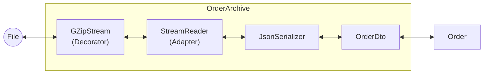

# 第54章：構造まとめミニ演習：Stream系でDecorator/Adapter/Facadeを一気に回収🎉

## ねらい 🎯

* `Stream`まわりの“定番構成”で、**Decorator / Adapter / Facade** をまとめて体に入れるよ💪✨
* 「読み書き・圧縮・テキスト化・DTO変換」みたいな**よくある処理の重なり**を、スッキリ扱えるようになるよ🧹🌸
* “変換層に業務ロジックを混ぜない”を守る練習もするよ🚧🙂

---

## 到達目標 ✅

* `FileStream → (Decorator) GZipStream → (Adapter) StreamReader → Json → DTO → ドメイン` の流れを説明できる📣
* `Facade` として「呼び出し側が楽になる入口」を1つ作れる🚪✨
* `Dispose`（using）を外さず、ファイル/ストリームを安全に扱える🧯
* テスト（MSTest）で「圧縮→復元→同じ内容」を確認できる🧪💕

---

## 手順 🧭

### 1) 今回の題材を決める（“gz圧縮JSON Lines”）📦🧵

今回は **gzip（.gz）で圧縮された JSON Lines（1行=1注文）** を入出力するよ🙂

* 1行ずつ読めるので、巨大ファイルでも“全部メモリに載せない”方向にしやすい✨
* そして **StreamReader/Writer が活躍**する（=Adapterを見せやすい）🫶

> `StreamReader` は、バイト列の `Stream` を文字列の世界（テキスト）に橋渡ししてくれる代表的な存在だよ📚✨（=Adapterの感覚）([Microsoft Learn][1])

---

### 2) 「どこが何パターン？」対応づけメモ 🧠📝


* **Decorator**：`GZipStream` で `Stream` を包んで「圧縮/解凍」を後付け🎁
* **Adapter**：`StreamReader / StreamWriter` で「Stream ↔ テキスト」を変換🔌
* **Facade**：複雑な手順（Open→Wrap→Read→Deserialize→Map）を `OrderArchive` みたいな窓口にまとめる🚪✨




---

### 3) 最小のモデル（ドメイン/DTO）を用意する 🛒🍰

既に `Order` / `Money` があるなら、そこに合わせてOK！
ここでは“教材用の最小”を置いておくね🙂

```csharp
using System;
using System.Collections.Generic;

public readonly record struct Money(decimal Amount, string Currency);

public sealed record Order(
    string OrderId,
    Money Total,
    IReadOnlyList<OrderLine> Lines
);

public sealed record OrderLine(
    string Sku,
    int Quantity,
    Money UnitPrice
);

// JSON用DTO（“保存形式”なので、ドメインよりシンプルでOK）
public sealed record OrderDto(
    string OrderId,
    decimal TotalAmount,
    string Currency,
    List<OrderLineDto> Lines
);

public sealed record OrderLineDto(
    string Sku,
    int Quantity,
    decimal UnitPrice
);
```

---

### 4) Facade（窓口）を作る：`OrderArchive` 🚪✨

ポイントはこれ👇

* 呼び出し側は **「Import/Export を呼ぶだけ」**にする
* 中では `Stream` を組み合わせる（Decorator/Adapter）
* DTO変換は **“変換だけ”**にして、業務判断は混ぜない🙅‍♀️💦

```csharp
using System;
using System.Collections.Generic;
using System.IO;
using System.IO.Compression;
using System.Text;
using System.Text.Json;
using System.Threading;
using System.Threading.Tasks;
using System.Runtime.CompilerServices;

public static class OrderArchive
{
    private static readonly JsonSerializerOptions JsonOptions = new()
    {
        PropertyNamingPolicy = JsonNamingPolicy.CamelCase,
        PropertyNameCaseInsensitive = true
    };

    // ===== Facade：ファイルから読む（入口）=====
    public static async Task<IReadOnlyList<Order>> ImportFromGZipJsonLinesFileAsync(
        string path,
        CancellationToken ct = default)
    {
        await using var file = File.OpenRead(path);

        // “全部読み切って List にする”版（呼び出し側が扱いやすい）
        var result = new List<Order>();

        await foreach (var order in ImportFromGZipJsonLinesAsync(file, ct))
        {
            result.Add(order);
        }

        return result;
    }

    // ===== Facade：ファイルへ書く（入口）=====
    public static async Task ExportToGZipJsonLinesFileAsync(
        string path,
        IEnumerable<Order> orders,
        CancellationToken ct = default)
    {
        await using var file = File.Create(path);
        await ExportToGZipJsonLinesAsync(file, orders, ct);
    }

    // ===== 中核：Streamから読む（Decorator + Adapter + DTO変換）=====
    public static async IAsyncEnumerable<Order> ImportFromGZipJsonLinesAsync(
        Stream source,
        [EnumeratorCancellation] CancellationToken ct = default)
    {
        // Decorator：Stream を “解凍できるStream” に変える
        using var gzip = new GZipStream(source, CompressionMode.Decompress, leaveOpen: true);

        // Adapter：Stream を “行で読めるテキスト” に変える
        using var reader = new StreamReader(
            gzip,
            Encoding.UTF8,
            detectEncodingFromByteOrderMarks: true,
            bufferSize: 1024,
            leaveOpen: true);

        while (true)
        {
            ct.ThrowIfCancellationRequested();

            var line = await reader.ReadLineAsync().ConfigureAwait(false);
            if (line is null) yield break;

            if (string.IsNullOrWhiteSpace(line)) continue;

            var dto = JsonSerializer.Deserialize<OrderDto>(line, JsonOptions)
                      ?? throw new InvalidDataException("Invalid JSON line (OrderDto).");

            yield return FromDto(dto);
        }
    }

    // ===== 中核：Streamへ書く（Decorator + Adapter + DTO変換）=====
    public static async Task ExportToGZipJsonLinesAsync(
        Stream destination,
        IEnumerable<Order> orders,
        CancellationToken ct = default)
    {
        // Decorator：Stream を “圧縮して書けるStream” に変える
        using var gzip = new GZipStream(destination, CompressionLevel.SmallestSize, leaveOpen: true);

        // Adapter：Stream を “行で書けるテキスト” に変える
        using var writer = new StreamWriter(
            gzip,
            new UTF8Encoding(encoderShouldEmitUTF8Identifier: false),
            bufferSize: 1024,
            leaveOpen: true);

        foreach (var order in orders)
        {
            ct.ThrowIfCancellationRequested();

            var dto = ToDto(order);
            var json = JsonSerializer.Serialize(dto, JsonOptions);

            await writer.WriteLineAsync(json).ConfigureAwait(false);
        }

        await writer.FlushAsync().ConfigureAwait(false);
        // ※ Dispose の順で gzip のフッターもちゃんと出るよ
    }

    // ===== DTO変換（ここに業務ロジックを入れないのがコツ）=====
    private static OrderDto ToDto(Order order)
    {
        var lines = new List<OrderLineDto>(order.Lines.Count);
        foreach (var l in order.Lines)
        {
            lines.Add(new OrderLineDto(l.Sku, l.Quantity, l.UnitPrice.Amount));
        }

        return new OrderDto(
            order.OrderId,
            order.Total.Amount,
            order.Total.Currency,
            lines
        );
    }

    private static Order FromDto(OrderDto dto)
    {
        var lines = new List<OrderLine>(dto.Lines.Count);
        foreach (var l in dto.Lines)
        {
            lines.Add(new OrderLine(l.Sku, l.Quantity, new Money(l.UnitPrice, dto.Currency)));
        }

        return new Order(
            dto.OrderId,
            new Money(dto.TotalAmount, dto.Currency),
            lines
        );
    }
}
```

* `StreamWriter` のコンストラクターは「ストリーム＋エンコーディング＋バッファ」みたいに受け取れて、テキスト出力の入口になってくれるよ🖊️✨([Microsoft Learn][2])
* `System.Text.Json` の `JsonSerializer` は、DTOへの変換で“標準ど真ん中”！ Stream から直接読む `DeserializeAsync` も用意されてるよ📦✨([Microsoft Learn][3])

---

### 5) 呼び出し側は、こうなる（Facadeのご褒美）🍬

```csharp
var orders = await OrderArchive.ImportFromGZipJsonLinesFileAsync(@"C:\work\orders.jsonl.gz");
await OrderArchive.ExportToGZipJsonLinesFileAsync(@"C:\work\orders_copy.jsonl.gz", orders);
```

呼び出し側は **Streamの重ね着**を知らなくてOK！これがFacadeの嬉しさだよ🚪💕

---

### 6) テストで「圧縮→復元」を確認する 🧪✨（MSTest）

ファイルを使わず、`MemoryStream` でサクッとテストするのが気楽だよ🙂

```csharp
using Microsoft.VisualStudio.TestTools.UnitTesting;
using System.Collections.Generic;
using System.IO;
using System.Threading.Tasks;

[TestClass]
public class OrderArchiveTests
{
    [TestMethod]
    public async Task Export_and_Import_roundtrip_should_keep_orders()
    {
        var orders = new List<Order>
        {
            new(
                "ORD-001",
                new Money(1200m, "JPY"),
                new List<OrderLine>
                {
                    new("SKU-AAA", 2, new Money(300m, "JPY")),
                    new("SKU-BBB", 1, new Money(600m, "JPY"))
                }
            )
        };

        await using var ms = new MemoryStream();

        // 圧縮して書く
        await OrderArchive.ExportToGZipJsonLinesAsync(ms, orders);

        // 読む前に先頭へ戻す
        ms.Position = 0;

        var restored = new List<Order>();
        await foreach (var o in OrderArchive.ImportFromGZipJsonLinesAsync(ms))
        {
            restored.Add(o);
        }

        Assert.AreEqual(1, restored.Count);
        Assert.AreEqual("ORD-001", restored[0].OrderId);
        Assert.AreEqual(1200m, restored[0].Total.Amount);
        Assert.AreEqual("JPY", restored[0].Total.Currency);
        Assert.AreEqual(2, restored[0].Lines.Count);
    }
}
```

---

### 7) （発展）`JsonSerializer.DeserializeAsync` で Stream から直読みする案 🌊

もしファイル形式を「JSON Lines」じゃなく **JSON配列**（`[ {...}, {...} ]`）にできるなら、Streamから直接デシリアライズもできるよ✨([Microsoft Learn][3])
さらに“巨大配列をちょっとずつ”なら `DeserializeAsyncEnumerable<T>` も選べる（JSON配列を逐次列挙）🌟([Microsoft Learn][4])

---

### 8) セキュリティ注意（超だいじ）🛡️⚠️

Streamで「オブジェクト丸ごと保存したい…」ってなると、昔の癖で `BinaryFormatter` に行きがちだけど、**セキュリティ的に危険で非推奨**だから避けようね🙅‍♀️💦([Microsoft Learn][4])

あと、.NET は月次で更新（Patch Tuesday）されるので、**ランタイム/SDKは新しいパッチに追従**が安心だよ🔧✨([Microsoft][5])

---

## よくある落とし穴 🕳️💦

* **変換層（DTO変換）に業務ルールを混ぜる**
  「通貨がJPYなら割引」みたいなのをここに入れると、Facadeが太って壊れやすい😵‍💫
* **`Dispose` を忘れて gzip の最後が出ない**
  gzipは最後にフッターを書くので、`using` が命だよ🧯
* **テストで `MemoryStream.Position = 0;` を忘れる**
  書いた後は末尾にいるので、読めなくなるあるある😇
* **“便利そう”で例外握りつぶし**
  失敗した行があるなら、最低限「どの行で死んだか」くらいは分かるようにしたい📣

---

## ミニ演習（10〜30分）🎮✨

1. ✅ 上の `OrderArchive` をコピペではなく **自分で打って**動かす（型が頭に残るよ）🧠💡
2. ✅ テストを1本通す（Roundtrip）🧪
3. 🌟 余裕があれば：空行が混じっても壊れないようにして、テストを1つ足す🙂
4. 🌟 さらに余裕があれば：`ImportFromGZipJsonLinesFileAsync` の戻りを `IAsyncEnumerable<Order>` 版にして、「逐次処理」っぽさを体験する🚶‍♀️✨

---

## 自己チェック ✅🌸

* Decorator（`GZipStream`）と Adapter（`StreamReader/Writer`）を **どの行で使ってるか**言える？🎁🔌
* 呼び出し側が「Open→Wrap→Read…」を知らずに済んでる？（Facadeできてる？）🚪
* DTO変換に、業務ロジック（割引/在庫/状態遷移）を混ぜてない？🧼
* テストで「圧縮→復元」が通ってる？🧪🎉

[1]: https://learn.microsoft.com/ja-jp/dotnet/api/system.io.streamreader.readline?view=net-10.0 "https://learn.microsoft.com/ja-jp/dotnet/api/system.io.streamreader.readline?view=net-10.0"
[2]: https://learn.microsoft.com/ja-jp/dotnet/api/system.io.streamwriter.-ctor?view=net-8.0 "https://learn.microsoft.com/ja-jp/dotnet/api/system.io.streamwriter.-ctor?view=net-8.0"
[3]: https://learn.microsoft.com/ja-jp/dotnet/api/system.text.json.jsonserializer?view=net-9.0 "https://learn.microsoft.com/ja-jp/dotnet/api/system.text.json.jsonserializer?view=net-9.0"
[4]: https://learn.microsoft.com/lv-lv/dotnet/core/releases-and-support "https://learn.microsoft.com/lv-lv/dotnet/core/releases-and-support"
[5]: https://dotnet.microsoft.com/ja-jp/platform/support/policy "https://dotnet.microsoft.com/ja-jp/platform/support/policy"
