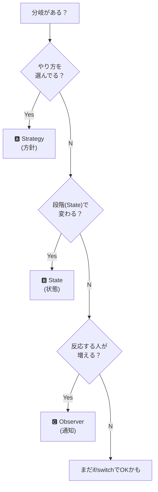

# 第55章：振る舞いの基本：if/switchを減らす3つの道🧠

## ねらい 🎯

* 「if/switchが増えてつらい…😵」の原因を、**3つのタイプ**に分けてスパッと整理できるようにするよ✂️✨
* そして「この分岐はどのパターン系で減らせる？」を、**迷わず判定**できるようにするよ🧭💕

---

## 到達目標 🏁

* 目の前の分岐が
  **①方針（Strategy系）** / **②状態（State系）** / **③通知（Observer系）**
  のどれかを説明できる📣
* 「この分岐はまだswitchでOK / もうパターンにした方がいい」を判断できる⚖️
* 次章以降（CoR/Command/Iterator/Observer/Strategy/State…）の入り口が、ちゃんとつながる🔗✨

---

## 手順 🧩🪄

### 1) まず分岐を“3分類”する（これが本章のメイン！）🎨


分岐って、だいたいこの3つのどれかだよ👇

* **A. 方針（Policy）＝やり方を選ぶ分岐** 🧠🔁
  例：割引の計算方法を選ぶ / 並び替えルールを選ぶ / 支払い計算ロジックを切り替える
  👉 だいたい **Strategy** が効く✨（.NETなら `IComparer<T>` や `Comparison<T>` もまさにそれ📏）

* **B. 状態（State）＝“今どの段階？”で許可される操作が変わる分岐** 🚦📦
  例：注文が「未払い」なら発送できない、みたいなやつ
  👉 **State** が効く✨（最初は `enum` + `switch` でもOK。でも増えてきたら状態クラスへ🧩）

* **C. 通知（Notification）＝“起きた出来事”に反応する分岐** 📣🔔
  例：注文確定したら「メール送信」「在庫引当」「ログ保存」…反応が増えるやつ
  👉 **Observer**（C#なら `event` / `EventHandler` が王道🔔）
  さらに発展すると `IObservable<T>` の世界もある🌊（.NET標準のObserver例も公式にあるよ）([Microsoft Learn][1])




---

### 2) 迷ったら“質問3つ”で判定する🧠❓

コードの分岐を見て、これを自分に聞いてみてね👇

1. **「やり方（アルゴリズム）を選んでる？」**
   Yes → **方針（Strategy系）** 🧠🔁

2. **「ライフサイクル（段階）で、許可/禁止や振る舞いが変わる？」**
   Yes → **状態（State系）** 🚦

3. **「出来事が起きたら“反応する人”が増える？」**
   Yes → **通知（Observer系）** 📣

※ たまに複合してる場合もあるけど、**最初は“主犯”を1つ決める**のがコツだよ👮‍♀️✨

---

### 3) “分岐地獄”を1個だけ題材にして、分類だけやってみる🧯🔥

たとえば、こんな感じのコード（イメージ）👇
（※ ここで大事なのは「書き換え」じゃなくて「分類」ね！）

```csharp
public void PlaceOrder(Order order)
{
    // 支払い方法によって処理が分岐
    switch (order.PaymentMethod)
    {
        case PaymentMethod.CreditCard:
            PayByCard(order);
            break;
        case PaymentMethod.BankTransfer:
            PayByBank(order);
            break;
        default:
            throw new NotSupportedException();
    }

    // 状態によって許可される操作が分岐
    if (order.Status == OrderStatus.Paid)
    {
        Ship(order);
    }

    // 出来事に応じて通知先が分岐
    if (order.IsVip)
    {
        NotifyVipDesk(order);
    }
    else
    {
        NotifyCustomer(order);
    }
}
```

この中の分岐を分類すると👇

* `PaymentMethod` の `switch` → **方針（Strategy系）** 💳🧠
* `Status` の `if` → **状態（State系）** 🚦
* `IsVip` の `if` → **通知（Observer系）** ……に見える？🤔
  でもこれ、よく見ると「通知先の選択（方針）」でもあるよね！
  👉 こういう時は **“何が増える予定？”** を見るのがポイント✨

  * 「通知の種類/反応が増える」→ Observer寄り📣
  * 「通知先の選択肢が増える」→ Strategy寄り🧠
  * 「状態ごとに通知ルールが変わる」→ State寄り🚦
    **増える軸がどれか**で決めるとブレにくいよ🌟

---

### 4) “パターンにするタイミング”の目安を知る⏱️⚖️

いきなり全部パターン化しなくてOKだよ🙆‍♀️💕

* **switchが1回だけ**＆ケースも少ない → まずはそのままでもOK🙂
* でも、こうなったら“移す”サイン👇

  * 同じ `switch` が **あちこちにコピペ**され始めた📄📄
  * ケース追加のたびに **複数ファイル修正**になる😵
  * テストで「この分岐だけ差し替えたい…！」が出てきた🧪
  * 例外/戻り値/ログ/リトライなどの“横断”が絡み始めた🧷

このサインが出たら、次章以降のパターンが効きやすいよ🔧✨

---

### 5) .NETの“現場の定番”に軽く触れておく（次の章が楽になる）📌

この教材は **標準＆デファクト中心**で行くよ💡
今の最新ラインだと、.NET 10 がLTSで、C# 14 が最新だよ（公式）([Microsoft for Developers][2])
さらに **C# 14 は .NET 10 以降でサポート**、って明確に書かれてる📝([Microsoft Learn][3])

「振る舞いパターンっぽい標準例」の代表はこんな感じ👇（“触るだけ”でOK！）

* **Chain of Responsibility（流す）**：ASP.NET Coreのミドルウェアや、`HttpClient` の `DelegatingHandler`（“外向きミドルウェア”って公式でも言ってる）📨🔗([Microsoft Learn][4])
* **Observer（知らせる）**：`event` / `EventHandler`、発展で `IObservable<T>` 🌊([Microsoft Learn][1])
* **Strategy（差し替える）**：`IComparer<T>` / `Comparison<T>` / `Func<>` 🧠🔁
* **Iterator（回す）**：`IEnumerable<T>` / `yield return` 🚶‍♀️✨

「へぇ〜そうなんだ」くらいでOK！次の章でちゃんと触るよ😊💕

---

## よくある落とし穴 🕳️😵

* **落とし穴1：全部いきなりパターン化して、クラスが増えすぎる** 📚💥
  → まずは“分類”だけで勝ち✨ 必要になってから移すでOK🙆‍♀️

* **落とし穴2：分類がブレて混乱する** 🌀
  → 「今後なにが増える？」を1つ決める（増える軸で決める）📈✨

* **落とし穴3：通知（Observer）で購読解除を忘れる系** 🧠⚠️
  → `event` は便利だけど、長生きオブジェクトが絡むと要注意！
  （このへんはObserver章でがっつりやるよ🔔）

* **落とし穴4：AIの出力をそのまま採用して“謎抽象”が増える** 🤖💦
  → AIは「分類」「候補提示」「テスト案」には超強い✨
  でも「最終設計の責任」は人間が持つ、って意識が大事だよ👀✅
  （GitHub のCopilotとか、OpenAI のCodex系を使う場合も同じね✍️）

---

## 演習（10〜30分）🧪🎨

### 演習1：分岐を3色で塗り分けよう🖍️

第12章の“分岐地獄”コード（または手元のコード）から、分岐（if/switch）を10個だけ拾って👇

* 🟦 方針（Strategy系）
* 🟩 状態（State系）
* 🟨 通知（Observer系）

で分類してメモしてね📒✨
（AIに「このifはどれっぽい？」って聞くのはOK！でも最後は自分で決めるよ🙂）

### 演習2：1つだけ“増える軸”を書こう📈

分類した分岐を1つ選んで、1行で書く✍️

* 「この分岐で今後増えるのは **◯◯** だから、まずは **△△系** を疑う」

例：

* 「割引ルールが増えそう → Strategy系」💸🧠
* 「注文の状態が増えそう → State系」📦🚦
* 「注文確定後の反応が増えそう → Observer系」🎉📣

---

## チェック（自己チェック）✅✨

* [ ] 目の前の分岐を見て「方針/状態/通知」のどれか言える🙂
* [ ] 迷ったら「増える軸はどれ？」で決められる📈
* [ ] “まだswitchでOK”と“もう移すべき”のサインを2つ言える⏱️
* [ ] 次章以降で、どのパターンが自分に効きそうか1つ予想できる🔮💕

---

（次章から、いよいよ「流す（CoR）」「操作（Command）」「回す（Iterator）」…って感じで、3分類の道を順番に攻略していくよ🔗🎮🚶‍♀️✨）

[1]: https://learn.microsoft.com/en-us/dotnet/standard/events/observer-design-pattern?utm_source=chatgpt.com "Observer design pattern - .NET"
[2]: https://devblogs.microsoft.com/dotnet/announcing-dotnet-10/?utm_source=chatgpt.com "Announcing .NET 10"
[3]: https://learn.microsoft.com/en-us/dotnet/csharp/language-reference/language-versioning?utm_source=chatgpt.com "Language versioning - C# reference"
[4]: https://learn.microsoft.com/en-us/aspnet/core/fundamentals/http-requests?view=aspnetcore-10.0&utm_source=chatgpt.com "Make HTTP requests using IHttpClientFactory in ASP.NET ..."
