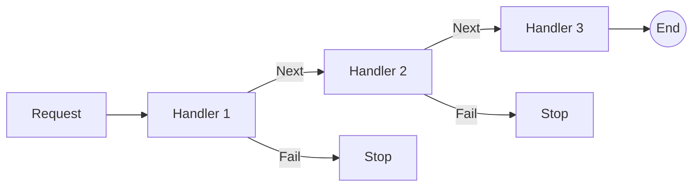

# 第56章：Chain of Responsibility ①：流れを“通す”設計🔗

## ねらい 🎯✨

* 処理を「小さく分けて」「順番に流す」設計で、変更に強くする感覚をつかむよ🙂🔗
* 途中で止めたり（バリデーションで終了🚫）、差し替えたり（ログだけ追加📝）が“自然に”できる形を作れるようにするよ💪
* そして何より…「巨大if/switch」「巨大メソッド」を“増えにくい形”にするのがゴールだよ🧠🌸

---

## 到達目標 🏁✨

* Chain of Responsibility（CoR）が解く困りごとを、**自分の言葉で1分**で説明できる🙂🗣️
* 「使う／使わない」の判断を、**具体条件で言える**（例：順序が大事・途中で止めたい・処理が増えがち…など）✅
* “最小構成”のイメージが描ける🧩

  * **Request（依頼）**：流したいデータ
  * **Handler（処理係）**：小さな仕事
  * **Next（次の人）**：渡す先

---

## 手順 🧭🔗

### 1) まず「流したい処理」を“箇条書き”にする 📝

例：注文確定の流れ（シンプル版）🛒

* 入力チェック（Validation）✅
* 在庫チェック（Stock）📦
* 支払い（Payment）💳
* 通知（Notification）🔔

ここで重要なのは、**順番がある**＆**途中で止めたい可能性がある**ことだよ🚦

---

### 2) CoRの2つの流し方を知る 🔗✨

**A. “止める”型（クラシックCoR）🚧**

* あるHandlerが「自分が処理できる！」なら処理して終了
* できなければ次へ➡️

**B. “パイプライン”型（今どき実務でよく見る）🌊**

* 各Handlerが「前処理→次へ→後処理」できる
* 途中で止める（次へ渡さない）もできる
* これが **ASP.NET CoreのMiddleware** の考え方に近いよ🌐✨（リクエストは“Request delegateの列”として順に呼ばれる）([Microsoft Learn][1])

この教材ではまず **B（パイプライン型）** をメインに掴むと超わかりやすいよ🙂🔗

---

### 3) “Request（流す箱）”を用意する 📦✨

注文処理なら、最低限こんなイメージでOK👇

* 注文ID
* エラー（あれば止める）
* 途中の結果（支払い済みフラグ等）

---

### 4) Handlerの形を“軽く”決める 🧩⚙️

実務でよく見る形は2つ：

* **Middleware風（nextを引数に持つ）**

  * 「次を呼ぶかどうか」をその場で決めやすい✨
* **Nextをプロパティ/コンストラクタで持つ（連結型）**

  * 直感的にチェーンを作れる🙂

どっちもOK。ここでは理解しやすい **“連結型”** をまず置くね🔗

---

### 5) 最小コードで「流れる」を体験する 🧪✨





```csharp
using System;
using System.Threading;
using System.Threading.Tasks;

public sealed class OrderFlowContext
{
    public required string OrderId { get; init; }
    public bool IsValid { get; set; } = true;
    public bool IsPaid { get; set; }
    public string? Error { get; set; }

    public void Fail(string message)
    {
        IsValid = false;
        Error = message;
    }
}

public interface IOrderFlowHandler
{
    Task HandleAsync(OrderFlowContext ctx, CancellationToken ct);
}

public abstract class OrderFlowHandlerBase : IOrderFlowHandler
{
    private readonly IOrderFlowHandler? _next;

    protected OrderFlowHandlerBase(IOrderFlowHandler? next) => _next = next;

    public async Task HandleAsync(OrderFlowContext ctx, CancellationToken ct)
    {
        // すでに失敗してたら、以降は流さない（早期終了）🚫
        if (!ctx.IsValid) return;

        await HandleCoreAsync(ctx, ct);

        if (!ctx.IsValid) return;

        if (_next is not null)
            await _next.HandleAsync(ctx, ct);
    }

    protected abstract Task HandleCoreAsync(OrderFlowContext ctx, CancellationToken ct);
}

public sealed class ValidateOrderHandler : OrderFlowHandlerBase
{
    public ValidateOrderHandler(IOrderFlowHandler? next) : base(next) { }

    protected override Task HandleCoreAsync(OrderFlowContext ctx, CancellationToken ct)
    {
        if (string.IsNullOrWhiteSpace(ctx.OrderId))
            ctx.Fail("OrderId が空だよ😵");

        return Task.CompletedTask;
    }
}

public sealed class PayHandler : OrderFlowHandlerBase
{
    public PayHandler(IOrderFlowHandler? next) : base(next) { }

    protected override Task HandleCoreAsync(OrderFlowContext ctx, CancellationToken ct)
    {
        // ここではダミーで「支払い成功」にしてみる💳✨
        ctx.IsPaid = true;
        return Task.CompletedTask;
    }
}

public static class Demo
{
    public static async Task RunAsync()
    {
        // Validate → Pay の順で流す🔗
        IOrderFlowHandler flow =
            new ValidateOrderHandler(
                new PayHandler(next: null));

        var ctx = new OrderFlowContext { OrderId = "ORD-001" };
        await flow.HandleAsync(ctx, CancellationToken.None);

        Console.WriteLine($"IsValid={ctx.IsValid}, IsPaid={ctx.IsPaid}, Error={ctx.Error}");
    }
}
```

ポイントはここだよ👇🙂

* **呼び出し側（Demo）は、処理の中身を知らない**（並べるだけ）✨
* 途中で `ctx.Fail(...)` したら **後続が呼ばれない**🚫
* Handlerは“小さい責務”に分割される🧩

---

### 6) 「実務の定番」に脳内で接続する 🌐📨

このパターン、.NET周りだとめちゃ身近👇

* **ASP.NET Core Middleware**：リクエスト処理が“delegateの列”として順に呼ばれる（まさにチェーン）([Microsoft Learn][1])

  * Middlewareを書くときは `RequestDelegate` を受け取り、`Invoke/InvokeAsync` で次へ渡す形が基本だよ([Microsoft Learn][2])
* **HttpClientのDelegatingHandler**：`SendAsync` で前後処理して、`base.SendAsync` で内側へ渡す（チェーン）([Microsoft Learn][3])

  * さらに `IHttpClientFactory` でもメッセージハンドラーを組み立てて使うのが定番になってるよ🧰([Microsoft Learn][4])

そして最新の .NET は **.NET 10（LTS）** が公開されていて、ASP.NET Core も 10 系のドキュメントが整ってるよ📚✨([Microsoft for Developers][5])
（LTS/STSのリズムも「毎年11月・偶数がLTS」って方針が明確だよ）([Microsoft][6])

---

## よくある落とし穴 🕳️⚠️

1. **“何でも屋ハンドラ”が生まれる** 😵

* 「検証も支払いもログも…全部ここ！」みたいになると終わる…
* 目安：Handlerの名前が「Process」「Execute」みたいに雑になったら危険🚨

2. **順序依存が強くなりすぎる** 🔁

* 「このHandlerは必ずあれより前」みたいなのが増えると読みづらい
* 対策：順序が大事な理由をコメント1行でも残す📝（後で消してOK）

3. **Contextが“ゴミ箱”化する** 🗑️

* なんでも `ctx` に詰め込むと、結局つらい
* 対策：Contextに入れるのは「チェーン全体で共有したい最小限」だけ✨

4. **例外/失敗のルールが曖昧** 🌧️

* 「失敗は例外？ ctx.Fail？ 戻り値？」が混ざると地獄
* 対策：この章ではまず **ctx.Failで止める** に寄せて統一🙂

---

## 演習（10〜30分）🧪💖

### お題：注文処理に「在庫チェック」を足して、失敗したら止める📦🚫

1. `StockCheckHandler` を追加する
2. `OrderId` が `"OUT-OF-STOCK"` のときだけ `ctx.Fail("在庫ないよ😢")`
3. チェーンを `Validate → StockCheck → Pay` に並べ替える
4. `"OUT-OF-STOCK"` で実行して、**Payが走らない**のを確認する✨

AI補助を使うなら、こんな感じで“範囲を狭く”お願いするのがコツだよ🤖✍️

* 「`OrderFlowHandlerBase` の流儀（Failで止める）に合わせて `StockCheckHandler` だけ作って」
* 「余計な汎用フレームワーク化はしないで」←これ超大事😇

---

## チェック ✅🌸

* [ ] 「処理を順に流して、途中で止められる」設計だと言える🙂🔗
* [ ] 呼び出し側が **if/switchを持たず**、並べるだけになってる✨
* [ ] Handlerが“小さな責務”になってる🧩
* [ ] 失敗時のルール（今回は `ctx.Fail`）がブレてない🚫
* [ ] 追加の処理（例：ログ）を“差し込めそう”な気がする📝✨

[1]: https://learn.microsoft.com/en-us/aspnet/core/fundamentals/middleware/?view=aspnetcore-10.0&utm_source=chatgpt.com "ASP.NET Core Middleware"
[2]: https://learn.microsoft.com/ja-jp/aspnet/core/fundamentals/middleware/write?view=aspnetcore-10.0&utm_source=chatgpt.com "カスタム ASP.NET Core ミドルウェアを記述する"
[3]: https://learn.microsoft.com/ja-jp/aspnet/web-api/overview/advanced/httpclient-message-handlers?utm_source=chatgpt.com "ASP.NET Web API の HttpClient メッセージ ハンドラー"
[4]: https://learn.microsoft.com/en-us/aspnet/core/fundamentals/http-requests?view=aspnetcore-10.0&utm_source=chatgpt.com "Make HTTP requests using IHttpClientFactory in ASP.NET ..."
[5]: https://devblogs.microsoft.com/dotnet/announcing-dotnet-10/?utm_source=chatgpt.com "Announcing .NET 10"
[6]: https://dotnet.microsoft.com/en-us/platform/support/policy/dotnet-core?utm_source=chatgpt.com "NET and .NET Core official support policy"
