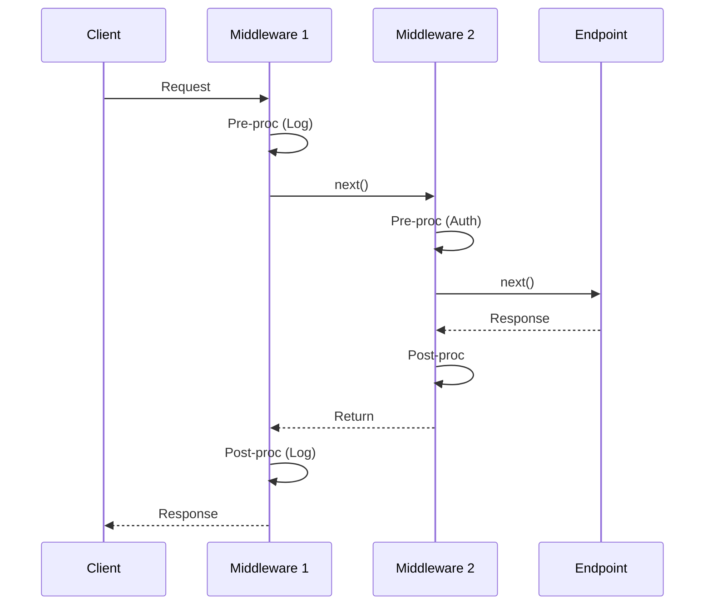

# 第57章：Chain of Responsibility ②：デファクト①（ASP.NET Core Middleware）🌐

## ねらい 🎯

ASP.NET Core の「ミドルウェア・パイプライン」を **Chain of Responsibility（責務の連鎖）**として読み解いて、
「処理を順番に通す」「途中で止める」「差し替える」をスッキリ実装できるようになるよ〜☺️✨ ([Microsoft Learn][1])

---

## 到達目標 ✅

この章が終わったら、こんなことができるようになるよ🎉

* 「ミドルウェア = Handler の連鎖」って言葉で説明できる🗣️🔗 ([Microsoft Learn][1])
* `Use` / `Run` / `Map` / `UseWhen` の役割を **CoRの操作**として説明できる🧠✨ ([Microsoft Learn][1])
* “順番が命”な理由（例外処理・認証/認可など）を説明できる🧯🔐 ([Microsoft Learn][2])
* 自作ミドルウェアで「ログ」や「APIキー必須」みたいな横断処理を入れられる📝🔑 ([Microsoft Learn][3])
* `IMiddleware` と普通のミドルウェアの違いを、DI（依存性注入）視点で言える🧩🔍 ([Microsoft Learn][3])

---

## 手順 🧭

### 1) まずコレだけ覚えよう：「ミドルウェアは“前後に挟める”責務の連鎖」🧸🔗





ASP.NET Core のミドルウェアは、リクエストが来るたびに

* **自分の前処理**（例：ログ開始📝）
* **次へ渡す**（`next()` を呼ぶ➡️）
* **自分の後処理**（例：ログ終了🧾）

…みたいに「前後に挟める」のがポイントだよ✨
そしてレスポンスは **帰り道（後処理）が逆順**になるのが超大事！🔄 ([Microsoft Learn][1])

> CoRっぽく言うと：
> Handler（各ミドルウェア）が「次のHandler（`next`）」を持ってて、必要なら処理を回す感じだよ🔗🙂 ([Microsoft Learn][1])

---

### 2) `Use` と `Run` は「流す／止める」ボタン 🎛️🛑

* `app.Use(...)`：**基本形**。`next()` を呼ぶかどうか選べる（= 通す / 止める）
* `app.Run(...)`：**終点**。そこで処理が終わる（= 以降へ渡さない）

つまり `Run` は CoR の「ここでチェーン終了🛑」を明示する感じ！ ([Microsoft Learn][1])

---

### 3) `Map` / `UseWhen` は「分岐した別チェーン」🌿🔀

現実のWebアプリは「URLや条件で処理を分けたい」ことが多いよね🙂

* `Map(...)`：パス（`/api` とか）で **枝分かれ** 🌿
* `UseWhen(...)`：条件（ヘッダーがある/ない等）で **枝分かれ** 🌿

どっちも「分岐先に別のミドルウェア連鎖を作る」って感覚だよ！ ([Microsoft Learn][1])

---

### 4) “順番が命”を体感しよう（特に認証/認可）🔐⚠️

ミドルウェアは **登録した順番で実行**されるから、順序ミスると事故る😵💦

たとえば認証/認可は、ルーティングの前後関係が重要で、置く場所がドキュメントで明確に案内されてるよ📌 ([Microsoft Learn][2])

---

## まずは最小コードで体験しよう 🧪✨（自作ミドルウェア：APIキー必須＋ログ）

### ゴール 🎯

* `/hello` にアクセスする時、`X-Api-Key` が無いと **401で止める**🛑
* あるなら **次へ流す**➡️
* ついでに “前後ログ” を入れて **順序と帰り道** を感じる📝🔄

```csharp
using Microsoft.AspNetCore.Builder;
using Microsoft.AspNetCore.Http;
using Microsoft.Extensions.Hosting;
using Microsoft.Extensions.Logging;

var builder = WebApplication.CreateBuilder(args);
var app = builder.Build();

// ① 前後に挟める：いちばん外側に置くと「全体」を包めるよ🧸✨
app.Use(async (context, next) =>
{
    app.Logger.LogInformation("🟦 [Before] {Path}", context.Request.Path);

    await next(); // ここが「次の Handler へ」🔗➡️

    app.Logger.LogInformation("🟩 [After ] {Path} Status={StatusCode}",
        context.Request.Path, context.Response.StatusCode);
});

// ② 途中で止めるミドルウェア（= チェーンを短絡）🛑🔑
app.UseMiddleware<ApiKeyMiddleware>();

// ③ エンドポイント（最終的にここへ到達するイメージ）🎯
app.MapGet("/hello", () => Results.Text("Hello! 🎉"));

app.Run();

public sealed class ApiKeyMiddleware
{
    private readonly RequestDelegate _next;
    private readonly ILogger<ApiKeyMiddleware> _logger;

    public ApiKeyMiddleware(RequestDelegate next, ILogger<ApiKeyMiddleware> logger)
    {
        _next = next;
        _logger = logger;
    }

    public async Task InvokeAsync(HttpContext context)
    {
        if (!context.Request.Headers.TryGetValue("X-Api-Key", out var apiKey) || apiKey != "demo")
        {
            _logger.LogWarning("🟥 Missing/Invalid API key");
            context.Response.StatusCode = StatusCodes.Status401Unauthorized;
            await context.Response.WriteAsync("Unauthorized 😢");
            return; // ← ここで止める！（nextを呼ばない）🛑
        }

        await _next(context); // OKなら次へ🔗➡️
    }
}
```

この「`next()` を呼ぶ/呼ばない」が、CoRのど真ん中だよ〜🔗😊 ([Microsoft Learn][1])

---

## `IMiddleware` と普通のミドルウェアの違い（DIで詰まりやすい所）🧩😵‍💫

### ✅ 普通の（Conventional）ミドルウェア

さっきの `ApiKeyMiddleware` みたいな形ね。
基本は **`RequestDelegate next` をコンストラクタで受け取る**タイプ。 ([Microsoft Learn][3])

### ✅ `IMiddleware`

`IMiddleware` を実装すると、**DIコンテナが都度作る**（＝扱いが変わる）ので
「スコープ付きサービスを安全に使いたい」みたいな場面で助かるよ🛟✨ ([Microsoft Learn][3])

> ザックリ結論：
>
> * “普通のミドルウェア”は **アプリ全体で長生き**しやすい（だから **コンストラクタに scoped を直に入れるのは危険**）
> * 迷ったら **InvokeAsyncの引数でサービスを受ける**か、`IMiddleware` を検討する
>   このへんは公式の「カスタムミドルウェア」説明に沿うのが安全だよ📘✨ ([Microsoft Learn][3])

---

## よくある落とし穴 ⚠️😵

* **`next()` を呼び忘れて**、後ろの処理が全部動かない🛑
  → 「止めたい」のか「うっかり」なのか、意図をコメントで明確にしよ🙂
* **順番ミス**（例：認証/認可やルーティングの位置がおかしい）🔐💥
  → 代表例はルーティングの説明で配置意図が書かれてるよ📌 ([Microsoft Learn][2])
* **“便利そう”でミドルウェアが肥大化**（何でもやり始める）🐘
  → ミドルウェアは「横断関心（ログ/認証/リトライ等）」寄りに留めるのが安全
* **DIのライフタイム事故**（scoped をコンストラクタで掴む等）🧩🔥
  → `IMiddleware` や Invoke の引数注入の説明を一度読むのが近道📘 ([Microsoft Learn][3])

---

## ミニ演習（10〜30分）✍️🧪

### 演習A：3つのミドルウェアで “入って出る” を体感しよう 🔁✨

次の3つを `Use` で追加して、ログ順を目で確認してね👀📝

1. `Timing`：処理時間を測ってログ🕒
2. `ApiKey`：APIキーが無いと止める🔑🛑（さっきのやつ）
3. `AddHeader`：レスポンスヘッダーを追加🏷️

**期待**：

* APIキー無し → 途中で止まる（でも外側の “After” は動くか？を観察！）
* APIキー有り → 全部通る

ミドルウェアの「前後」と「帰り道」を体で覚えるのが勝ち🏆 ([Microsoft Learn][1])

### 演習B：`UseWhen` で “分岐チェーン” 🌿

`/hello` だけ、もしくは「特定ヘッダーがある時だけ」ログを増やす…みたいに
枝分かれを作ってみてね🌿✨ ([Microsoft Learn][1])

---

## テストで“流れ”を固定する（超おすすめ）🧪📌

ミドルウェアは「順番」が正義だから、テストで固定すると安心感が爆増するよ🥹✨
ASP.NET Core には `WebApplicationFactory` を使った統合テストの定番ルートがあるよ📘 ([Microsoft Learn][4])

```csharp
// ※ 例：xUnitイメージ（発想だけ掴めればOK）
// WebApplicationFactory を使う統合テストの流れは公式ドキュメント参照📘✨

using System.Net;
using Microsoft.AspNetCore.Mvc.Testing;
using Xunit;

public class MiddlewareTests : IClassFixture<WebApplicationFactory<Program>>
{
    private readonly WebApplicationFactory<Program> _factory;

    public MiddlewareTests(WebApplicationFactory<Program> factory) => _factory = factory;

    [Fact]
    public async Task MissingApiKey_Returns401()
    {
        var client = _factory.CreateClient();
        var res = await client.GetAsync("/hello");

        Assert.Equal(HttpStatusCode.Unauthorized, res.StatusCode);
    }

    [Fact]
    public async Task WithApiKey_Returns200()
    {
        var client = _factory.CreateClient();
        client.DefaultRequestHeaders.Add("X-Api-Key", "demo");

        var res = await client.GetAsync("/hello");
        Assert.Equal(HttpStatusCode.OK, res.StatusCode);
    }
}
```

> 小ワザ💡
> `WebApplicationFactory<Program>` を使う時は、`Program` を参照できるように `partial` にするパターンがよく出るよ（公式の流れに沿うのが安心）📘 ([Microsoft Learn][4])

---

## 自己チェック ✅📌

* 「ミドルウェアは Handler の連鎖」って、30秒で説明できる？⏱️🔗 ([Microsoft Learn][1])
* `Use` と `Run` の違いを説明できる？（流す/止める）🎛️🛑 ([Microsoft Learn][1])
* 「レスポンスは逆順」って言える？🔄🙂 ([Microsoft Learn][1])
* 認証/認可が“置き場所大事”な理由を言える？🔐📍 ([Microsoft Learn][2])
* `IMiddleware` を選ぶ場面を1つ言える？🧩✨ ([Microsoft Learn][3])

---

## 参考（一次情報）📚

この章は、主に Microsoft の公式ドキュメント（Microsoft Learn）を元に構成してるよ📘✨ ([Microsoft Learn][1])

[1]: https://learn.microsoft.com/ja-jp/aspnet/core/fundamentals/middleware/?view=aspnetcore-10.0&utm_source=chatgpt.com "ASP.NET Core のミドルウェア"
[2]: https://learn.microsoft.com/ja-jp/aspnet/core/fundamentals/routing?view=aspnetcore-10.0&utm_source=chatgpt.com "ASP.NET Core のルーティング"
[3]: https://learn.microsoft.com/ja-jp/aspnet/core/fundamentals/middleware/extensibility?view=aspnetcore-9.0&utm_source=chatgpt.com "ASP.NET Core でのファクトリ ベースのミドルウェア ..."
[4]: https://learn.microsoft.com/en-us/aspnet/core/test/integration-tests?view=aspnetcore-10.0&utm_source=chatgpt.com "Integration tests in ASP.NET Core"
