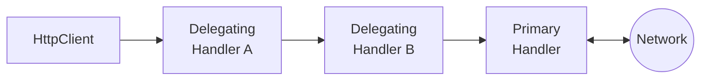

# 第58章：Chain of Responsibility ③：デファクト②（HttpMessageHandler / DelegatingHandler）📨

## ねらい 🎯

* 「HttpClientの裏側は、Chain of Responsibility（処理を順番に通す鎖）」だと体感するよ 😊
* ログ・認証・リトライ・計測みたいな“横断的な処理”を、呼び出し側のif/switch無しで差し込めるようになるよ ✨
* 「どこが差し替え点？」「順番どうなる？」を読める目を作るよ 👀

---

## 到達目標 🏁

* HttpClientの“ハンドラの流れ”を、図なしでも説明できる 📣
* DelegatingHandlerで「前処理→次へ→後処理」が書ける ✍️
* IHttpClientFactoryで AddHttpMessageHandler を使って差し込める 🔧 ([Microsoft Learn][1])
* テストで「順番」を可視化できる 🧪

---

## 手順 🧭

### 1) まず全体像：HttpClientは“ハンドラの鎖”を通して通信するよ 🔗🌊





HttpClientは、リクエストを「HttpMessageHandler（処理担当）」に渡して送信する仕組みだよ。
その中でも DelegatingHandler は“次のハンドラに委譲する前提のハンドラ”で、いわば「外側にかぶせる中間処理（アウトゴーイング・ミドルウェア）」になってるよ 📦✨ ([Microsoft Learn][2])

イメージはこんな感じ👇

```text
呼び出し側
  ↓
HttpClient
  ↓
[Handler A] → [Handler B] → [Primary Handler] → ネットワーク
  ↑             ↑                ↑
  └────── レスポンスは“逆向き”に戻る ──────┘
```

* リクエスト：A → B → Primary の順
* レスポンス：Primary → B → A の順（戻り道は逆走）
  これが「鎖っぽい！」って感覚だね😊 ([Microsoft Learn][2])

---

### 2) 登場人物を整理しよ 👥🧠

**(A) HttpMessageHandler**

* “送る処理の本体側”の抽象だよ。
* 注意：同じハンドラインスタンスに対して SendAsync が同時に呼ばれることがある（＝スレッド安全を意識）⚠️ ([Microsoft Learn][3])

**(B) DelegatingHandler**

* 「自分で完結しないで、InnerHandler（次）に委譲する」ための型だよ。
* “次のハンドラ”は InnerHandler プロパティでつながるよ 🔗 ([Microsoft Learn][4])
* そして SendAsync をオーバーライドして、

  * 前に何かする
  * 次へ渡す（base.SendAsync）
  * 後で何かする
    って書けるのが超重要！✨ ([Microsoft Learn][5])

**(C) Primary Handler（いちばん内側）**

* 実際にネットワークI/Oを担当する“最後の人”。
* 普通は既定のままでOK。必要なときだけ設定する感じだよ 👍 ([Microsoft Learn][2])

---

### 3) 最小のDelegatingHandlerを書いてみる ✍️✨（前→次→後）

まずは“差し込める感覚”を掴む用に、ヘッダー追加＋ログの最小例いくよ😊

```csharp
using System.Net.Http;
using System.Threading;
using System.Threading.Tasks;
using Microsoft.Extensions.Logging;

public sealed class CorrelationIdHandler : DelegatingHandler
{
    private readonly ILogger<CorrelationIdHandler> _logger;

    public CorrelationIdHandler(ILogger<CorrelationIdHandler> logger)
        => _logger = logger;

    protected override async Task<HttpResponseMessage> SendAsync(
        HttpRequestMessage request,
        CancellationToken cancellationToken)
    {
        // ✅ 前処理：リクエストを触る
        var correlationId = Guid.NewGuid().ToString("N");
        request.Headers.TryAddWithoutValidation("X-Correlation-Id", correlationId);

        _logger.LogInformation("HTTP ▶ {Method} {Url} (cid={Cid})",
            request.Method, request.RequestUri, correlationId);

        // ✅ 次へ：鎖を進める（ここが“CoRのキモ”！）
        var response = await base.SendAsync(request, cancellationToken);

        // ✅ 後処理：レスポンスを触る
        _logger.LogInformation("HTTP ◀ {StatusCode} (cid={Cid})",
            (int)response.StatusCode, correlationId);

        return response;
    }
}
```

ポイントはこれだけ覚えればOKだよ👇

* **base.SendAsync(request, cancellationToken)** が「次へ渡す」＝鎖を進める 📌 ([Microsoft Learn][5])
* cancellationToken はちゃんと渡す（止めたいとき止まる）🧊
* 前後に処理を書ける（“行き”と“帰り”がある）🚪↩️ ([Microsoft Learn][2])

---

### 4) “差し込み”はIHttpClientFactoryでやるのが定番 🔧🧩

ハンドラを差し込む代表ルートが **IHttpClientFactory**。
HttpClientの生成・設定・ハンドラ構成をDIでまとめやすいのがメリットだよ 😊 ([Microsoft Learn][6])

例：Typed Client（型付きクライアント）で組むと読みやすいよ✨

```csharp
using Microsoft.Extensions.DependencyInjection;

var services = new ServiceCollection();

// HandlerはDIに登録（毎回作ってOKな軽いものならTransientが使いやすい）
services.AddTransient<CorrelationIdHandler>();

services.AddHttpClient<PaymentGatewayClient>(client =>
{
    client.BaseAddress = new Uri("https://example.invalid/");
})
// ここで“鎖に差し込む”
.AddHttpMessageHandler<CorrelationIdHandler>();
```

* AddHttpMessageHandler が「DelegatingHandlerを鎖に追加する」操作だよ 🔗 ([Microsoft Learn][1])

Typed Clientはこう：

```csharp
public sealed class PaymentGatewayClient
{
    private readonly HttpClient _http;

    public PaymentGatewayClient(HttpClient http) => _http = http;

    public Task<HttpResponseMessage> GetHealthAsync(CancellationToken ct)
        => _http.GetAsync("health", ct);
}
```

---

### 5) “順番”が超大事！追加した順＝外側から入る 🧠🔁

DelegatingHandlerを複数足すときは、**順番が設計そのもの**になるよ⚠️

ざっくり覚え方👇

* 追加した順に“外側→内側”へ入っていく
* レスポンスは逆に戻る（内側→外側）

これは公式の説明でも「委譲ハンドラのシーケンスで前後処理できる」って整理されてるよ 📣 ([Microsoft Learn][2])

---

### 6) テストで“鎖の順番”を目で見る 🧪👀（超おすすめ）

ネットワークに出ない “偽物の一番奥のハンドラ” を作ると、順番がはっきりするよ😊

```csharp
using System.Net;
using System.Net.Http;
using System.Threading;
using System.Threading.Tasks;

public sealed class StubTerminalHandler : HttpMessageHandler
{
    private readonly List<string> _log;

    public StubTerminalHandler(List<string> log) => _log = log;

    protected override Task<HttpResponseMessage> SendAsync(
        HttpRequestMessage request,
        CancellationToken cancellationToken)
    {
        _log.Add("Terminal");
        return Task.FromResult(new HttpResponseMessage(HttpStatusCode.OK));
    }
}

public sealed class RecordingHandler : DelegatingHandler
{
    private readonly string _name;
    private readonly List<string> _log;

    public RecordingHandler(string name, List<string> log, HttpMessageHandler inner)
    {
        _name = name;
        _log = log;
        InnerHandler = inner; // 次のハンドラをつなぐ
    }

    protected override async Task<HttpResponseMessage> SendAsync(
        HttpRequestMessage request,
        CancellationToken cancellationToken)
    {
        _log.Add($"{_name}:before");
        var resp = await base.SendAsync(request, cancellationToken);
        _log.Add($"{_name}:after");
        return resp;
    }
}
```

MSTestで順番確認：

```csharp
using Microsoft.VisualStudio.TestTools.UnitTesting;

[TestClass]
public class HandlerPipelineTests
{
    [TestMethod]
    public async Task Handlers_are_called_in_order()
    {
        var log = new List<string>();

        // A → B → Terminal の鎖を作る
        var terminal = new StubTerminalHandler(log);
        var b = new RecordingHandler("B", log, terminal);
        var a = new RecordingHandler("A", log, b);

        using var client = new HttpClient(a);

        await client.GetAsync("https://example.invalid/");

        // リクエストは外→内、レスポンスは内→外
        CollectionAssert.AreEqual(new[]
        {
            "A:before",
            "B:before",
            "Terminal",
            "B:after",
            "A:after",
        }, log);
    }
}
```

これが通れば、もう“鎖”は完全に理解できてるよ🎉

---

### 7) AI補助を使うときのコツ 🤖📝

AIに任せるなら、まずは“雛形だけ”作らせるのが安全だよ😊
プロンプト例👇

* 「C#でDelegatingHandlerを作成。SendAsyncをoverrideし、前後に処理を書ける形。必ずbase.SendAsyncに渡し、CancellationTokenも渡す。状態はフィールドに持たずローカル変数中心。」

出てきたコードは、次のチェックで人間が守るのがポイント✅

* base.SendAsync を呼んでる？
* cancellationToken を渡してる？
* 例外を握りつぶしてない？
* フィールドに“リクエストごとの状態”を溜めてない？（並列で壊れる⚠️） ([Microsoft Learn][3])

---

## よくある落とし穴 ⚠️😵

* **base.SendAsyncを呼び忘れて鎖が止まる**
  → “通信しない謎ハンドラ”が爆誕するよ😂（意図して止めるならOK）

* **順番ミスで意味が変わる**
  例：認証ヘッダー付与より先にログを取って「ヘッダー無いログ」になった…等
  → “外側から入る”を思い出してね 🔁 ([Microsoft Learn][2])

* **Handlerを状態フルにして並列で壊す**
  HttpClientは並列に呼ばれることがあるから、ハンドラは基本“ステートレス寄り”が安心⚠️ ([Microsoft Learn][3])

* **CancellationTokenを無視して止まらない**
  → タイムアウトやキャンセルが効かなくて、つらい…🧊

* **HttpClientを毎回newして運用トラブル**
  → 生成・寿命の扱いをまとめやすいのが IHttpClientFactory の強みだよ 😊 ([Microsoft Learn][6])

---

## 演習 🏃‍♀️💪

### 演習1：2本差し込みで“行きと帰り”を味わう 🔗✨

1. RecordingHandlerを2本（A/B）作る
2. テストで「A before → B before → Terminal → B after → A after」を通す
3. Aは“計測”、Bは“ヘッダー追加”みたいに役割を分ける（責務を薄くね😊）

### 演習2：IHttpClientFactoryで差し込む 🔧📨

1. CorrelationIdHandler をDI登録
2. AddHttpClient + AddHttpMessageHandler で差し込む ([Microsoft Learn][1])
3. 呼び出し側のコードは「普通にGetAsyncするだけ」で、横断処理が動くのを確認🎉

### 演習3：短絡（ショートサーキット）を1回だけやってみる ✂️😆

“キャッシュがあったら通信しない”の超ミニ版を作るよ。

* ある条件なら base.SendAsync を呼ばずに HttpResponseMessage を返す
* その代わり「いつ短絡するか」を明確にコメントで残す（事故防止🚧）

---

## チェック ✅📋

* 「外側→内側→外側」の流れを言える？ 🔁
* DelegatingHandlerで **前→base.SendAsync→後** が書ける？ ✍️ ([Microsoft Learn][5])
* cancellationToken を渡してる？ 🧊
* 複数ハンドラの順番を、テストで説明できる？ 🧪
* ハンドラが“何でも屋”になってない？（責務うすい？）🪶

[1]: https://learn.microsoft.com/en-us/aspnet/web-api/overview/advanced/httpclient-message-handlers?utm_source=chatgpt.com "HttpClient Message Handlers in ASP.NET Web API"
[2]: https://learn.microsoft.com/en-us/aspnet/core/fundamentals/http-requests?preserve-view=true&view=aspnetcore-10.0 "Make HTTP requests using IHttpClientFactory in ASP.NET Core | Microsoft Learn"
[3]: https://learn.microsoft.com/ja-jp/dotnet/api/system.net.http.httpmessagehandler?view=net-8.0&utm_source=chatgpt.com "HttpMessageHandler クラス (System.Net.Http)"
[4]: https://learn.microsoft.com/en-us/dotnet/api/system.net.http.httpclient.-ctor?view=net-10.0&utm_source=chatgpt.com "HttpClient Constructor (System.Net.Http)"
[5]: https://learn.microsoft.com/ja-jp/dotnet/api/microsoft.extensions.dependencyinjection.httpclientbuilderextensions.addhttpmessagehandler?view=net-9.0-pp&utm_source=chatgpt.com "HttpClientBuilderExtensions.AddHttpMessageHandler ..."
[6]: https://learn.microsoft.com/ja-jp/dotnet/core/extensions/httpclient-factory?utm_source=chatgpt.com "IHttpClientFactory を使用する - .NET"
