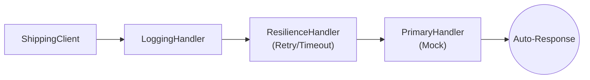

# 第59章：Chain of Responsibility ④：演習（HttpClientパイプラインでログ＋リトライ）📝🔁

## ねらい 🎯✨

* **Chain of Responsibility（責務の連鎖）**を、C#の“現場ど真ん中”で体感するよ〜🙂
* `HttpClient` の送受信を **パイプライン（ハンドラの連鎖）**で組み立てて、
  **ログ**と**リトライ**を“後付け”できるようにするよ💪💖
* 「処理の前後にちょい足ししたい」を、`if`増殖なしでやる練習だよ〜🌱

---

## 到達目標 ✅🌸

* `DelegatingHandler` が「責務の連鎖」になっている理由を説明できる🙂
* **ログ用ハンドラ**を1個作って、`HttpClient` に差し込める🧩
* `IHttpClientFactory` で **ハンドラを合成**して、呼び出し側はスッキリ✨
* **標準寄りの耐障害化（resilience）**で “リトライ付き” をサクッと入れられる🔁
  （`Microsoft.Extensions.Http.Resilience` が `HttpClient` 向けの仕組みを提供してるよ）([Microsoft Learn][1])

---

## 手順 🧭🛠️

### 1) ログ用ハンドラを作る（DelegatingHandler）📝✨

* ここが **CoRの主役**！「本体処理（`base.SendAsync`）の前後」に責務を足すよ🎁
* `ILogger` を使うと、`IHttpClientFactory` まわりのログ設計と相性がいいよ🙂([Microsoft Learn][2])

```csharp
using System.Diagnostics;
using System.Net.Http;
using System.Threading;
using System.Threading.Tasks;
using Microsoft.Extensions.Logging;

public sealed class LoggingHandler : DelegatingHandler
{
    private readonly ILogger<LoggingHandler> _logger;

    public LoggingHandler(ILogger<LoggingHandler> logger)
        => _logger = logger;

    protected override async Task<HttpResponseMessage> SendAsync(
        HttpRequestMessage request,
        CancellationToken cancellationToken)
    {
        var sw = Stopwatch.StartNew();

        _logger.LogInformation("➡️ {Method} {Uri}", request.Method, request.RequestUri);

        try
        {
            var response = await base.SendAsync(request, cancellationToken);

            _logger.LogInformation("⬅️ {Status} {Uri} ({Elapsed}ms)",
                (int)response.StatusCode, request.RequestUri, sw.ElapsedMilliseconds);

            return response;
        }
        catch (OperationCanceledException) when (cancellationToken.IsCancellationRequested)
        {
            _logger.LogInformation("🛑 Canceled {Method} {Uri} ({Elapsed}ms)",
                request.Method, request.RequestUri, sw.ElapsedMilliseconds);
            throw;
        }
        catch (HttpRequestException ex)
        {
            _logger.LogWarning(ex, "💥 HttpRequest failed {Method} {Uri} ({Elapsed}ms)",
                request.Method, request.RequestUri, sw.ElapsedMilliseconds);
            throw;
        }
    }
}
```

---

### 2) 呼び出し側（業務側）は “HttpClientを使うだけ” にする 🛒✨

* 連鎖の中身は知らない！ただ叩くだけ！がポイント💡

```csharp
using System.Net.Http;
using System.Threading;
using System.Threading.Tasks;

public sealed class ShippingApiClient
{
    private readonly HttpClient _http;

    public ShippingApiClient(HttpClient http) => _http = http;

    public async Task<string> GetFeeAsync(CancellationToken ct = default)
    {
        using var res = await _http.GetAsync("/shipping/fee", ct);
        res.EnsureSuccessStatusCode();
        return await res.Content.ReadAsStringAsync(ct);
    }
}
```

---

### 3) 連鎖を組み立てる（IHttpClientFactory + 標準寄りResilience）🔗🧩





* `IHttpClientFactory` は “作り方・設定・ハンドラ連鎖” をまとめて管理できるよ🙂
  （`HttpClient` を都度 `new` して捨てるのを避けるのが定番）([Microsoft Learn][3])
* **リトライなどの耐障害化**は `Microsoft.Extensions.Http.Resilience` で “HttpClient向け”に入れられるよ([Microsoft Learn][1])
* まずは最短で：**標準のResilienceハンドラ**を追加するところからでOK！🧡([Microsoft Learn][4])

下の例は「外部アクセスなし」で動くように、**疑似サーバ用ハンドラ**を噛ませてるよ（デモ用）🙂

```csharp
using System;
using System.Net;
using System.Net.Http;
using System.Threading;
using System.Threading.Tasks;
using Microsoft.Extensions.DependencyInjection;
using Microsoft.Extensions.Logging;
using Microsoft.Extensions.Http.Resilience;

// 疑似サーバ：最初の2回は500、3回目で200を返す（リトライ確認用）
public sealed class FlakyHandler : HttpMessageHandler
{
    private int _count;

    protected override Task<HttpResponseMessage> SendAsync(HttpRequestMessage request, CancellationToken cancellationToken)
    {
        var n = Interlocked.Increment(ref _count);

        if (n <= 2)
        {
            return Task.FromResult(new HttpResponseMessage(HttpStatusCode.InternalServerError)
            {
                Content = new StringContent("temporary fail")
            });
        }

        return Task.FromResult(new HttpResponseMessage(HttpStatusCode.OK)
        {
            Content = new StringContent("fee=500")
        });
    }
}

public static class Demo
{
    public static async Task RunAsync()
    {
        var services = new ServiceCollection();

        services.AddLogging(b =>
        {
            b.AddConsole();
            b.SetMinimumLevel(LogLevel.Information);
        });

        services.AddTransient<LoggingHandler>();

        services.AddHttpClient<ShippingApiClient>(c =>
            {
                c.BaseAddress = new Uri("https://example.test/");
            })
            // ★ここが“本体”の代わり（疑似サーバ）
            .ConfigurePrimaryHttpMessageHandler(() => new FlakyHandler())
            // ★ログ（自作のDelegatingHandler）
            .AddHttpMessageHandler<LoggingHandler>()
            // ★リトライ等（標準寄り：HttpClient向けResilience）
            .AddStandardResilienceHandler();

        using var sp = services.BuildServiceProvider();

        var api = sp.GetRequiredService<ShippingApiClient>();
        var result = await api.GetFeeAsync();

        Console.WriteLine($"🎉 Result: {result}");
    }
}
```

ポイント🌟

* **LoggingHandler**が「前後に処理を足す」＝CoRの手触り🎁
* **Resilience側（標準）**が「失敗したら再試行」＝CoRが“横断関心”に強い理由🔁([Microsoft Learn][4])
* リトライの最大回数などは、Retry系オプションに **`MaxRetryAttempts`** みたいな設定があるよ（PollyのRetryオプションの考え方）([pollydocs.org][5])

---

### 4) ハンドラの順番を変えて観察する 👀🔁📝

* **ログを外側**に置くと「1回の呼び出しとしてログ」になりやすい🙂
* **ログを内側**に置くと「リトライのたびにログ」になりやすい🙂
* どっちが良いかは目的次第（障害解析なら内側が便利、静かにしたいなら外側が便利）✨

---

## 落とし穴 ⚠️😵‍💫

* **リトライしていい処理だけ**にすること！

  * `GET`みたいな “安全寄り” は比較的OK
  * `POST` は二重実行の危険があるよ（課金・注文確定とか…怖い😱）
* **ログに秘密を出さない**（トークン、個人情報、本文まるごと…🙅‍♀️）
* **キャンセルは尊重**：`CancellationToken` で止まる設計にする（止まらないリトライ地獄つらい）🛑
* “便利そう”でハンドラを増やしすぎると、逆に追えなくなる（連鎖も肥大化する）🐣💦

---

## 演習 🧪💖

1. **リトライが起きるのをログで確認**しよう🔁

   * `FlakyHandler` を「最初の3回は500」に変えて、最終的に成功するか見てみよ🙂
2. **ログの位置を入れ替えて**、ログの出方がどう変わるか観察しよ👀
3. **キャンセルのテスト**をしてみよ🛑

   * `GetFeeAsync(ct)` に `CancellationTokenSource(TimeSpan.FromMilliseconds(50))` を渡して、ちゃんと止まるか確認✨
4. 余裕があれば：**「どのHTTPだけリトライする？」**を考えて、GET以外は抑止する方針メモを書こう📝💡

---

## チェック ✅📌

* `DelegatingHandler` の `base.SendAsync` は「連鎖の次へ渡す」って説明できる？🔗
* ログハンドラは「業務処理を知らずに」追加できた？🧩
* リトライが起きる状況（例：一時的な失敗）と、起きてほしくない状況（例：二重課金）を分けて説明できる？💳⚠️
* “ログを外側/内側” で何が変わるか言える？📝🔁

[1]: https://learn.microsoft.com/es-es/dotnet/core/resilience/http-resilience?utm_source=chatgpt.com "Construcción de aplicaciones HTTP resilientes: patrones ..."
[2]: https://learn.microsoft.com/ja-jp/dotnet/core/extensions/httpclient-factory "IHttpClientFactory を使用する - .NET | Microsoft Learn"
[3]: https://learn.microsoft.com/en-us/aspnet/core/fundamentals/best-practices?view=aspnetcore-10.0 "ASP.NET Core Best Practices | Microsoft Learn"
[4]: https://learn.microsoft.com/pt-pt/dotnet/core/resilience/http-resilience "Crie aplicativos HTTP resilientes: principais padrões de desenvolvimento - .NET | Microsoft Learn"
[5]: https://www.pollydocs.org/api/Polly.Retry.RetryStrategyOptions.html?utm_source=chatgpt.com "Class RetryStrategyOptions"
