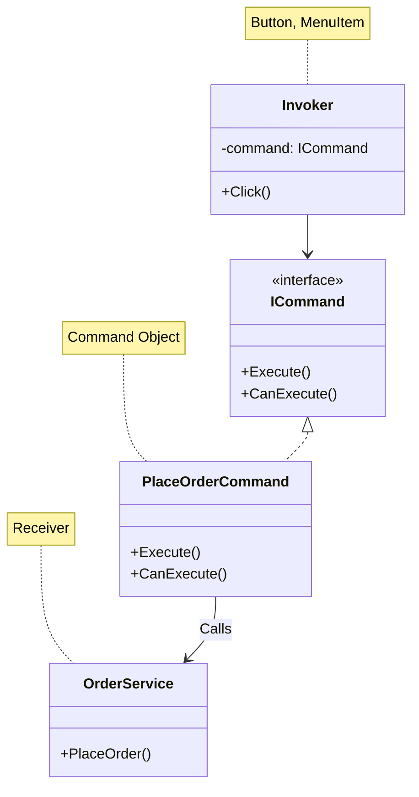

# 第60章：Command ①：操作をオブジェクト化する🎮

## ねらい😊✨

* 「ボタンを押したら○○する」みたいな“操作”を、**ひとつのオブジェクト（命令）**として扱えるようにする🎁
* その結果として、**Undo（取り消し）・履歴・キュー投入・ログ付け**みたいな“後付け要求”に強くなる💪📚
* さらに、GUIで超ありがちな **「押せる/押せない」状態（CanExecute）** をキレイに整理する🔘✅

---

## 到達目標🎯

* Command が効く状況を、具体例つきで説明できる🗣️✨
* GoFの登場人物（Invoker / Command / Receiver / Client）を、WPFの世界に当てはめられる🧩
* WPF標準の **`ICommand`** と **Commanding（RoutedCommand / CommandBinding）** の関係を言える🪄
* 「押せないときはグレーアウト」などの UI 状態を **CanExecute** で制御できる✅
* “やりすぎサイン”を3つ言える🚨

---

## まずイメージ🍓：操作＝「命令カード」🃏





「注文確定」って操作を、ただの `PlaceOrder()` 呼び出しにしちゃうと…

* どこから呼ばれる？（ボタン？ショートカット？メニュー？）がバラバラに増える😵
* 「今は押しちゃダメ」を各所で if する地獄🔥
* Undo や履歴が欲しくなった瞬間に詰む🧟‍♀️

そこで **操作を“命令カード（Command）”として独立**させる🎴✨
呼ぶ側（UI）は「この命令を実行してね」って渡すだけ。実際の処理は命令が持つ（または命令がReceiverに委譲する）🎯

---

## Commandがハマる場面・ハマらない場面🧭

### ハマる👍💖

* **同じ操作が複数の入口から呼ばれる**（ボタン/メニュー/ショートカット）
* **押せる/押せない**をUI全体で統一したい（CanExecute）
* **履歴**が必要（Undo / Redo / 操作ログ / 監査）
* **キュー**に積みたい（「あとで実行」「順番に実行」）

### まだ早いかも👶💭

* その操作が **1か所からしか呼ばれない**
* CanExecute や Undo の要求が **今後も絶対に来ない**（言い切れるなら）
* “命令”が増えることで逆に迷子になる規模

---

## 役割分担（GoFの基本形）🧩✨

* **Invoker**：命令を実行する人（例：ボタン、メニュー）
* **Command**：命令そのもの（実行できる/できない、実行）
* **Receiver**：実処理を持つ人（例：注文確定サービス）
* **Client**：それらを組み立てる人（アプリ起動時の配線、DIなど）

---

## WPFでは「Command」が標準でいる🪄（これが強い）

WPFは **Commanding** という仕組みが標準で入ってて、ボタンやメニューが **`ICommand`** を直接扱えるようになってるよ🖱️✨ ([Microsoft Learn][1])
そして、WPFには **定番コマンド群（Command Library）** も用意されてる📚（`ApplicationCommands` / `NavigationCommands` / `MediaCommands` / `EditingCommands` / `ComponentCommands` など） ([Microsoft Learn][1])

### `ICommand`の超重要ポイント🔑

`ICommand` は「実行できる？」「実行して！」「実行可否が変わったよ」の3点セット。

* `Execute(object? parameter)`：実行する ([Microsoft Learn][2])
* `CanExecute(object? parameter)`：実行できるか判断する ([Qiita][3])
* `CanExecuteChanged`：実行可否が変わったかもしれない通知 ([Microsoft Learn][4])

---

## 手順🛠️（この章は “考え方＋最小の体験”）

ここでは **WPF標準の Commanding** を使って、「操作がオブジェクトになる感覚」を体験するよ🎮✨ ([Microsoft Learn][1])

### 1) まず “命令にしたい操作” を1個選ぶ🎯

例：

* 注文確定（Place Order）🛒✅
* 取り消し（Undo）↩️（※本格Undoは次章以降で育てる）

この章では **PlaceOrder だけでもOK** 🙆‍♀️✨

### 2) 「呼ぶ側」と「処理側」を分けて考える🧠

* 呼ぶ側：Button / MenuItem / ショートカット
* 処理側：注文処理（仮でOK。MessageBoxでもOK）

WPFでは、呼ぶ側が **Command Source** になって、CanExecuteChanged を見て勝手にグレーアウトしたりするよ🔘✨ ([Microsoft Learn][1])

### 3) CanExecute（押せる/押せない）を1つの場所に集める✅

「在庫がないなら押せない」みたいな条件を、クリックイベントの中じゃなく **CanExecuteに置く**💡

### 4) “状態が変わったのにグレーが戻らない😇” を知っておく

WPFの **`CommandManager`** は、必要に応じて「CanExecute確認してね」を促す仕組みを持ってるよ。状態がUIに反映されないときは、再問い合わせを促すメソッドがある（`InvalidateRequerySuggested`）🧯✨ ([Microsoft Learn][1])

---

## 最小サンプル🧁（WPF標準だけでCommand体験）

「注文確定」ボタンを **Command** で動かし、押せる/押せないも制御するよ🔘✅

### ① XAML（ボタンと状態を切り替えるボタン）

```xml
<Window x:Class="CommandSample.MainWindow"
        xmlns="http://schemas.microsoft.com/winfx/2006/xaml/presentation"
        xmlns:x="http://schemas.microsoft.com/winfx/2006/xaml"
        Title="Command Sample" Height="200" Width="360">
    <StackPanel Margin="16" Gap="10">

        <TextBlock Text="Commandで『注文確定』を実行するよ🛒✨" FontSize="16"/>

        <WrapPanel>
            <Button Content="注文確定 ✅"
                    Width="120"
                    Margin="0,0,8,0"
                    Command="{x:Static local:AppCommands.PlaceOrder}" />
            <Button Content="在庫あり/なしを切替 🔁"
                    Width="180"
                    Click="ToggleStock_Click"/>
        </WrapPanel>

        <TextBlock x:Name="StockText" FontSize="14"/>
    </StackPanel>
</Window>
```

※ `local:AppCommands` を使うので、XAMLの `xmlns:local="clr-namespace:CommandSample"` が必要だよ（プロジェクト名に合わせてね）🧩

### ② コマンド定義（RoutedUICommandで“命令カード”を作る）🎴

```csharp
using System.Windows.Input;

namespace CommandSample;

public static class AppCommands
{
    // 「命令カード」：表示名/内部名/所有者型
    public static readonly RoutedUICommand PlaceOrder =
        new("注文確定", "PlaceOrder", typeof(AppCommands));
}
```

WPFでは **`RoutedCommand` / `RoutedUICommand`** を作るのが定番ルートだよ🪄 ([Microsoft Learn][1])
（`ICommand` を自作実装する道もあるけど、それは次章でしっかりやるのがスムーズ✨）

### ③ CommandBinding（命令と処理を結びつける）🔗

```csharp
using System.Windows;
using System.Windows.Input;

namespace CommandSample;

public partial class MainWindow : Window
{
    private bool _inStock = true;

    public MainWindow()
    {
        InitializeComponent();

        // CommandBinding：このWindowが「命令の処理場所」になる
        CommandBindings.Add(new CommandBinding(
            AppCommands.PlaceOrder,
            Executed_PlaceOrder,
            CanExecute_PlaceOrder));

        UpdateStockText();
    }

    private void CanExecute_PlaceOrder(object sender, CanExecuteRoutedEventArgs e)
    {
        // 押せる条件をここに集約✨
        e.CanExecute = _inStock;
        e.Handled = true;
    }

    private void Executed_PlaceOrder(object sender, ExecutedRoutedEventArgs e)
    {
        MessageBox.Show("注文確定しました🛒✅（仮）");
        e.Handled = true;
    }

    private void ToggleStock_Click(object sender, RoutedEventArgs e)
    {
        _inStock = !_inStock;
        UpdateStockText();

        // 状態が変わったので、CanExecute再評価を促す🧯
        CommandManager.InvalidateRequerySuggested();
    }

    private void UpdateStockText()
    {
        StockText.Text = _inStock ? "在庫：あり ✅" : "在庫：なし ❌（注文確定ボタンがグレーになるよ）";
    }
}
```

* Command Source（ボタンなど）は **`CanExecuteChanged` を監視して状態を更新**するのが基本だよ🔘✨ ([Microsoft Learn][1])
* `CommandManager` は、必要に応じて「CanExecute確認してね」を流す仕組みがあり、明示的に促す方法もあるよ（`InvalidateRequerySuggested`）🧯 ([Microsoft Learn][1])

---

## ここで「Commandパターンの旨味」を言葉にする🍯✨

このサンプルのポイントはこれ👇

* ボタンは「注文確定の中身」を知らない（**命令を実行するだけ**）🧠➡️🎴
* “押せる/押せない”が Click の中じゃなく **CanExecuteに集約**される✅
* 同じ命令を、将来 **メニューやショートカット**にも同じように付けられる⌨️🖱️
  （WPFはInputBindingでショートカットもつけられるよ） ([Microsoft Learn][1])

---

## .NET標準の「既製コマンド」も知っておこう📚✨

WPFには最初からコマンドがいっぱい入ってるよ！
例：Copy / Paste / Undo / Redo など（`ApplicationCommands` や `EditingCommands` など） ([Microsoft Learn][1])
さらに `ComponentCommands` には、フォーカス移動などUIっぽい命令もあるよ🧭✨（例：`MoveFocus`） ([Microsoft Learn][5])

「自作する前に、既製がないか確認」ここめっちゃ大事💎

---

## よくある落とし穴😵‍💫⚠️

### 落とし穴1：Commandが“サービスのコピペ”になる📦

Commandの中に業務ロジックを全部書き始めると、

* どこが本体の処理かわからなくなる
* テストしづらくなる
  ってなりがち💦

**コツ**：Commandは「実行の入口」と「引数の受け渡し」に寄せて、実処理はReceiver（サービス）へ🎯

---

### 落とし穴2：CanExecuteの条件が散る（結局if地獄）🔥

* UI側
* ハンドラ側
* サービス側
  に条件が分散すると破滅😇

**コツ**：UIの押せる/押せないは **CanExecuteに集約**。例外は例外で「契約」として扱う📜

---

### 落とし穴3：状態が変わったのにボタンが更新されない🔘💤

「在庫が復活したのに、ボタンがグレーのまま」みたいなやつ🥺
Commandingの仕組みとして、再評価のタイミングが絡むよ。`CommandManager` の再問い合わせの仕組みを知っておくと安心🧯✨ ([Microsoft Learn][1])

---

## 演習（10〜30分）🧪🌸

### 演習A：入口を増やす（Commandのご褒美を味わう）🎁

1. 「注文確定 ✅」ボタンのCommandを、そのまま **MenuItem** にも付ける🍔
2. さらに **Ctrl+Enter** で注文確定できるようにする⌨️✨

   * ヒント：InputBinding（KeyBinding）で Command を結びつけられるよ ([Microsoft Learn][1])

✅ゴール：入口が増えても、処理側は増えない（ここが気持ちいい！）

---

### 演習B：CommandParameterを使って“引数つき命令”にする🎯

* 例えば `注文確定(配送方法)` みたいに、ボタンごとに違う値を渡す
* `Executed` 側で `e.Parameter` を読んで処理を分ける

✅ゴール：「命令カードにメモ（引数）を添える」感覚を掴む📝🎴

---

## 自己チェック✅💮

* Commandを入れると嬉しいのは「入口が増えるとき」って言える？🚪✨
* Invoker / Command / Receiver をWPFの例で説明できる？🧩
* “押せる/押せない”は CanExecute に集約した？🔘✅
* 状態を変えたのにUIが更新されない時、`CommandManager` 系の再評価の話を思い出せる？🧯 ([Microsoft Learn][1])
* 既製コマンド（`ApplicationCommands` など）を先に探す癖、ついた？📚✨ ([Microsoft Learn][1])

[1]: https://learn.microsoft.com/en-us/dotnet/desktop/wpf/advanced/commanding-overview "Commanding Overview - WPF | Microsoft Learn"
[2]: https://learn.microsoft.com/ja-jp/dotnet/api/system.windows.input.routedcommand?view=windowsdesktop-10.0&utm_source=chatgpt.com "RoutedCommand Class (System.Windows.Input)"
[3]: https://qiita.com/Sakai_path/items/9bc0a7a0a68b50c8e138?utm_source=chatgpt.com "【C#】Channel<T> でスレッド間通信をシンプルに"
[4]: https://learn.microsoft.com/en-us/dotnet/api/system.windows.input.icommand?view=net-10.0&utm_source=chatgpt.com "ICommand Interface (System.Windows.Input)"
[5]: https://learn.microsoft.com/ja-jp/dotnet/desktop/wpf/advanced/commanding-overview?utm_source=chatgpt.com "総括的な概要 - WPF"
