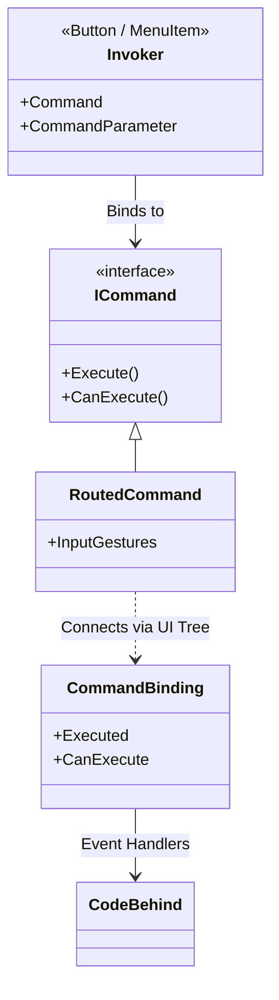

# 第61章：Command ②：標準（ICommand）で体験（WPFのミニ）🖱️✨

## ねらい 🎯





WPFの「コマンド」って、**ボタンのクリック処理を“その場で書く”**のとは発想がちょっと違います🙂
「やりたい操作」を **ICommand（命令）として別物にして**、ボタン・メニュー・ショートカットキーから**同じ操作を呼べる**ようにします✨

さらに、`CanExecute` が `false` だと **ボタンが自動で無効化**されるのが強い…！🧁
ICommandは `CanExecute / Execute / CanExecuteChanged` という形で定義されています。([Microsoft Learn][1])

---

## 到達目標 🧠✨

* `ICommand` の **3点セット（CanExecute / Execute / CanExecuteChanged）**を説明できる🙂([Microsoft Learn][1])
* WPFで **Button / MenuItem / Ctrl+Enter** を全部同じ操作につなげられる⌨️✨
* `CanExecute` で **押せる/押せない**を作って、UIが自然に連動するのを体験できる🌸
* `CommandManager` と `CommandBinding / InputBinding` の役割をざっくり言える🧩([Microsoft Learn][2])

---

## 手順 🛠️✨

### 1) まず「Commandの気持ち」を掴む 🧃

* **Clickイベント**：ボタンに「その場で処理」を書きがち
* **Command**：

  * 「操作（命令）」を **ICommand** として分離する
  * ボタン・メニュー・キー入力は **“呼び出し役”**
  * 実際に何をするかは **“実行役”**
  * 押せるかどうかは `CanExecute` で決める

WPFのコマンド機構は `CommandManager` が関わっていて、`CanExecute` 再評価の仕組み（`RequerySuggested` など）も説明されています。([Microsoft Learn][2])

---

### 2) ミニ題材：注文確定（PlaceOrder）を「コマンド」にする🛒✨

画面にこれだけ置きます🙂

* 金額入力（TextBox）
* 「注文確定」ボタン（Button）
* メニューの「注文確定」（MenuItem）
* Ctrl+Enter でも同じ操作（KeyBinding）

---

### 3) XAMLを書く（ボタン/メニュー/キーを同じCommandへ）🧷✨

`MainWindow.xaml` をこんな感じにします👇

```xml
<Window x:Class="WpfCommandMini.MainWindow"
        xmlns="http://schemas.microsoft.com/winfx/2006/xaml/presentation"
        xmlns:x="http://schemas.microsoft.com/winfx/2006/xaml"
        Title="Commandミニ" Height="220" Width="420">

    <!-- Window全体に「このコマンドはこう処理する」を登録 -->
    <Window.CommandBindings>
        <CommandBinding Command="{x:Static local:MainWindow.PlaceOrderCommand}"
                        CanExecute="PlaceOrder_CanExecute"
                        Executed="PlaceOrder_Executed"/>
    </Window.CommandBindings>

    <!-- ショートカットキーで同じCommandを呼ぶ -->
    <Window.InputBindings>
        <KeyBinding Key="Enter" Modifiers="Control"
                    Command="{x:Static local:MainWindow.PlaceOrderCommand}"/>
    </Window.InputBindings>

    <DockPanel>
        <Menu DockPanel.Dock="Top">
            <MenuItem Header="_Order">
                <MenuItem Header="注文確定(_P)"
                          Command="{x:Static local:MainWindow.PlaceOrderCommand}"/>
            </MenuItem>
        </Menu>

        <StackPanel Margin="16" VerticalAlignment="Center">
            <TextBlock Text="金額（円）" Margin="0,0,0,6"/>
            <TextBox Name="AmountTextBox" Height="28" Margin="0,0,0,12"
                     TextChanged="AmountTextBox_TextChanged"/>

            <Button Content="注文確定"
                    Height="32"
                    Command="{x:Static local:MainWindow.PlaceOrderCommand}"/>

            <TextBlock Margin="0,10,0,0" Foreground="Gray"
                       Text="ヒント：Ctrl + Enter でも注文確定できるよ🙂✨"/>
        </StackPanel>
    </DockPanel>
</Window>
```

> ポイント💡
>
> * ButtonもMenuItemもKeyBindingも **同じCommand** を指してる😍
> * どこから呼んでも、実行ロジックは1か所に集まる✨

---

### 4) コマンド本体（RoutedCommand）と CanExecute/Executed を書く 🧩✨

`MainWindow.xaml.cs` に追記します👇
（WPF標準のルーティングコマンドを使って、“WPFのCommandらしさ”を体験します🙂）

```csharp
using System.Globalization;
using System.Windows;
using System.Windows.Input;

namespace WpfCommandMini;

public partial class MainWindow : Window
{
    // WPFの「ルーティングコマンド」：CommandBindingで処理を結びつける
    public static readonly RoutedUICommand PlaceOrderCommand =
        new RoutedUICommand("注文確定", "PlaceOrder", typeof(MainWindow),
            new InputGestureCollection { new KeyGesture(Key.Enter, ModifierKeys.Control) });

    public MainWindow()
    {
        InitializeComponent();
    }

    private void PlaceOrder_CanExecute(object sender, CanExecuteRoutedEventArgs e)
    {
        // 金額が「正しく数値として読み取れて」「0より大きい」なら押せる
        e.CanExecute = TryReadAmount(out var amount) && amount > 0;
        e.Handled = true;
    }

    private void PlaceOrder_Executed(object sender, ExecutedRoutedEventArgs e)
    {
        if (!TryReadAmount(out var amount))
        {
            MessageBox.Show("金額が読み取れないよ〜🥺", "エラー", MessageBoxButton.OK, MessageBoxImage.Warning);
            return;
        }

        MessageBox.Show($"注文確定！🎉  金額：{amount:N0} 円", "OK", MessageBoxButton.OK, MessageBoxImage.Information);
        AmountTextBox.SelectAll();
        AmountTextBox.Focus();
    }

    private void AmountTextBox_TextChanged(object sender, System.Windows.Controls.TextChangedEventArgs e)
    {
        // TextBox変更のたびに「押せる？押せない？」を再評価してほしい
        // CommandManager が RequerySuggested を発火させる仕組みを持ってるので、
        // ここでは明示的に再評価を促す🙂
        CommandManager.InvalidateRequerySuggested();
    }

    private bool TryReadAmount(out decimal amount)
    {
        // ちょい優しめ：空白許可、カンマも許可
        var text = AmountTextBox.Text?.Trim() ?? "";
        return decimal.TryParse(text, NumberStyles.Number, CultureInfo.CurrentCulture, out amount);
    }
}
```

ここで使ってる `CommandManager.InvalidateRequerySuggested()` は、コマンドの再評価（`RequerySuggested`）を促す代表的な方法として説明されています。([Microsoft Learn][3])
（`ICommand` 自体の定義もここがベースです🙂）([Microsoft Learn][1])

---

### 5) 動かして観察する 👀✨

* 金額が空、または 0、または文字 → ボタンが **押せない**（無効）😴
* 金額が 1000 とか → ボタンが **押せる**（有効）💪
* ボタンでも、メニューでも、Ctrl+Enterでも → **同じ処理が走る**🎮✨

この「呼び出し元が増えても、実行の中身は1か所」の体験が、Commandのめちゃ旨ポイントです🍰

---

### 6) AIに手伝ってもらうコツ 🤖📝

雛形生成は便利だけど、コマンド周りは “盛りがち” なので注意⚠️😵
おすすめの投げ方はこんな感じ👇

* 「WPF RoutedCommand と CommandBinding の最小例。TextBoxの内容で CanExecute を切り替えたい」
* 「CommandManager.InvalidateRequerySuggested を使う理由を短く説明して」

そして **レビュー観点** はこれ💡

* `CanExecute` が **速い**（重い処理してない）🕊️
* `Executed` が **UI操作と業務処理をごちゃ混ぜにしてない**（今回はミニだからOKだけど、肥大化の芽は早めに摘む）🌱
* ショートカット・メニュー・ボタンが **同じCommandを参照してる**✅

---

## よくある落とし穴 🕳️💦

* **CanExecuteが更新されない**🥺

  * 状態が変わったのにボタンが有効/無効切り替わらないときは、`CommandManager` 周り（再評価タイミング）を疑うと早いです。([Microsoft Learn][2])
* **Executedで全部やり始めて太る**🐘

  * 画面操作・入力検証・注文処理・ログ…を1メソッドに詰めると一気に読めなくなる😵
* **例外やエラーメッセージがUI依存になりすぎる**⚠️

  * “見せ方”はUIだけど、“判断”は寄せられるなら寄せたい（のちの章で効いてくる✨）

---

## 演習 ✍️🎀

次のどれか1つだけでOK（10〜30分）🙂✨

1. **入力がマイナスなら押せない**にする

* `amount > 0` を使ってるので、すでにできてるはず！✅
* じゃあ次は「上限 1,000,000 円まで」みたいなルールも追加してみよ💰

2. **“注文確定”を2回連打できない**にする

* 「実行中フラグ」を作って、実行中は `CanExecute = false`
* 実行が終わったら `true` に戻す
* 最後に再評価を促す（`InvalidateRequerySuggested`）✨([Microsoft Learn][3])

3. **ショートカットキーを追加**する

* Ctrl+Enter だけじゃなくて、F5でも注文確定、とか🎹✨
* `InputBindings` に `KeyBinding` をもう1個追加！

---

## チェック ✅✨

* [ ] `ICommand` が **2メソッド＋1イベント**でできてるって言える🙂([Microsoft Learn][1])
* [ ] ボタン・メニュー・キー入力が **同じCommand** にぶら下がってる🎀
* [ ] `CanExecute` が `false` のとき、UIが **自然に無効化**されるのを確認した😴➡️💪
* [ ] `CommandManager` が “再評価のタイミング” に関わることを言葉にできる（超ざっくりでOK）🧩([Microsoft Learn][2])

[1]: https://learn.microsoft.com/ja-jp/dotnet/api/system.windows.input.icommand?view=net-10.0&utm_source=chatgpt.com "ICommand インターフェイス (System.Windows.Input)"
[2]: https://learn.microsoft.com/ja-jp/dotnet/desktop/wpf/advanced/commanding-overview?utm_source=chatgpt.com "総括的な概要 - WPF"
[3]: https://learn.microsoft.com/ja-jp/dotnet/api/system.windows.input.commandmanager?view=windowsdesktop-10.0&utm_source=chatgpt.com "CommandManager クラス (System.Windows.Input)"
