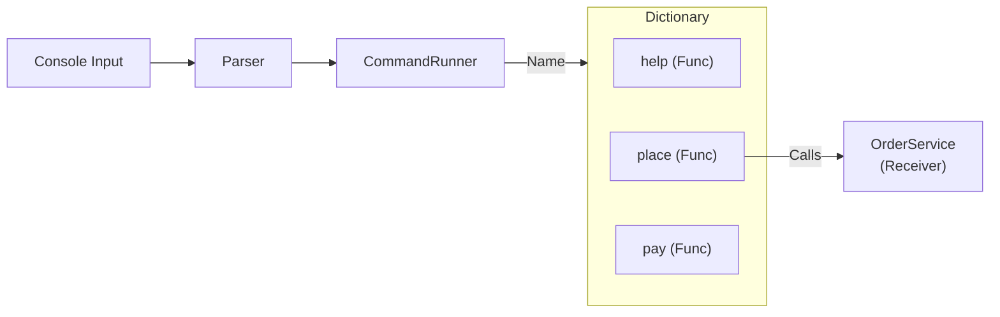

# 第62章：Command ③：Consoleでも使う（Func/Actionで軽量Command）⚡

## ねらい 🎯✨





* 「操作（コマンド）」を **実行ループ（呼ぶ側）から切り離す** 感覚を、Consoleアプリでも体に入れるよ〜😊
* “Commandっぽい専用クラス”を増やさず、**`Func` / `Action`（標準のデリゲート）** で軽く実装して、読みやすさ＆差し替えやすさを作るよ🧠💡
* **テストで守る**（差し替え可能性を壊さない）を練習するよ🧪🌸

---

## 到達目標 🥇🌈

* Consoleの `switch` 地獄（または `if` 連打）が、**コマンド登録（Dictionary）** に置き換わって説明できる🙂
* `Action` と `Func` の使い分けができる（特に **非同期なら `Func<Task>` / `Func<Task<T>>` が安全**）🔐✨ ([Microsoft Learn][1])
* 演習コードが「動く✅」「テストが通る✅」「責務が薄い✅」になってる🎉

---

## 手順 🧭✨

### 1) いまどきの “標準の武器” を確認しよ〜🧰😊

* **`Action`**：戻り値なしの処理を表すデリゲート型（＝「やるだけ」）✋
* **`Func`**：戻り値ありの処理を表すデリゲート型（＝「やって結果を返す」）📦
  これが **Commandを軽くする最短ルート** だよ⚡ ([Microsoft Learn][1])
* C# はデリゲート＋ラムダが強いので、**「コマンド = 関数」** として扱えるのが超おいしい🍯✨ ([Microsoft Learn][2])
* ちなみに今どきは **.NET 10（LTS）** と **C# 14** が軸になってるよ（最新の公式情報ベース）🆕✨ ([Microsoft][3])

---

### 2) まず “導入前” を作る（switch版）🔥

Consoleでよくある形👇（これが増えるとツラい😵）

```csharp
// Program.cs（導入前のイメージ）
while (true)
{
    Console.Write("> ");
    var line = Console.ReadLine();
    if (line is null) break;

    switch (line.Trim().ToLowerInvariant())
    {
        case "help":
            Console.WriteLine("help / place / pay / quit");
            break;

        case "place":
            Console.WriteLine("注文を作ったよ🛒");
            break;

        case "pay":
            Console.WriteLine("支払いしたよ💳");
            break;

        case "quit":
            return;

        default:
            Console.WriteLine("不明コマンド🥺  help って打ってね");
            break;
    }
}
```

✅ この段階で「コマンドが10個になった未来」を想像してみてね…（つらい予感しかしない）😇💦

---

### 3) “コマンド = 関数” に置き換える（Func/Action版）⚡

ここからが本番〜！🎉
ポイントは **「実行ループは “探して呼ぶだけ”」** にすること🙂✨

#### 今回の最小設計（登場人物）🧩

* **Invoker（呼ぶ側）**：`CommandRunner`（コマンド名を見て実行するだけ）
* **Receiver（実処理）**：`OrderService`（注文・支払い等の業務っぽい処理）
* **Command（命令）**：`Func<CommandContext, string[], Task<int>>`（ただの関数！）⚡

---

### 4) コードを書く（そのまま貼ってOK）✍️✨

#### (1) Receiver：`OrderService`（業務はここ）🛒

```csharp
// OrderService.cs
public sealed class OrderService
{
    public bool HasOrder { get; private set; }
    public bool IsPaid { get; private set; }

    public void Place()
    {
        HasOrder = true;
        IsPaid = false;
    }

    public void Pay()
    {
        if (!HasOrder) throw new InvalidOperationException("注文がないよ🥺");
        IsPaid = true;
    }
}
```

#### (2) Context：`CommandContext`（依存をまとめて渡す箱）📦

Console出力は **`TextWriter`** にするとテストが超ラクだよ🧪✨

```csharp
// CommandContext.cs
using System.IO;
using System.Threading;

public sealed class CommandContext
{
    public CommandContext(OrderService orders, TextWriter output, CancellationToken cancellationToken)
    {
        Orders = orders;
        Output = output;
        CancellationToken = cancellationToken;
    }

    public OrderService Orders { get; }
    public TextWriter Output { get; }
    public CancellationToken CancellationToken { get; }
}
```

#### (3) Invoker：`CommandRunner`（探して呼ぶだけ）🔎➡️🏃‍♀️

* 返り値は **終了コード `int`** にしておくと、Consoleアプリらしくて扱いやすいよ（`0`=成功）😊
* 非同期コマンドも混ざる想定なら、**`Func<..., Task<int>>` に統一**が安全✨
  （`Action` で `async void` を作り始めると地獄になりがち…）😇 ([Microsoft Learn][4])

```csharp
// CommandRunner.cs
using System;
using System.Collections.Generic;
using System.Threading.Tasks;

public sealed class CommandRunner
{
    public delegate Task<int> CommandHandler(CommandContext ctx, string[] args);

    private readonly IReadOnlyDictionary<string, CommandHandler> _commands;

    public CommandRunner(IReadOnlyDictionary<string, CommandHandler> commands)
        => _commands = commands;

    public async Task<int> ExecuteLineAsync(CommandContext ctx, string line)
    {
        var (name, args) = Parse(line);

        if (string.IsNullOrWhiteSpace(name))
            return 0;

        if (!_commands.TryGetValue(name, out var handler))
        {
            await ctx.Output.WriteLineAsync($"不明コマンド🥺: {name}  (helpで一覧だよ)");
            return 2;
        }

        return await handler(ctx, args);
    }

    private static (string name, string[] args) Parse(string line)
    {
        var parts = (line ?? "").Trim().Split(' ', StringSplitOptions.RemoveEmptyEntries);
        if (parts.Length == 0) return ("", Array.Empty<string>());

        var name = parts[0].ToLowerInvariant();
        var args = parts.Length == 1 ? Array.Empty<string>() : parts[1..];
        return (name, args);
    }
}
```

#### (4) Program：コマンド登録して回すだけ🎡✨

ここが **switch撤去の気持ちよさ** だよ〜🥳🎉

```csharp
// Program.cs
using System;
using System.Collections.Generic;
using System.Threading;
using System.Threading.Tasks;

public static class Program
{
    public static async Task Main()
    {
        using var cts = new CancellationTokenSource();

        var orders = new OrderService();
        var ctx = new CommandContext(orders, Console.Out, cts.Token);

        var commands = new Dictionary<string, CommandRunner.CommandHandler>
        {
            ["help"] = async (c, args) =>
            {
                await c.Output.WriteLineAsync("help / place / pay / status / quit");
                return 0;
            },

            ["place"] = (c, args) =>
            {
                c.Orders.Place();
                c.Output.WriteLine("注文を作ったよ🛒✨");
                return Task.FromResult(0);
            },

            ["pay"] = (c, args) =>
            {
                c.Orders.Pay();
                c.Output.WriteLine("支払いしたよ💳✨");
                return Task.FromResult(0);
            },

            ["status"] = (c, args) =>
            {
                var s = c.Orders.HasOrder
                    ? (c.Orders.IsPaid ? "注文あり✅ 支払い済み💳" : "注文あり✅ 未払い💦")
                    : "注文なし🥺";

                c.Output.WriteLine($"状態: {s}");
                return Task.FromResult(0);
            },

            ["quit"] = async (c, args) =>
            {
                await c.Output.WriteLineAsync("ばいばい〜👋");
                return 10; // ← 自分ルールで「10なら終了」にしてみたよ
            },
        };

        var runner = new CommandRunner(commands);

        while (true)
        {
            Console.Write("> ");
            var line = Console.ReadLine();
            if (line is null) break;

            var code = await runner.ExecuteLineAsync(ctx, line);

            if (code == 10) break;
        }
    }
}
```

✅ これで「コマンドが増えても、辞書に1行足すだけ」になったよ〜！🎉
✅ 実行ループは **“探して呼ぶだけ”** なので、責務がスッキリ💆‍♀️✨

---

### 5) テストで “差し替え可能性” を守る🧪🌸

Console出力を `Console.Out` 直書きしてるとテストが痛いので、さっき `TextWriter` にしたのが効くよ👍✨

```csharp
// CommandRunnerTests.cs（MSTest）
using Microsoft.VisualStudio.TestTools.UnitTesting;
using System.Collections.Generic;
using System.IO;
using System.Threading;
using System.Threading.Tasks;

[TestClass]
public sealed class CommandRunnerTests
{
    [TestMethod]
    public async Task place_then_status_should_show_has_order()
    {
        var orders = new OrderService();
        var sw = new StringWriter();
        var ctx = new CommandContext(orders, sw, CancellationToken.None);

        var commands = new Dictionary<string, CommandRunner.CommandHandler>
        {
            ["place"] = (c, args) =>
            {
                c.Orders.Place();
                c.Output.WriteLine("OK place");
                return Task.FromResult(0);
            },
            ["status"] = (c, args) =>
            {
                c.Output.WriteLine(c.Orders.HasOrder ? "HAS_ORDER" : "NO_ORDER");
                return Task.FromResult(0);
            },
        };

        var runner = new CommandRunner(commands);

        await runner.ExecuteLineAsync(ctx, "place");
        await runner.ExecuteLineAsync(ctx, "status");

        var output = sw.ToString();
        StringAssert.Contains(output, "HAS_ORDER");
    }

    [TestMethod]
    public async Task unknown_command_should_return_2()
    {
        var orders = new OrderService();
        var sw = new StringWriter();
        var ctx = new CommandContext(orders, sw, CancellationToken.None);

        var runner = new CommandRunner(new Dictionary<string, CommandRunner.CommandHandler>());

        var code = await runner.ExecuteLineAsync(ctx, "what");
        Assert.AreEqual(2, code);
    }
}
```

✅ “Commandを関数で表す” と、**テストは超シンプル**になるよ〜🥰

---

### 6) （発展）キューイングしたくなったら `Channel<T>` が定番📮✨

「コマンドを順番に処理したい」「バックグラウンドで流したい」ってなったら、.NET標準の **`System.Threading.Channels`** が使いやすいよ🌊
（Producer/Consumerのパイプに強い！） ([Microsoft Learn][5])

超ミニ例👇（雰囲気だけ掴めればOK😊）

```csharp
using System.Threading.Channels;

var channel = Channel.CreateUnbounded<string>();

// Producer: 入力をキューに積む
_ = Task.Run(async () =>
{
    while (true)
    {
        var line = Console.ReadLine();
        if (line is null) break;
        await channel.Writer.WriteAsync(line);
    }
    channel.Writer.Complete();
});

// Consumer: キューから取り出して実行
await foreach (var line in channel.Reader.ReadAllAsync())
{
    await runner.ExecuteLineAsync(ctx, line);
}
```

---

## よくある落とし穴 🕳️😵

* **`Action` に `async void` を混ぜる**
  `async void` は基本 “イベントハンドラ用” って考えるのが安全だよ⚠️
  コマンドは **`Func<Task>` / `Func<Task<int>>`** に寄せようね✨ ([Microsoft Learn][4])
* **コマンドが肥大化する**（サービスのコピーになっちゃう）🐘💦
  コマンドは「引数チェック→Receiver呼ぶ→出力」くらいで薄く！
* **例外が握りつぶされる**😇
  `OrderService.Pay()` みたいな例外は、上位で表示するか、コマンド側でメッセージ化するか、方針を決めよう🙂
* **コマンド名の衝突**（辞書に同名登録）⚔️
  “登録時に重複チェック” を入れたくなるけど、最初は **命名を揃える運用** でOK👌
* **パースが凝り始める**（自作CLIフレームワーク化）🚧
  まずは `Split(' ')` で十分！「必要になってから」育てよ〜🌱

---

## 演習（10〜30分）🏃‍♀️💨

### 演習A：`refund` コマンドを追加しよ💸

1. `OrderService` に `Refund()` を追加（支払い済みなら未払いに戻す、みたいに軽く）
2. `commands["refund"] = ...` を1つ追加
3. MSTestで

   * `pay` → `refund` → `status` が期待通りになるテストを書く🧪✨

### 演習B：引数ありコマンドにしてみよ🔧

`place <orderId>` を受け取るようにしてみてね🙂

* `args.Length == 1` のときだけ通す
* ダメなら `return 1;` ＋メッセージ表示🥺

### 演習C（発展）：`Channel<string>` で “まとめ実行”📦

* あらかじめ用意したコマンド列（例：`place`, `pay`, `status`）をキューに積んで流す
* テストで「順番に実行された」ことを `StringWriter` 出力で確認🧪✨ ([Microsoft Learn][5])

---

## 自己チェック ✅💖

* `switch` が消えて、**コマンド追加が “辞書に1行足すだけ”** になった？🎉
* 実行ループは **「入力→探す→呼ぶ」だけ** になってる？🔁
* コマンドは薄い？（引数チェック→Receiver呼ぶ→出力 くらい）🧼✨
* 非同期コマンドを作るなら **`Func<Task>` 系** で統一できてる？（`async void` 回避！）🛡️ ([Microsoft Learn][4])
* テストが “Console無し” で回る？（`TextWriter` が効いてる？）🧪🌸

[1]: https://learn.microsoft.com/en-us/dotnet/api/system.action?view=net-10.0&utm_source=chatgpt.com "Action Delegate (System)"
[2]: https://learn.microsoft.com/en-us/dotnet/csharp/language-reference/language-specification/delegates?utm_source=chatgpt.com "Delegates - C# language specification"
[3]: https://dotnet.microsoft.com/en-us/platform/support/policy?utm_source=chatgpt.com "The official .NET support policy"
[4]: https://learn.microsoft.com/en-us/dotnet/csharp/language-reference/keywords/async?utm_source=chatgpt.com "async keyword - C# reference"
[5]: https://learn.microsoft.com/ja-jp/dotnet/api/system.threading.channels.channel-1?view=net-10.0&utm_source=chatgpt.com "Channel<T> クラス (System.Threading.Channels)"
