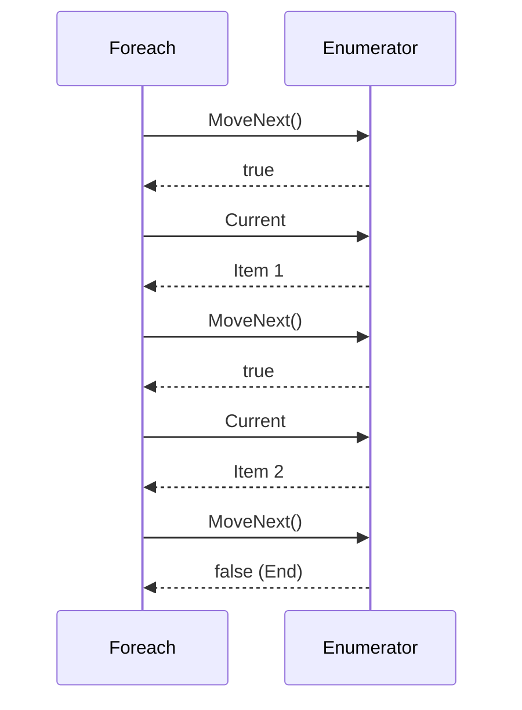

# 第63章：Iterator ①：foreachの裏側を知る🚶‍♀️

## ねらい🎯✨





* 「Iterator（イテレータ）」が解く困りごと――**“走査（なめる）方法を統一して、内部構造を隠したい”**――を、ちゃんと言葉で説明できるようになるよ🙂📣
* C#では Iterator が **ほぼ標準機能として完成してる**ので、「それっぽいクラス」を作るよりも、まずは **IEnumerable<T> / IEnumerator<T> / foreach** の役割を体感するよ🧠💡
* そして「foreachって、実は何やってるの？」をスッキリさせる回だよ〜👀✨
  （C# 14 は .NET 10 でサポートされるよ）([Microsoft Learn][1])

---

## 到達目標🌸✅

この章が終わったら、次のことができればOKだよ🙆‍♀️✨

* 「Iteratorって何？」を **30秒で説明**できる📣🙂
* 「foreach は列挙子（IEnumerator）を使って回してる」って **イメージできる**🔁
* 自分のクラスで **IEnumerable<T> を返す**ことで、内部の持ち方（List/配列/DB結果など）を隠せるって分かる🫣✨
* 「yield return は“列挙を作るための標準の書き方”」って言える🌟([Microsoft Learn][2])

---

## 手順🧭👣

### 1) まずは「foreach＝Iterator」だと思ってOK🧺✨

C# の世界では、Iterator パターンはだいたいこういう意味だよ👇

* **外からは “foreach で回せる” だけに見せたい**
* 中身が **List でも配列でも何でもいい**（変えても呼び出し側が壊れない）
* “回し方”のルールを **IEnumerable<T> に統一**する

つまり、**「走査の共通インターフェイス」＝ IEnumerable<T>** が主役だよ🌟

---

### 2) foreach の裏側：列挙子（IEnumerator）で回してる🔁🧠

「foreach は列挙子の複雑さを隠してくれる」って公式ドキュメントにも書いてあるよ📚✨([Microsoft Learn][3])
ざっくり裏側はこんな感じ👇（※ “だいたいこう” のイメージ版だよ）

* コレクションから GetEnumerator() をもらう
* MoveNext() で次へ進む
* Current で今の要素を読む
  （GetEnumerator が IEnumerator<T> を返すこと、MoveNext/Current の流れは公式説明そのまま）([Microsoft Learn][4])

---

### 3) 手で回してみる：IEnumerator を直に触って正体を見破る🕵️‍♀️✨

「foreach が何を隠しているか」を体で覚えると、Iterator が一気に分かりやすくなるよ💪🙂

```csharp
using System;
using System.Collections.Generic;

public sealed record Order(int Id, decimal Total);

public static class Program
{
    public static void Main()
    {
        var orders = new List<Order>
        {
            new(1, 1200m),
            new(2, 500m),
            new(3, 3000m),
        };

        // foreach（いつもの）
        foreach (var o in orders)
        {
            Console.WriteLine($"foreach: {o.Id} / {o.Total}");
        }

        Console.WriteLine("---");

        // IEnumerator を手で回す（裏側を体験）
        using var e = ((IEnumerable<Order>)orders).GetEnumerator();
        while (e.MoveNext())
        {
            var o = e.Current;
            Console.WriteLine($"manual: {o.Id} / {o.Total}");
        }
    }
}
```

ポイント💡

* これだけで「foreachって、列挙子で回してるんだな〜」が腹落ちするよ🙂✨
* そして **“回せる” という能力を外に見せるのが IEnumerable<T>** だよ🌟

---

### 4) Iteratorパターンっぽくするコツ：戻り値を IEnumerable にする🫶✨

ありがちな失敗がこれ👇

* 「内部で List<Order> を持ってる」
* それをそのまま外に渡す（List を公開）
  → 呼び出し側が Add/Remove できちゃって、**中の事情が漏れる**😵‍💫💦

Iterator っぽくするなら、まずは **“列挙できる形（IEnumerable）だけ外に見せる”** のが超強いよ🛡️✨

```csharp
using System.Collections;
using System.Collections.Generic;

public sealed record Order(int Id, decimal Total);

public sealed class OrderBook : IEnumerable<Order>
{
    private readonly List<Order> _orders = new();

    public void Add(Order order) => _orders.Add(order);

    // Iteratorパターンの入口：foreach できるようにする
    public IEnumerator<Order> GetEnumerator() => _orders.GetEnumerator();

    // 非ジェネリック版も必要（IEnumerable の契約）
    IEnumerator IEnumerable.GetEnumerator() => GetEnumerator();
}
```

これで外からは👇みたいに “回せる” だけが見えるよ🙂✨

```csharp
var book = new OrderBook();
book.Add(new Order(1, 1200m));
book.Add(new Order(2, 500m));

foreach (var o in book)
{
    // 呼び出し側は「中が List かどうか」知らなくてOK
    Console.WriteLine(o);
}
```

「GetEnumerator は foreach を支えるために実装される」って説明も、まさにこの話だよ🧩✨([Microsoft Learn][5])

---

### 5) yield return を “ちら見せ”🌟（次章の主役！）

yield return は、**列挙（Iterator）を作るための言語機能**だよ✨([Microsoft Learn][2])
次章でガッツリやるけど、ここでは “雰囲気” だけ先に🙂

```csharp
using System.Collections.Generic;

public static class OrderQueries
{
    public static IEnumerable<Order> ExpensiveOnly(IEnumerable<Order> source, decimal threshold)
    {
        foreach (var o in source)
        {
            if (o.Total >= threshold)
            {
                yield return o; // ここで1件ずつ返していくイメージ✨
            }
        }
    }
}

public sealed record Order(int Id, decimal Total);
```

これ、何が嬉しいの？🤔💡

* 「フィルタした結果を List に詰めて返す」じゃなくて、**必要になった分だけ順に返せる**（遅延評価）
* しかも呼び出し側は **普通に foreach** するだけでOK🎀

---

## よくある落とし穴⚠️😵‍💫

### 落とし穴1：遅延評価で「例外のタイミング」がズレる⏳💥

yield return は遅延評価になりやすいから、
**メソッドを呼んだ時点では成功っぽいのに、foreach し始めた瞬間に落ちる**…みたいなことが起きるよ😇💦

---

### 落とし穴2：多重列挙で副作用が二重に起きる🔁🔥

列挙の中でログを書いたり、外部アクセスしたりすると、
同じ IEnumerable を2回 foreach しただけで **2回実行される**ことがあるよ😵‍💫
（「遅延評価」はパワーだけど、扱いは丁寧にね🫶）

---

### 落とし穴3：yield の制約にひっかかる🧱

yield return / yield break は **try/catch/finally の場所に制限**があるよ⚠️
特に「catch や finally の中では使えない」などのルールがあるから、引っかかったら公式の制約を見に行くのが最短だよ🧭✨([Microsoft Learn][6])

---

## 演習（10〜30分）🧪🍰

### お題：OrderBook を “Iteratorっぽく” して、呼び出し側をスッキリさせよう✨

1. OrderBook を作る（内部は List<Order> でOK）🧺
2. OrderBook を foreach できるようにする（IEnumerable<Order>）🔁
3. 「合計が1000以上の注文だけ」列挙するメソッドを1つ作る（まずは普通に foreach + if でOK）🙂
4. 余裕があれば、そのメソッドを yield return で書き換える🌟

テストもできたら最高だよ🧁✨（“列挙結果が期待通り” を固定する）

```csharp
using Microsoft.VisualStudio.TestTools.UnitTesting;
using System.Linq;

[TestClass]
public class IteratorTests
{
    [TestMethod]
    public void OrderBook_IsEnumerable()
    {
        var book = new OrderBook();
        book.Add(new Order(1, 1200m));
        book.Add(new Order(2, 500m));

        var ids = book.Select(x => x.Id).ToArray();

        CollectionAssert.AreEqual(new[] { 1, 2 }, ids);
    }
}
```

---

## 自己チェック✅🪄

* 「Iteratorって何？」→ **“走査を統一して、内部構造を隠すやつ！”** と言えた🙂📣
* 「foreach の裏側」→ **GetEnumerator / MoveNext / Current** の流れを説明できた🔁
* 自分のクラスを **IEnumerable<T> にするだけ**で、呼び出し側がスッキリするのを体感できた✨
* yield return の “遅延評価” に **ちょっとだけビビれた**（ビビれたら勝ち😎⚡）

[1]: https://learn.microsoft.com/en-us/dotnet/csharp/whats-new/csharp-14?utm_source=chatgpt.com "What's new in C# 14"
[2]: https://learn.microsoft.com/ja-jp/dotnet/csharp/language-reference/statements/yield?utm_source=chatgpt.com "yield ステートメント - 反復子で次の要素を指定する - C# ..."
[3]: https://learn.microsoft.com/ja-jp/dotnet/api/system.collections.generic.list-1.system-collections-generic-ienumerable-t--getenumerator?view=net-8.0&utm_source=chatgpt.com "List<T>.IEnumerable<T>.GetEnumerator メソッド"
[4]: https://learn.microsoft.com/ja-jp/dotnet/api/system.collections.generic.ienumerable-1.getenumerator?view=net-8.0&utm_source=chatgpt.com "IEnumerable<T>.GetEnumerator メソッド"
[5]: https://learn.microsoft.com/en-us/dotnet/api/system.collections.ienumerable.getenumerator?view=net-10.0&utm_source=chatgpt.com "IEnumerable.GetEnumerator Method (System.Collections)"
[6]: https://learn.microsoft.com/en-us/dotnet/csharp/language-reference/statements/yield?utm_source=chatgpt.com "yield statement - provide the next element in an iterator"
