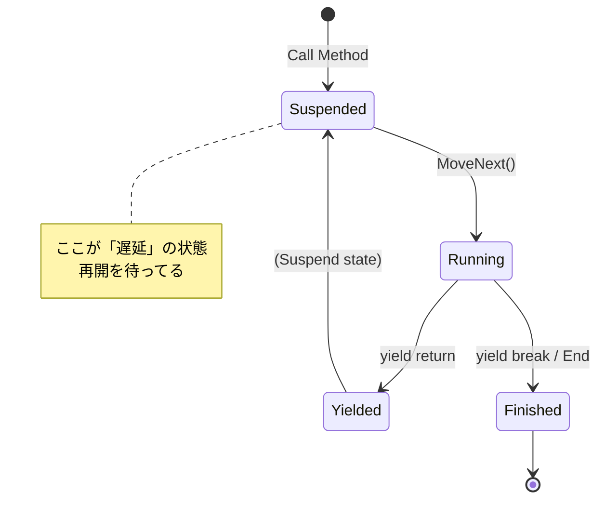

# 第64章：Iterator ②：C#本命（IEnumerable / yield return）🌟

## ねらい 🎯✨





* C#の **Iterator（反復）** が、ほぼ **`IEnumerable<T>` + `foreach` + `yield return`** で出来ていることを体感するよ〜🚶‍♀️🧺
* 「内部構造は隠して、走査方法だけ統一する」っていう **“気持ちよさ”** を、.NET標準APIの実例で覚えるよ📚💕

---

## 到達目標 ✅🌸

* `foreach` の正体が「列挙子を取って回してるだけ」と説明できる🌀
* `IEnumerable<T>` と `IEnumerator<T>` の役割を、**利用者視点**で言える（＝何を知らなくてよくなるか）🙂
* `yield return` を見たら「遅延実行（deferred execution）」を思い出して、落とし穴も言える⚠️
* `File.ReadLines` / `Directory.EnumerateFiles` が **“必要になった分だけ読む系”** だと説明できる📄🔍

---

## 手順 🧭✨

### 1) `foreach` の裏側をざっくり掴む 🚶‍♀️🧠

C#の `foreach` は、コレクションから **列挙子（Enumerator）をもらって**、
`MoveNext()` で進めながら `Current` を読んでる…ってイメージだよ〜🌀
（言語仕様としてそういう動きになるよ）([Microsoft Learn][1])

超ざっくり擬似コード（雰囲気だけ掴めればOK）👇

```csharp
// だいたいこんな感じ（概念）
var e = sequence.GetEnumerator();
try
{
    while (e.MoveNext())
    {
        var item = e.Current;
        // ここが foreach 本体
    }
}
finally
{
    (e as IDisposable)?.Dispose();
}
```

※ “Dispose されるかも” も大事ポイントだよ〜♻️✨

---

### 2) `IEnumerable<T>` は「列挙子を作れるよ」の契約📜

`IEnumerable<T>` は **「私は反復できます」** の合図で、やることはほぼ1つだけ👇

* `GetEnumerator()` で `IEnumerator<T>` を返す([Microsoft Learn][2])

そして `IEnumerator<T>` 側が、反復の三点セット👇

* `MoveNext()`（次へ進む）
* `Current`（今の要素）
* `Dispose()`（必要ならお片付け）

つまり利用者（呼び出し側）は **中身の構造（List？木構造？ファイル？DB？）を知らなくてOK** になるよ〜😳💡

---

### 3) `yield return` は “Iterator を自動生成”してくれる魔法🪄✨

C#の `yield return` は、**遅延実行を支える言語機能**として紹介されてるよ🧠
「必要になった瞬間に、次の要素を1個ずつ作って返す」っていうノリ🧁
（典型的な実装は lazy evaluation だよ）([Microsoft Learn][3])

例：注文の中から「一定以上の注文だけ」返すイテレータ🍰

```csharp
public static IEnumerable<Order> HighValueOrders(IEnumerable<Order> source, decimal threshold)
{
    foreach (var o in source)
    {
        if (o.Total >= threshold)
            yield return o; // 条件に合ったものだけ、1個ずつ返す✨
    }
}
```

ここで大事なのは👇

* このメソッド呼んだ瞬間には **まだ走査が始まってない** ことが多い（＝遅延実行）([Microsoft Learn][3])
* 走査が始まるのは、`foreach` した時など！([Microsoft Learn][2])

---

### 4) .NET標準の “Iteratorっぽい” 実例を読む📚🔍

#### 4-1) `File.ReadLines`：ファイルを「全部読まずに」1行ずつ📄✨

`File.ReadLines(...)` は `IEnumerable<string>` を返すよ。
そして **列挙していく途中でファイル内容が読まれる**（＝全部まとめて読み込まない）って明記されてる🥹👍([Microsoft Learn][4])

```csharp
foreach (var line in File.ReadLines("orders.log"))
{
    // ここに来たタイミングで、必要な分だけ読まれていく📄✨
    Console.WriteLine(line);
}
```

#### 4-2) `Directory.EnumerateFiles`：ファイル一覧を “必要になった分だけ” 🗂️🚶‍♀️

`Directory.EnumerateFiles(...)` も `IEnumerable<string>`。
しかも **列挙結果はキャッシュされない**、そして **`GetEnumerator()` を呼ぶたびに新しい列挙が始まる**ってハッキリ書いてあるよ〜⚠️([Microsoft Learn][5])

```csharp
var files = Directory.EnumerateFiles("C:\\logs", "*.log");

// ここではまだ列挙は進んでない（遅延っぽい）
// 使った瞬間に動く💨
foreach (var f in files)
{
    Console.WriteLine(f);
}
```

---

### 5) 「lazy だけじゃない」：`OrderBy` みたいに先に全部必要な例もある🧠📏

遅延実行の説明の中で、`OrderBy` は **最初の要素を返す前に全体を処理（ソート）する必要がある**例として出てくるよ〜📌([Microsoft Learn][3])
なので Iterator を見たらいつも「全部遅延だ！」と思わずに、**何の処理か**で考えるのがコツ💡

---

## よくある落とし穴 ⚠️🌀

### 落とし穴1：遅延実行で「作ったのに何も起きない」😵

`var q = source.Select(...);` みたいに書いても、**列挙されるまで処理が走らない**ことが多いよ〜（典型）([Microsoft Learn][2])
なのでデバッグ中「えっ動いてない？」ってなる😂

### 落とし穴2：例外のタイミングがズレる💥

ファイル列挙や変換処理の例外が、メソッド呼び出し時じゃなくて
`foreach` で回した瞬間に出たりする😇（遅延あるある）

### 落とし穴3：**複数回列挙**で、同じ処理が何回も走る（＆遅い／バグる）🐢💦

`IEnumerable` は、作った結果が **自動でキャッシュされない**（“Lazyみたいにキャッシュされるわけじゃない”）って説明されてるよ⚠️([Microsoft Learn][2])
つまりこういうのは危ない👇

```csharp
var seq = GetOrders().Where(o => o.Total >= 1000);

// 1回目の列挙：Count()
var n = seq.Count();

// 2回目の列挙：foreach
foreach (var o in seq) { }
```

この “複数列挙問題” は、.NETの品質ルールでも注意されてるよ〜🧯([Microsoft Learn][2])

**対策の基本**は2つ👇

* 「本当に複数回必要？」をまず疑う🤔
* 必要なら `ToArray()` / `ToList()` で **一度具体化**（ただしメモリ増える）([Microsoft Learn][2])

### 落とし穴4：列挙中にリソース（ファイル等）を掴む場合の寿命♻️📄

`File.ReadLines` みたいに「列挙しながら読む」系は、**列挙が終わるまで何かを保持**してる可能性が高いよね。
だから **途中で列挙を放棄**した時の挙動（Disposeされる？）も意識すると安心〜🙂✨

---

## 演習 🧪🎀（10〜30分×2本）

### 演習1：`ReadLines` の “遅延っぽさ” をデバッグで見る🔍🧁

1. 小さなテキストファイル（3〜5行）を用意📄
2. `var lines = File.ReadLines(path);` の次の行にブレークポイント🧷
3. `foreach` の中にもブレークポイント🧷
4. **「代入しただけでは読まれてない」感じ**を、ステップ実行で確認する👀✨
   ポイント：列挙が進むところで動き出すよ〜([Microsoft Learn][4])

### 演習2：複数列挙をわざと踏んで、`ToArray()` で直す🧯🍀

題材は “重い列挙” を疑似的に作ればOK💡

```csharp
public static IEnumerable<int> SlowNumbers()
{
    for (int i = 1; i <= 3; i++)
    {
        Console.WriteLine($"produce {i}");
        yield return i;
    }
}
```

1. `var seq = SlowNumbers();` を作る
2. `seq.Count()` → `foreach` をやる（Console出力が何回出る？）
3. 次に `var materialized = seq.ToArray();` にしてから同じことをやる
4. 違いをメモ📝
   「列挙はキャッシュされない」って話とつなげるよ〜([Microsoft Learn][2])

#### AIに頼むなら（プロンプト例）🤖💬

* 「`IEnumerable<T>` と `yield return` を使って、遅延実行の動きが見える最小コードをC#で。`Count()` と `foreach` で複数列挙が分かるように。余計な抽象化は禁止。」

---

## 自己チェック ✅💖

* `foreach` が何を呼んでループしてるか、口で説明できる？([Microsoft Learn][1])
* `IEnumerable<T>` が「内部構造を隠す」ってどういう意味か言える？([Microsoft Learn][2])
* `yield return` を見たら「遅延実行かも！」って警戒できる？([Microsoft Learn][3])
* `File.ReadLines` / `Directory.EnumerateFiles` が “全部読み” じゃない理由を言える？([Microsoft Learn][4])
* `Count()`→`foreach` みたいな複数列挙が危ないケースを説明できる？([Microsoft Learn][2])

[1]: https://learn.microsoft.com/en-us/dotnet/csharp/language-reference/statements/yield "yield statement - provide the next element in an iterator - C# reference | Microsoft Learn"
[2]: https://learn.microsoft.com/ja-jp/dotnet/fundamentals/code-analysis/quality-rules/ca1851 "CA1851: 'IEnumerable' コレクションの複数列挙の可能性 - .NET | Microsoft Learn"
[3]: https://learn.microsoft.com/en-us/dotnet/standard/linq/deferred-execution-lazy-evaluation "Deferred execution and lazy evaluation - LINQ to XML - .NET | Microsoft Learn"
[4]: https://learn.microsoft.com/ja-jp/dotnet/api/system.io.file.readlines?view=net-8.0 "File.ReadLines メソッド (System.IO) | Microsoft Learn"
[5]: https://learn.microsoft.com/en-us/dotnet/api/system.io.directory.enumeratefiles?view=net-10.0 "Directory.EnumerateFiles Method (System.IO) | Microsoft Learn"
