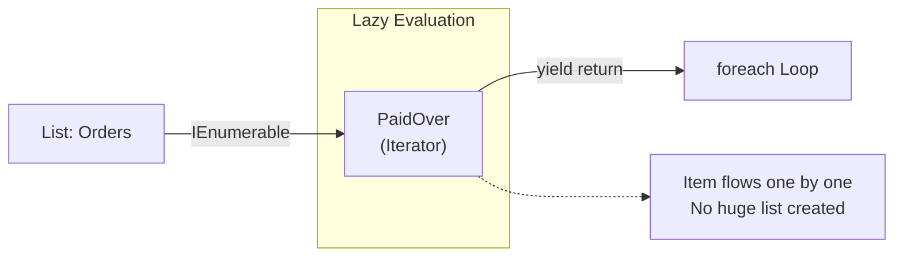

# 第65章：Iterator ③：演習（注文のフィルタ列挙をyieldで）🛒

## ねらい 🎯💖





* 「注文一覧をフィルタして返す」みたいな処理を、**IEnumerable<T>** と **yield return** でスッキリ書けるようになるよ〜😊
* **foreach で回せる形（＝列挙可能）**にしておくと、呼び出し側が気持ちよくなる✨
* **遅延実行（必要になった分だけ取り出す）**の感覚を、テストでちゃんと体験するよ🧪🌸（LINQの遅延実行と同じ発想だよ）([Microsoft Learn][1])
* IEnumerator を自力実装しなくても、C#は **yield** で Iterator（反復子）を書けるのが強い💪😆([Microsoft Learn][2])

---

## 到達目標 🏁🌟

* IEnumerable<T> を返すフィルタ処理を **yield return** で書ける😊
* 「Listで全部作って返す（即時実行）」と「yieldで返す（遅延実行）」の違いを説明できる🧠✨
* **MSTest** で「動く・テストが通る・責務が薄い」を満たせる🧪🎀([Microsoft Learn][3])
* “同じ IEnumerable を2回列挙すると2回走る” を理解して、対策（ToListでキャッシュ等）を選べる🔁🙂

---

## 手順 🧩🛠️

## 1) プロジェクトを作る📁✨

* ソリューション：GofPatterns
* クラスライブラリ：ECommerce（Target Framework は net10.0 でOK。LTSだよ〜）🧡([Microsoft Learn][4])
* テスト：ECommerce.Tests（MSTest）🧪🌸([Microsoft Learn][3])

---

## 2) 例題の最小ドメインを用意する🍰🛒

「注文(Order)」を最低限だけ作るよ😊

### OrderStatus.cs

```csharp
namespace ECommerce;

public enum OrderStatus
{
    New = 0,
    Paid = 1,
    Shipped = 2,
    Cancelled = 3
}
```

### Order.cs

```csharp
namespace ECommerce;

public sealed record Order(
    int Id,
    OrderStatus Status,
    decimal TotalAmount,
    DateTime CreatedAtUtc
);
```

---

## 3) 導入前：まずは“素朴にListで返す”版を作る🧺🙂

「全部走査して、条件に合うものを List に詰めて返す」やつ。わかりやすいけど、**毎回ぜんぶ走る**し、**全部メモリに乗る**感じになりがち😵

### OrderFilters_Eager.cs

```csharp
using System.Collections.Generic;

namespace ECommerce;

public static class OrderFiltersEager
{
    public static List<Order> PaidOver(IEnumerable<Order> source, decimal minTotalAmount)
    {
        ArgumentNullException.ThrowIfNull(source);
        if (minTotalAmount < 0) throw new ArgumentOutOfRangeException(nameof(minTotalAmount));

        var result = new List<Order>();

        foreach (var order in source)
        {
            if (order.Status == OrderStatus.Paid && order.TotalAmount >= minTotalAmount)
            {
                result.Add(order);
            }
        }

        return result;
    }
}
```

---

## 4) 導入後：Iterator（yield return）版に置き換える🚶‍♀️✨

ここが本番〜！💖
IEnumerable<T> を返せば foreach できるし、必要な分だけ取り出せるよ😊([Microsoft Learn][2])
yield は「次の要素を返す」「終わる」を表現できるよ🪄([Microsoft Learn][5])

### コツ：引数チェックを“即時”にしたいときはラッパーを作る⚠️

yield を含むメソッドは **呼び出した瞬間には中身が走らず**、列挙されたときに走る（遅延）から、引数チェックも遅れがち🙃
だから「チェックだけ先にして、実体は別メソッドにyieldで書く」って形が超よく使われるよ👍

### OrderFilters_Iterator.cs

```csharp
using System.Collections.Generic;

namespace ECommerce;

public static class OrderFilters
{
    // ✅ ここは“普通のメソッド”。なので引数チェックが呼び出し時に走るよ🙂
    public static IEnumerable<Order> PaidOver(IEnumerable<Order> source, decimal minTotalAmount)
    {
        ArgumentNullException.ThrowIfNull(source);
        if (minTotalAmount < 0) throw new ArgumentOutOfRangeException(nameof(minTotalAmount));

        return PaidOverImpl(source, minTotalAmount);
    }

    // ✅ ここがIterator本体（遅延実行）
    private static IEnumerable<Order> PaidOverImpl(IEnumerable<Order> source, decimal minTotalAmount)
    {
        foreach (var order in source)
        {
            if (order.Status == OrderStatus.Paid && order.TotalAmount >= minTotalAmount)
            {
                yield return order; // 🌟 1個ずつ返す
            }
        }

        // 何も返すものがなければ、自然に終わる（yield breakでもOK）🧁
    }
}
```

---

## 5) “呼び出し側”はどう楽になる？😆🎉

* foreach でそのまま回せる🚶‍♀️✨
* さらに LINQ と繋げやすい（Where / Take / First など）🔗💎
* ただし！**同じ IEnumerable を2回列挙すると2回走る**（重要）🔁😵

---

## 6) テストを書く🧪🌸（動く・通る・薄い！）

MSTest は、TestClass / TestMethod でテストを認識するよ〜😊([Microsoft Learn][3])
（TestMethod は void / Task / ValueTask もOK、みたいな契約もあるよ）([Microsoft Learn][3])

### OrderFiltersTests.cs

```csharp
using System;
using System.Collections.Generic;
using System.Linq;
using Microsoft.VisualStudio.TestTools.UnitTesting;

namespace ECommerce.Tests;

[TestClass]
public class OrderFiltersTests
{
    [TestMethod]
    public void PaidOver_filters_correctly()
    {
        var orders = SampleOrders();

        var filtered = OrderFilters.PaidOver(orders, minTotalAmount: 3000m).ToList();

        // Paid かつ 3000以上だけ
        Assert.AreEqual(2, filtered.Count);
        CollectionAssert.AreEqual(new[] { 2, 4 }, filtered.Select(o => o.Id).ToArray());
    }

    [TestMethod]
    public void PaidOver_is_lazy_until_enumerated()
    {
        var log = new List<int>();
        IEnumerable<Order> source = SampleOrdersWithLog(log);

        var query = OrderFilters.PaidOver(source, minTotalAmount: 3000m);

        // まだ列挙してないのでログは空🫧
        Assert.AreEqual(0, log.Count);

        // First() した瞬間に必要な分だけ進む🏃‍♀️💨
        var first = query.First();

        Assert.AreEqual(2, first.Id);
        CollectionAssert.AreEqual(new[] { 1, 2 }, log); // 1→2まで見たところで最初のヒット
    }

    [TestMethod]
    public void PaidOver_argument_check_happens_immediately()
    {
        Assert.ThrowsException<ArgumentNullException>(() =>
        {
            _ = OrderFilters.PaidOver(null!, 100m); // 呼び出し時点で落ちるのが嬉しい👍
        });
    }

    private static List<Order> SampleOrders() =>
        new()
        {
            new Order(1, OrderStatus.New,     5000m, DateTime.UnixEpoch),
            new Order(2, OrderStatus.Paid,    3000m, DateTime.UnixEpoch),
            new Order(3, OrderStatus.Paid,    1000m, DateTime.UnixEpoch),
            new Order(4, OrderStatus.Paid,    9000m, DateTime.UnixEpoch),
            new Order(5, OrderStatus.Shipped, 7000m, DateTime.UnixEpoch),
        };

    private static IEnumerable<Order> SampleOrdersWithLog(List<int> log)
    {
        foreach (var o in SampleOrders())
        {
            log.Add(o.Id);       // いま何個目まで見たかを記録📌
            yield return o;      // ここもyieldで“供給”してるよ✨
        }
    }
}
```

ここまで動けばOK〜！🎉✨
※ 公式ドキュメントを読むときは、Microsoft の Learn がいちばん確実だよ📚🧡（yield / IEnumerable / MSTest も全部まとまってる）([Microsoft Learn][2])

---

## 落とし穴 🕳️⚠️

1. 遅延実行で「例外がいつ出るか」ズレる😵

* 呼び出した瞬間じゃなく、列挙したタイミングで落ちることがあるよ。遅延実行の性質だね🫠([Microsoft Learn][1])

2. 2回列挙すると2回“同じ処理”が走る🔁😱

* DB/HTTP みたいな重いソースに繋がってる IEnumerable だと事故る💥
* 必要なら ToList() で一度だけ評価してキャッシュするのもアリ🙂

3. 副作用（ログ出力、乱数、現在時刻）を iterator の中でやると再現性が壊れやすい🌀

* テストが不安定になりがちだよ🥲

4. “順番に依存する処理”が増えると、読みにくくなる📦😵

* Iterator は「走査を隠す」のが主役！
* ビジネスロジックを詰め込みすぎないのがコツだよ🍬

---

## 演習 📝💗

## 演習1：フィルタ条件を増やす（期間も入れる）📅✨

* OrderFilters に、作成日時の範囲でも絞れる版を追加してね😊

  * 例：Paid かつ minTotal 以上 かつ from〜to の間

ヒント：引数チェックはラッパーに置いて、Impl の中で yield return する構造はそのまま使ってOK👍

---

## 演習2：先頭N件だけ返す（yield breakを使う）🧁🔚

* “条件に合う注文を最大N件だけ返す” メソッドを作ってみてね😊
* N件返したら、その時点で終わらせると効率よし✨（yield は「終了」も表現できるよ）([Microsoft Learn][5])

---

## 演習3：AI補助でテスト雛形→人間がレビュー🤖👀✨

* GitHub Copilot などに「MSTestで、遅延実行を検証するテストを書いて」って頼んで雛形を出してもらう
* 最後に人間の目でチェック👇

  * そのテスト、列挙回数をちゃんと観測できてる？🔁
  * “たまたま通る” じゃなくて、失敗条件も作れてる？💥
  * 依存（DateTime.Now とか）を入れてテスト不安定にしてない？🌀

（もし OpenAI Codex を使うなら、OpenAI 系の拡張でも同じノリでOKだよ😊）

---

## チェック ✅🌸

* IEnumerable<T> を返すと、呼び出し側が foreach で回せるって説明できる？🚶‍♀️✨([Microsoft Learn][2])
* yield return のコードは「呼んだ瞬間」じゃなく「列挙した瞬間」に動くって言える？🫧([Microsoft Learn][1])
* 引数チェックを“即時”にしたいとき、ラッパー＋Impl に分ける理由を説明できる？🙂
* 同じ IEnumerable を2回列挙すると2回走るのを理解して、必要なら ToList() を選べる？🔁💡
* MSTest の TestClass / TestMethod を使って、演習がテストで守れてる？🧪🎀([Microsoft Learn][3])

---

[1]: https://learn.microsoft.com/en-us/dotnet/standard/linq/deferred-execution-lazy-evaluation?utm_source=chatgpt.com "Deferred execution and lazy evaluation - LINQ to XML - .NET"
[2]: https://learn.microsoft.com/en-us/dotnet/api/system.collections.generic.ienumerable-1?view=net-10.0&utm_source=chatgpt.com "IEnumerable<T> Interface (System.Collections.Generic)"
[3]: https://learn.microsoft.com/en-us/dotnet/core/testing/unit-testing-mstest-writing-tests-attributes?utm_source=chatgpt.com "MSTest attributes - .NET"
[4]: https://learn.microsoft.com/en-us/dotnet/core/whats-new/dotnet-10/overview?utm_source=chatgpt.com "What's new in .NET 10"
[5]: https://learn.microsoft.com/en-us/dotnet/csharp/language-reference/statements/yield?utm_source=chatgpt.com "yield statement - provide the next element in an iterator"
