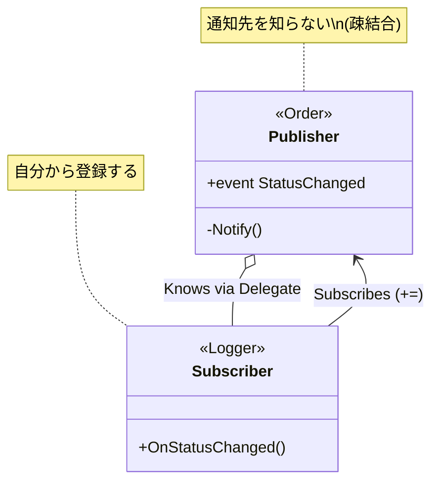

# 第66章：Observer ①：変化を知らせる📣

## ねらい 🎯





Observer は、**ある場所で起きた変化（イベント）を、関係者（購読者）に“疎結合”で通知する**ための考え方だよ〜！🔔✨
C# では **`event` / `EventHandler`** がまさに定番の実装手段で、**発行者（publisher）** と **購読者（subscriber）** をゆる〜くつなげられるのが強み😊
（“通知したい相手が増えても、発行者側のコードをいじらず足せる” がキモ！） ([Microsoft Learn][1])

---

## 到達目標 🌸

この章が終わったら、次ができるようになるよ〜！✨

* Observer が解く困りごとを、**「何が変化して」「誰に知らせたいか」**で説明できる🙂
* **`event EventHandler<TEventArgs>`** で、C#の“定番の形”でイベントを作れる🔔 ([Microsoft Learn][2])
* 購読（`+=`）と購読解除（`-=`）の大切さ（メモリリーク回避）を説明できる🧯😵
* 「イベントの契約」＝ **いつ通知？何を渡す？例外は？重い処理は？** を決められる📝✨

---

## 手順 🧭✨

### 1) “変化”と“知らせたい人”を分けて書く 📝

まずは超シンプルにこれだけ👇

* 変化（イベント）例：注文が **確定した** / **支払い済みになった** / **発送された** 🛒📦
* 知らせたい人（購読者）例：メール通知、監査ログ、画面更新、ポイント付与…📧🧾🖥️🎁

ここで大事なのは、**発行者が購読者を直接呼ばない**こと！
（発行者が `EmailSender` とか知り始めると、依存が太って地獄🔥）

---

### 2) C#の“標準イベントパターン”で設計する 🔔✨

C#/.NET には「こう書くのが定番だよ」ってガイドがあるよ〜📚

* イベント型は **`EventHandler<TEventArgs>` を使う**（独自デリゲートを増やしにくい） ([Microsoft Learn][2])
* 渡す情報は **`EventArgs` の派生クラス**にする（あとで情報が増えても困らない） ([Microsoft Learn][2])

---

### 3) 最小の“発行者（publisher）”を書いてみる 🧩

例：`Order`（注文）が状態変化を通知するよ〜📣

```csharp
public enum OrderStatus
{
    New,
    Paid,
    Shipped
}

public sealed class OrderStatusChangedEventArgs : EventArgs
{
    public OrderStatusChangedEventArgs(OrderStatus before, OrderStatus after)
    {
        Before = before;
        After = after;
    }

    public OrderStatus Before { get; }
    public OrderStatus After { get; }
}

public sealed class Order
{
    public OrderStatus Status { get; private set; } = OrderStatus.New;

    // ✅ 定番：EventHandler<TEventArgs>
    public event EventHandler<OrderStatusChangedEventArgs>? StatusChanged;

    public void MarkPaid()
    {
        if (Status != OrderStatus.New)
            throw new InvalidOperationException("New の注文だけ支払い可能です");

        var before = Status;
        Status = OrderStatus.Paid;

        OnStatusChanged(before, Status);
    }

    private void OnStatusChanged(OrderStatus before, OrderStatus after)
    {
        // ✅ event の起動（購読者がいれば呼ばれる）
        StatusChanged?.Invoke(this, new OrderStatusChangedEventArgs(before, after));
    }
}
```

ポイント💡

* `event` は「外から `Invoke` できない」「勝手に代入できない」など、**安全な公開**になりやすいよ〜🛡️
* `publisher/subscriber` の言い方は .NET ドキュメントでも定番！ ([Microsoft Learn][1])

---

### 4) “購読者（subscriber）”を書いてみる 👂✨

例：支払いになったら「ログに書く」購読者🧾

```csharp
public sealed class OrderAuditLogger : IDisposable
{
    private readonly Order _order;

    public OrderAuditLogger(Order order)
    {
        _order = order;
        _order.StatusChanged += OnStatusChanged; // ✅ 購読
    }

    private void OnStatusChanged(object? sender, OrderStatusChangedEventArgs e)
    {
        if (e.After == OrderStatus.Paid)
        {
            Console.WriteLine("AUDIT: 注文が支払い済みになりました 🧾✅");
        }
    }

    public void Dispose()
    {
        // ✅ 超重要：購読解除（後で理由を説明するよ）
        _order.StatusChanged -= OnStatusChanged;
    }
}
```

---

### 5) “イベントの契約”を決める（めっちゃ大事）📜✨

イベントは「呼べば勝手に良い感じになる魔法」じゃなくて、**契約**だよ〜🙂‍↕️

最低限これを決めよう👇

* いつ発火？（状態変更の直後？前？）⏱️
* 何を渡す？（IDだけ？Before/After？）🎁
* 例外はどうする？（購読者が投げたら止める？他も動かす？）💥
* 重い処理は？（イベント内で長時間処理しない）🐢

> ちなみにイベントは multicast（複数呼び出し）で、購読順に呼ばれるのが基本だよ〜（でも順序に依存した設計は危険⚠️） ([Microsoft Learn][3])

---

### 6) AI補助（Copilot/Codex）で雛形を作るなら 🤖✍️

雛形作りは速いけど、レビューは人間がやるやつ！👀✨
おすすめプロンプト例👇

* 「`Order` に `StatusChanged` event を追加。`EventHandler<TEventArgs>` で。`EventArgs` 派生クラスに Before/After。購読解除を `IDisposable` に入れて。**外部フレームワーク作らない**で」

チェック観点🧠

* `event` が public で、`Invoke` は class 内だけ？
* `TEventArgs` が必要最小？
* 購読解除できる導線ある？（Dispose など）

---

## よくある落とし穴 ⚠️😵

### 落とし穴1：購読解除しなくてメモリリーク🧟‍♀️

長生きする publisher（例：アプリ全体で生きるサービス）が、短命な subscriber（例：画面）を購読したままだと、
**subscriber が GC されにくくなって残り続ける**ことがあるよ〜😱

WPF みたいなUI世界では、これを避けるために **弱いイベント（Weak Event）** の仕組みも使われるよ〜🪶 ([Microsoft Learn][4])

✅ 対策の基本

* `Dispose()` などで `-=` する
* “誰がいつ解除するか” を決める（契約）📝

---

### 落とし穴2：イベントの中で重い処理をする🐢💤

イベントは基本「その場で呼ばれる」ので、購読者が重い処理をすると publisher 側が詰まるよ〜💦
（ログや送信はキューに積む、などにしたくなるけど、その話は後の章で育てよう🌱）

---

### 落とし穴3：通知データに“内部構造”を渡しすぎる🧨

たとえば `List<OrderLine>` まるごと渡すとか、可変の参照を渡すと事故る…😵
まずは **ID / Before-After / 必要最小**でOK！✨
（足りなくなったら `EventArgs` を拡張できるのが、標準パターンの良さだよ〜） ([Microsoft Learn][2])

---

### 落とし穴4：購読者の例外で全部止まる💥

イベント呼び出し中に購読者が例外を投げると、publisher まで波及して止まることがあるよ〜😱
対策は「契約として許す/許さない」を決めること！

* 例外は上に伝播して止める（バグを早期発見）🧯
* 例外は握りつぶして継続（“他の購読者は動かしたい”用途）🔁

後者をやるなら、`GetInvocationList()` で1つずつ呼ぶ方法もあるよ〜（順序や多重呼び出しの理解にも役立つ✨） ([Microsoft Learn][3])

---

## 演習（10〜30分）🧪🍰

“注文の変化”を Observer で通知してみよ〜！📣✨

### お題 🎯

* `Order` に `StatusChanged` イベントを作る（この章のコードでOK）🔔
* 購読者を2つ作る

  * `OrderAuditLogger`（ログ出す）🧾
  * `OrderBadgeUpdater`（「支払い済み✅」って表示する想定で `Console.WriteLine` でもOK）🏷️

### テスト（MSTest例）🧪

イベントがちゃんと飛んだかをテストで固定しよ〜！✨

```csharp
using Microsoft.VisualStudio.TestTools.UnitTesting;

[TestClass]
public class ObserverTests
{
    [TestMethod]
    public void MarkPaid_raises_StatusChanged_once()
    {
        var order = new Order();

        int callCount = 0;
        OrderStatus? before = null;
        OrderStatus? after = null;

        order.StatusChanged += (_, e) =>
        {
            callCount++;
            before = e.Before;
            after = e.After;
        };

        order.MarkPaid();

        Assert.AreEqual(1, callCount);
        Assert.AreEqual(OrderStatus.New, before);
        Assert.AreEqual(OrderStatus.Paid, after);
    }
}
```

### 追加チャレンジ 🔥

* `Dispose()` で購読解除したら、もう通知されないことをテストしてみてね🧯✨

---

## 自己チェック ✅🌟

* Observer を **「変化の発行者」＋「購読者」** で説明できる？📣👂 ([Microsoft Learn][1])
* `event EventHandler<TEventArgs>` を使って、定番の形で書けた？🔔 ([Microsoft Learn][2])
* 購読解除（`-=`）が必要な理由を言える？🧟‍♀️→🧯 ([Microsoft Learn][4])
* 「イベントの契約（いつ/何/例外/重さ）」を決めた？📜✨
* イベントの順序に依存してない？（依存してたら危険⚠️） ([Microsoft Learn][3])

[1]: https://learn.microsoft.com/en-us/dotnet/csharp/programming-guide/events/?utm_source=chatgpt.com "Events (C# Programming Guide)"
[2]: https://learn.microsoft.com/en-us/dotnet/standard/design-guidelines/event?utm_source=chatgpt.com "Event Design - Framework Design Guidelines"
[3]: https://learn.microsoft.com/en-us/dotnet/api/system.multicastdelegate.getinvocationlist?view=net-10.0 "MulticastDelegate.GetInvocationList Method (System) | Microsoft Learn"
[4]: https://learn.microsoft.com/en-us/dotnet/desktop/wpf/events/weak-event-patterns?utm_source=chatgpt.com "Weak event patterns - WPF"
