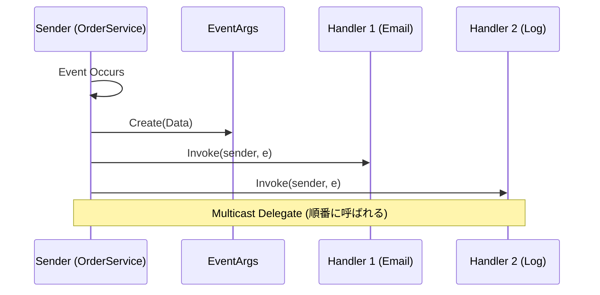

# 第67章：Observer ②：C#標準（event / EventHandler）🔔

## ねらい 🎯





* 「Observer（観測者）」を **C#の“標準のやり方”＝`event`** でスッと説明できるようになる📣
* **発行側（Subject）** が **購読者（Observer）を知らなくてよい** 状態を、実コードで体感する🧩✨
* `.NET`の定番APIを読んで「どこが差し替え点？」を見抜く目を作る👀💡

---

## 到達目標 ✅

* `event EventHandler<TEventArgs>` の意味を説明できる（`sender` と `e`）🔎
* 購読（`+=`）と解除（`-=`）を正しく使い、**解除漏れの怖さ**も説明できる😱🧯
* 「Observerを入れると、呼び出し側のif/switchが減る理由」を言語化できる🧠✨
* 「この場面はイベントでOK / これは別の仕組みが必要」を判断できる⚖️

---

## 手順 🧭

### 1) ObserverをC#に翻訳するとこうなる 📘✨

Observerはざっくり言うと、

* 変化を起こす人（発行側）がいて 👑
* それを見て反応する人（購読者）がいて 👀
* 発行側は「誰が見てるか」を知らなくてもOK 🤝

C#だとこの関係を、**`event` と `EventHandler`** で自然に表現できるよ〜🔔
`event` は「外から勝手に呼ばれないように、購読だけ許す」ためのキーワードだよ📌 ([Microsoft Learn][1])

---

### 2) “.NET標準のイベント形”を覚える（これが本命）🌟

Microsoftのガイドでも、通常は **`EventHandler` / `EventHandler<TEventArgs>` を使えば良い**（独自delegateは基本いらない）って方針だよ🧡 ([Microsoft Learn][2])
`EventHandler<TEventArgs>` 自体も「イベント用の定義済みデリゲート」だよ〜って書かれてる📚 ([Microsoft Learn][3])

まずは形を丸ごと覚えちゃうのが早い✨

```csharp
public event EventHandler? SomethingHappened;                 // 情報なし（EventArgs.Empty）
public event EventHandler<SomethingEventArgs>? SomethingHappened2; // 情報あり（EventArgs派生）
```

ポイントはこれ👇

* `sender`：誰が発行した？（たいてい `this`）
* `e`：イベントの情報（`EventArgs` か、その派生）

---

### 3) “本物のObserver”を標準APIで見る 👀🔍

「イベント＝Observer」を体感するなら、このへんが超定番✨

* **`FileSystemWatcher`**：ファイル変更をイベントで通知する📂🔔 ([Microsoft Learn][4])
* **`System.Timers.Timer`**：一定間隔でイベント発火する⏰💥（※スレッド注意あり） ([Microsoft Learn][5])
* **`INotifyPropertyChanged.PropertyChanged`**：UIバインディング等で「値変わったよ」を通知する🪞✨ ([Microsoft Learn][6])

ここで大事なのは「APIの使い手として、差し替え点はどこ？」って見ること👀
→ **購読者（ハンドラ）を追加/差し替えできる**のが差し替え点だよ💡

---

### 4) ミニ模倣コードを書く（イベント発行側＝Subject）🛒🔔

「注文確定したら通知が飛ぶ」ミニモデルでやってみよう✨
（学習用に最小！“汎用フレームワーク”とか作らないよ🙂）

```csharp
using System;

public sealed class OrderConfirmedEventArgs : EventArgs
{
    public OrderConfirmedEventArgs(int orderId, decimal total)
    {
        OrderId = orderId;
        Total = total;
    }

    public int OrderId { get; }
    public decimal Total { get; }
}

public sealed class OrderService
{
    // Observer（購読者）に向けた“通知口”
    public event EventHandler<OrderConfirmedEventArgs>? OrderConfirmed;

    public void ConfirmOrder(int orderId, decimal total)
    {
        // ここに本来は在庫引当とか支払い確定とかある想定🙂
        OnOrderConfirmed(new OrderConfirmedEventArgs(orderId, total));
    }

    private void OnOrderConfirmed(OrderConfirmedEventArgs e)
    {
        // よくある安全な呼び方：ローカルに退避してからInvoke
        var handler = OrderConfirmed;
        handler?.Invoke(this, e);
    }
}
```

ここでの美味しさ🍰

* `OrderService` は **通知先（メール/SMS/ログ）を知らない**
* 追加したい時は購読者を増やすだけでOK（疎結合）✨

---

### 5) 購読者（Observer）を“関数1個”で追加する 📩📣

C#のイベント購読はほんとにシンプル：

```csharp
public static class Observers
{
    public static void SendEmail(object? sender, OrderConfirmedEventArgs e)
    {
        Console.WriteLine($"📧 Email: Order={e.OrderId}, Total={e.Total}");
    }

    public static void SendSms(object? sender, OrderConfirmedEventArgs e)
    {
        Console.WriteLine($"📱 SMS: Order={e.OrderId}, Total={e.Total}");
    }
}

// 使い方
// var svc = new OrderService();
// svc.OrderConfirmed += Observers.SendEmail;
// svc.OrderConfirmed += Observers.SendSms;
// svc.ConfirmOrder(123, 9800m);
```

解除も同じくらい大事⚠️

```csharp
// 解除（これを忘れるとメモリリークになりやすい😱）
svc.OrderConfirmed -= Observers.SendEmail;
```

---

### 6) テストで「購読したら呼ばれる / 解除したら呼ばれない」を固定する 🧪✨

Observer系は **テストで“契約”を固める**と安心感が爆上がりするよ〜🌸

```csharp
using Microsoft.VisualStudio.TestTools.UnitTesting;

[TestClass]
public class OrderServiceTests
{
    [TestMethod]
    public void OrderConfirmed_WhenSubscribed_CallsHandler()
    {
        var svc = new OrderService();
        var called = false;

        svc.OrderConfirmed += (_, e) =>
        {
            called = true;
            Assert.AreEqual(1, e.OrderId);
            Assert.AreEqual(100m, e.Total);
        };

        svc.ConfirmOrder(1, 100m);

        Assert.IsTrue(called);
    }

    [TestMethod]
    public void OrderConfirmed_WhenUnsubscribed_DoesNotCallHandler()
    {
        var svc = new OrderService();
        var called = 0;

        void Handler(object? _, OrderConfirmedEventArgs __) => called++;

        svc.OrderConfirmed += Handler;
        svc.OrderConfirmed -= Handler;

        svc.ConfirmOrder(1, 100m);

        Assert.AreEqual(0, called);
    }
}
```

---

### 7) AI補助を使うなら「出力の型」を固定してお願いする 🤖📝

イベント周りは“それっぽい独自抽象”を作りがちなので、AIに頼むなら縛るのがコツ💡

```text
C#で .NET の標準イベントパターン（event + EventHandler<TEventArgs>）だけを使ってください。
独自delegateやイベントバス/汎用フレームワークは作らないでください。
発行側は購読者を知らない設計にしてください。
購読解除（-=）ができる例も入れて、MSTestで2本テストを書いてください。
```

---

## 落とし穴 ⚠️😵

* **解除漏れ（メモリリーク）** 🧟‍♀️
  発行側が長生きで、購読者が短命だと、購読者が回収されにくくなることがあるよ💦
  → `-=` を忘れない / 必要なら `Dispose` でまとめて解除する設計にする🧹

* **イベントの中で例外が出ると、後続の購読者が呼ばれない** 💥
  1人が例外を投げると、そこで止まっちゃう挙動になりがち😱
  → 「例外は止めるべき？続けるべき？」を決める（続けるなら1購読者ずつtry/catch）🧯

* **スレッドが違う場所で呼ばれることがある** 🧵⚡
  たとえば `Timer.Elapsed` は条件によって ThreadPool で呼ばれうるよ、って注意がある（=再入可能性も考える）⏰🌀 ([Microsoft Learn][5])
  → UI更新するならUIスレッドへ戻す（仕組みが必要）🪟

* **“イベントが1回だけ”だと思い込む** 🔁
  `FileSystemWatcher` みたいに、環境でイベントが複数回/想定外に起きる注意があるよ📂⚠️ ([Microsoft Learn][7])
  → 購読側で「重複を許す設計」や「抑制（デバウンス）」を考える🧠

* **`Action` イベントに寄せすぎる** 🤏
  もちろん書けるけど、標準の文脈（`sender`/`EventArgs`）から外れると読み手が迷いやすい💦
  → “.NETの流儀”に合わせるなら `EventHandler<TEventArgs>` が安心✨ ([Microsoft Learn][2])

---

## 演習 🧪🍰

### 演習1：購読者を3つに増やす（通知が増えても発行側は無改造）📣📣📣

1. `OrderService` の `OrderConfirmed` を使って、購読者を3つ作る

   * `Email`（ConsoleでOK）📧
   * `Sms`（ConsoleでOK）📱
   * `AuditLog`（ConsoleでOK）📝
2. `ConfirmOrder` を1回呼んで、3つ全部が動くのを確認する🎉

### 演習2：解除漏れ対策を入れる（`Dispose`でまとめて解除）🧹✨

1. 購読者側を `IDisposable` にして、`Dispose` で `-=` するようにする
2. テストで「Dispose後は呼ばれない」を確認する🧪✅

### 演習3：`INotifyPropertyChanged` っぽく触ってみる（観測の王道）🪞💎

1. `Product` に `Price` プロパティを作る
2. 変更時に `PropertyChanged` を発火（`PropertyChangedEventArgs` を使う）
3. `PropertyName` に `null` や空文字で「全部変わった」扱いにできる、みたいな“現実のルール”を軽く読む📚 ([Microsoft Learn][6])

---

## チェック ✅📌

* `event` が「購読はOK、外部からの発火はNG」を守る理由を言える？🔒 ([Microsoft Learn][1])
* `EventHandler<TEventArgs>` の `sender` と `e` の役割を説明できる？👀
* 購読（`+=`）と解除（`-=`）を、テストで保証できてる？🧪
* 発行側が「通知先の種類」を知らない状態になってる？（疎結合できてる？）🧩✨
* 例外・スレッド・解除漏れの3点を、最低1つは対策できてる？⚠️🧯

[1]: https://learn.microsoft.com/ja-jp/dotnet/csharp/language-reference/keywords/event?utm_source=chatgpt.com "'event' キーワード - C# reference"
[2]: https://learn.microsoft.com/ja-jp/dotnet/standard/events/how-to-raise-and-consume-events?utm_source=chatgpt.com "方法: イベントを発生させ、使用する - .NET"
[3]: https://learn.microsoft.com/ja-jp/dotnet/api/system.eventhandler-1?view=net-9.0&utm_source=chatgpt.com "EventHandler<TEventArgs> 代理人 (System)"
[4]: https://learn.microsoft.com/ja-jp/dotnet/api/system.io.filesystemwatcher?view=net-10.0&utm_source=chatgpt.com "FileSystemWatcher Class (System.IO)"
[5]: https://learn.microsoft.com/en-us/dotnet/api/system.timers.timer.elapsed?view=net-10.0&utm_source=chatgpt.com "Timer.Elapsed Event (System.Timers)"
[6]: https://learn.microsoft.com/en-us/dotnet/api/system.componentmodel.inotifypropertychanged.propertychanged?view=net-10.0&utm_source=chatgpt.com "INotifyPropertyChanged.PropertyChanged Event"
[7]: https://learn.microsoft.com/en-us/dotnet/api/system.io.filesystemwatcher.changed?view=net-10.0&utm_source=chatgpt.com "FileSystemWatcher.Changed Event (System.IO)"
