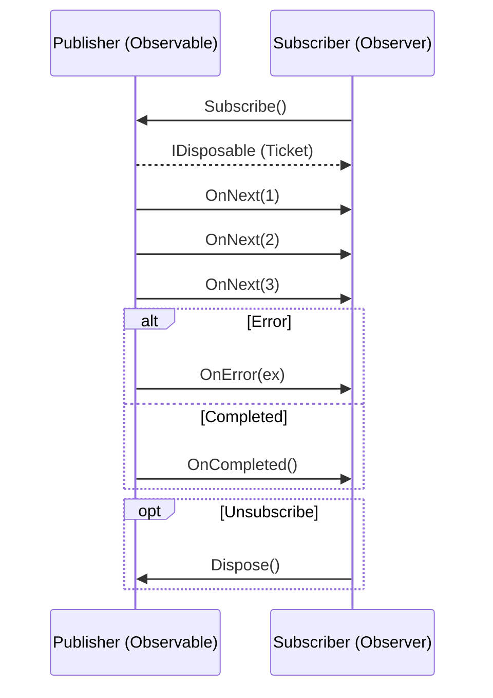

# 第68章：Observer ③：発展（IObservable<T> / Reactive系の入口）🌊

## ねらい 🎯💡





* 「通知」を“イベント1回”じゃなくて、“流れてくるデータの川（ストリーム）”として扱えるようになる 🌊✨
* `event` 版Observerの次の一歩として、`IObservable<T>` の約束（契約）を理解する 🤝🙂
* Reactive（Rx）の超入口として、**最小のコード**で「購読・解除・テスト」を体験する 🧪🌸

---

## 到達目標 🏁✨

* `IObservable<T>` が **OnNext / OnError / OnCompleted** の3つで通知を表すことを説明できる 📣
* `Subscribe()` の戻り値 `IDisposable` を使って「購読解除」できる 🧹✨
* `System.Reactive`（Rx）を使って、`Where` / `Select` くらいの基本オペレータを触れる 🔎➡️
* テストで「通知された」「解除された」「完了した」を確認できる 🧪✅

---

## 手順 🧭🌟

### 1) まず `event` と何が違うの？ 🤔🔔

`event` はだいたいこういう世界：

* 1回の出来事を通知する（クリックした！とか）🖱️
* “購読者が増えても” ただ呼び出して回るだけ 🔁

`IObservable<T>` はこう：

* 通知が **連続するデータの流れ**（0回〜無限回）🌊
* 終わりがあるなら **完了（OnCompleted）**、失敗なら **エラー（OnError）** まで含めて表現する 🧯🏁
  `IObservable<T>` は Observer パターンの push 型通知（プロバイダが押し出してくる）として設計されていて、購読は `Subscribe`、解除は `IDisposable` で行います。([Microsoft Learn][1])

---

### 2) `IObservable<T>` の「約束」3点セット 📜✨

覚えるのはこれだけでOKだよ〜🧁

* `OnNext(T value)`：値が届いた！📩
* `OnError(Exception ex)`：失敗した！ここで終了！💥
* `OnCompleted()`：正常に終わった！ここで終了！🎉

そして購読は：

* `Subscribe(...)` して
* **戻ってきた `IDisposable` を `Dispose()` したら解除** 🧹

この「解除は `IDisposable`」っていう設計が、イベントより“リーク対策しやすい”世界観になってるのがポイントだよ🙂✨([Microsoft Learn][1])

---

### 3) Reactive（Rx）って結局なに？どれ入れるの？ 📦🤖

`IObservable<T>` 自体は **標準インターフェース**だけど、これだけだと正直つらい…😵
なぜなら `Subscribe(IObserver<T>)` しかなくて、毎回 `IObserver<T>` 実装を書きがちになるから。

そこで登場するのが **Reactive Extensions（Rx）** 🎉
NuGet の `System.Reactive` を入れると、

* `Subscribe(x => ...)` みたいな **便利な購読**
* `Where` / `Select` / `Buffer` / `Throttle` みたいな **演算子（オペレータ）**
* `event` を `IObservable` に変換する橋渡し

が一気に使えるようになります ✨([nuget.org][2])

最新版の目安として、NuGet 上では **6.1.0（2025-10-03更新）** が安定版で、**7.0.0-preview.1（2025-11-06更新）** も出ています（プレビューは実務では慎重にね⚠️）。([nuget.org][2])

---

### 4) 最小サンプル：`Subject<T>` で「通知の川」を作る 🌊📣

`Subject<T>` は「通知する側」でもあり「通知される側」でもある便利アイテム（hotなストリーム）です✨
まずは“注文確定イベント”っぽいものを流してみよ〜🛒🎉

```csharp
using System;
using System.Reactive.Subjects;

public sealed record OrderConfirmed(Guid OrderId, DateTimeOffset At);

public sealed class OrderService : IDisposable
{
    private readonly Subject<OrderConfirmed> _stream = new();

    // 外には「読めるだけ」で渡す（勝手にOnNextさせない）✨
    public IObservable<OrderConfirmed> Confirmed => _stream;

    public void ConfirmOrder(Guid orderId)
        => _stream.OnNext(new OrderConfirmed(orderId, DateTimeOffset.Now));

    public void Dispose()
    {
        _stream.OnCompleted(); // 終了を知らせる（任意だけど丁寧）🎀
        _stream.Dispose();
    }
}
```

（`IObservable<T>` を外向きに公開して、`Subject<T>` は内側に隠すのが“ありがちな安全パターン”だよ🙂）

---

### 5) 購読する：`Subscribe` して、`Dispose` で解除 🧹🔔

```csharp
using System;

var service = new OrderService();

// 1人目：コンソール通知係📣
var sub1 = service.Confirmed.Subscribe(x =>
{
    Console.WriteLine($"✅ OrderConfirmed: {x.OrderId} at {x.At}");
});

// 2人目：3回だけ見て帰る係🚪
int count = 0;
var sub2 = service.Confirmed.Subscribe(_ =>
{
    count++;
    if (count >= 3)
    {
        Console.WriteLine("👋 3回見たので購読解除します");
        // 購読解除（重要！）
        sub2.Dispose();
    }
});

for (int i = 0; i < 5; i++)
{
    service.ConfirmOrder(Guid.NewGuid());
}

sub1.Dispose();
service.Dispose();
```

`Subscribe()` の戻り値が `IDisposable` で、それを `Dispose()` すると購読解除できる、が超重要ポイントだよ🧠✨([Microsoft Learn][1])

---

### 6) “if” を購読側に寄せる：`Where` / `Select` 入門 🔎➡️✨

「通知を受ける側」が増えやすいとき、購読側でフィルタすると気持ちいいよ〜🙂💕

```csharp
using System;
using System.Reactive.Linq;

var service = new OrderService();

var onlyMorning = service.Confirmed
    .Where(x => x.At.Hour < 12)                 // 午前だけ🌅
    .Select(x => $"🌸 Morning order: {x.OrderId}");

var sub = onlyMorning.Subscribe(Console.WriteLine);

service.ConfirmOrder(Guid.NewGuid());

sub.Dispose();
service.Dispose();
```

こういう “組み合わせやすさ” が Rx の強み！🧩✨([nuget.org][2])

---

### 7) 標準の `event` を `IObservable` に変換する 🌉📂

「既存の .NET のイベント」を“ストリーム化”すると、`Where/Buffer` みたいな処理が付けられて便利💕

例：`FileSystemWatcher` のイベントをストリーム化（変更を観測）📁👀

```csharp
using System;
using System.IO;
using System.Reactive.Linq;

var watcher = new FileSystemWatcher(@"C:\Temp")
{
    IncludeSubdirectories = false,
    EnableRaisingEvents = true
};

var changed = Observable.FromEventPattern<FileSystemEventHandler, FileSystemEventArgs>(
    h => watcher.Changed += h,
    h => watcher.Changed -= h
);

var sub = changed.Subscribe(e =>
{
    Console.WriteLine($"📝 Changed: {e.EventArgs.FullPath}");
});

// 終了時は両方Dispose（購読＋watcher）🧹
Console.ReadLine();
sub.Dispose();
watcher.Dispose();
```

Rx の README でも `FileSystemWatcher` をイベント→Observableに適応する例が紹介されています。([nuget.org][2])

---

### 8) テストで守る：通知・解除・完了を確認 🧪✅

「動くっぽい」だけじゃなく、**テストで安心**を作ろうね🌸

```csharp
using Microsoft.VisualStudio.TestTools.UnitTesting;
using System;
using System.Collections.Generic;
using System.Reactive.Subjects;

[TestClass]
public class ObservableTests
{
    [TestMethod]
    public void Subject_PushesValues_ToSubscribers()
    {
        var s = new Subject<int>();
        var received = new List<int>();

        var sub = s.Subscribe(received.Add);

        s.OnNext(1);
        s.OnNext(2);

        sub.Dispose();

        CollectionAssert.AreEqual(new[] { 1, 2 }, received);
        s.Dispose();
    }

    [TestMethod]
    public void Dispose_Unsubscribes()
    {
        var s = new Subject<int>();
        var received = new List<int>();

        var sub = s.Subscribe(received.Add);

        s.OnNext(1);
        sub.Dispose();
        s.OnNext(2); // これは届かないはず🙂

        CollectionAssert.AreEqual(new[] { 1 }, received);
        s.Dispose();
    }

    [TestMethod]
    public void Completed_IsNotified()
    {
        var s = new Subject<int>();
        bool completed = false;

        var sub = s.Subscribe(_ => { }, _ => { }, () => completed = true);

        s.OnCompleted();

        Assert.IsTrue(completed);
        sub.Dispose();
        s.Dispose();
    }
}
```

`OnCompleted` や `OnError` を“ストリームの契約”として扱えるのが `IObservable<T>` のいいところだよ✨([Microsoft Learn][1])

---

## よくある落とし穴 ⚠️🐣

* **購読解除し忘れ**でメモリリークっぽくなる 😱
  → `IDisposable` を必ず管理！`using var sub = ...` も便利🧹✨
* **`Subject<T>` は hot**（購読前に流れた通知は基本取り戻せない）🌊
  → 「最初から全部欲しい」なら別の手段（リプレイ系）を検討🌀
* **例外の扱いが雑**（購読側で例外投げる／送信側で握りつぶす）💥
  → `OnError` を“失敗の通知”として扱う意識が大事🧯
* **完了後に `OnNext` しちゃう** 🙅‍♀️
  → `OnCompleted` / `OnError` の後は“終了”。以降は流さない🛑
* **マルチスレッドで同時に流して壊れる** 🧵💦
  → 送信側の並行実行があるなら“順序化/直列化”を意識（最初は単一スレッドでOK！）🙂

---

## 演習 🎮🛒✨

### 演習1：注文確定ストリームを作って購読者を2つ付ける 📣📣

やること：

1. `OrderService` に `IObservable<OrderConfirmed>` を公開（さっきの形でOK）🌟
2. 購読者A：`Console.WriteLine` で表示
3. 購読者B：`int` カウンタで回数カウント
4. 5回 `ConfirmOrder` して、**Bだけ3回で解除**してみる👋

チェック：

* Bは3回で止まる？✅
* Aは最後まで受け取る？✅

---

### 演習2：`Where` / `Select` を1回だけ入れる 🔎➡️

やること：

* `OrderConfirmed` に `Amount`（decimal）を追加💰
* `Amount >= 5000` だけ通知する購読者を作る✨

チェック：

* フィルタ条件外は通知されない？✅

---

### 演習3：AI補助で“雛形だけ”作ってレビューする 🤖👀

プロンプト例（コピペOK）✍️💞

* 「C#で `IObservable<T>` と `Subject<T>` を使った最小例。`OrderService` は `Subject` を隠蔽し、外に `IObservable` を公開。購読解除を `IDisposable` で必ず行う。MSTestで通知・解除・完了をテスト。過剰な抽象化は禁止。」

レビュー観点：

* `Subject<T>` が外に漏れてない？（勝手に `OnNext` できない？）🕵️‍♀️
* `Dispose` で購読解除できてる？🧹
* テストが「通知」「解除」「完了」を押さえてる？🧪✅

---

## 自己チェック ✅🌸

* `OnNext / OnError / OnCompleted` を日本語で説明できる？📣
* `Subscribe` の戻り値を `Dispose` する意味を説明できる？🧹
* 「`event` で十分」な場面と「`IObservable` が嬉しい」場面を1つずつ言える？🙂
* 最小テスト（通知・解除・完了）が通る？🧪✨

[1]: https://learn.microsoft.com/ja-jp/dotnet/api/system.iobservable-1?view=net-5.0 "IObservable<T> インターフェイス (System) | Microsoft Learn"
[2]: https://www.nuget.org/packages/system.reactive/ "
        NuGet Gallery
        \| System.Reactive 6.1.0
    "
