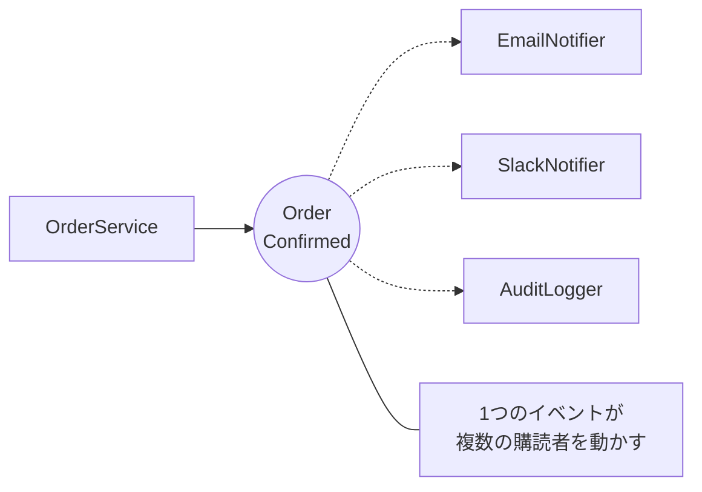

# 第69章：Observer ④：演習（注文確定→通知を購読者へ）🎉

## ねらい 😊





* 「注文が確定したよ！」という出来事（イベント）を、`event / EventHandler` で **疎結合に通知**できるようになる 🔔✨
* 通知先（メール📧、Slack💬、監査ログ🧾…）を **追加・削除・差し替え**しても、注文確定の本体コードをあまり触らなくて済む状態を作る 🧩
* ついでに「最新のC#/.NETの前提」を軽く押さえる（C# 14 が最新、.NET 10 はLTS）🌟 ([Microsoft Learn][1])
* .NETのイベントの基本形（`EventHandler` / `EventHandler<TEventArgs>`）を「正しい型」で使う感覚を掴む 🧠 ([Microsoft Learn][2])

---

## 到達目標 🎯

* ✅ `OrderService` が `OrderConfirmed` イベントを公開し、購読者が複数いても動く
* ✅ 購読者を増やしても `Confirm()` の中が太らない（if/switchが増えない）🌱
* ✅ 1つの購読者が例外を投げても、**他の購読者には通知が届く**（落とし穴回避）🛡️
* ✅ MSTestで「通知された」「解除したら呼ばれない」「例外があっても他は動く」をテストできる 🧪 ([Microsoft Learn][3])

---

## 手順 🧭✨

### 1) まず全体像をつかむ（登場人物）👀

* 🧑‍🍳 **Publisher（発行者）**：`OrderService`（注文確定を行う側）
* 👂 **Subscribers（購読者）**：メール通知📧、Slack通知💬、監査ログ🧾 など（増えたり減ったりする）
* 🔔 **Event**：`OrderConfirmed`
* 📦 **EventArgs**：`OrderConfirmedEventArgs`（「何が起きたか」のデータ）

.NETのイベントは `EventHandler` / `EventHandler<TEventArgs>` が基本形だよ〜、という公式の型があるので、ここに寄せるのがいちばん迷子になりにくいです 😊 ([Microsoft Learn][2])

---

### 2) ドメイン（最小のEC）を用意する 🛒

まずは超ミニの `Order` と `Money`！

```csharp
// Money.cs
public readonly record struct Money(decimal Amount, string Currency = "JPY")
{
    public override string ToString() => $"{Amount:N0} {Currency}";
}
```

```csharp
// Order.cs
public enum OrderStatus
{
    New = 0,
    Confirmed = 1,
}

public sealed class Order
{
    public Guid Id { get; } = Guid.NewGuid();
    public Money Total { get; }
    public OrderStatus Status { get; private set; } = OrderStatus.New;

    public Order(Money total) => Total = total;

    public void Confirm()
    {
        if (Status == OrderStatus.Confirmed)
            throw new InvalidOperationException("すでに確定済みだよ⚠️");

        Status = OrderStatus.Confirmed;
    }
}
```

---

### 3) 「注文確定イベント」を定義する 🔔📦

イベントデータ（EventArgs）を作るよ！

```csharp
// OrderConfirmedEventArgs.cs
public sealed class OrderConfirmedEventArgs : EventArgs
{
    public Guid OrderId { get; }
    public Money Total { get; }
    public DateTimeOffset OccurredAt { get; }

    public OrderConfirmedEventArgs(Guid orderId, Money total, DateTimeOffset occurredAt)
    {
        OrderId = orderId;
        Total = total;
        OccurredAt = occurredAt;
    }
}
```

---

### 4) Publisher：OrderServiceでイベントを発行する 🎺✨

ポイントはここ👇

* `event EventHandler<OrderConfirmedEventArgs>?` を公開する
* 発行は `OnOrderConfirmed()` に寄せる
* **購読者が例外を投げても、他の購読者に通知が届く**ようにする（GetInvocationList + try/catch）🛡️🔥

```csharp
// OrderService.cs
public sealed class OrderService
{
    public event EventHandler<OrderConfirmedEventArgs>? OrderConfirmed;

    public void Confirm(Order order)
    {
        order.Confirm();

        var e = new OrderConfirmedEventArgs(
            orderId: order.Id,
            total: order.Total,
            occurredAt: DateTimeOffset.UtcNow
        );

        OnOrderConfirmed(e);
    }

    private void OnOrderConfirmed(OrderConfirmedEventArgs e)
    {
        var handlers = OrderConfirmed;
        if (handlers is null) return;

        List<Exception>? exceptions = null;

        foreach (EventHandler<OrderConfirmedEventArgs> handler in handlers.GetInvocationList())
        {
            try
            {
                handler(this, e);
            }
            catch (Exception ex)
            {
                exceptions ??= new List<Exception>();
                exceptions.Add(ex);
            }
        }

        if (exceptions is not null)
            throw new AggregateException("通知の一部が失敗したよ⚠️", exceptions);
    }
}
```

> `EventHandler<TEventArgs>` を使うのが「.NETイベントの定番」なので、チーム開発でも読みやすさが強いです 💪 ([Microsoft Learn][2])

---

### 5) Subscribers：購読者を作って、好きにぶら下げる 🧩📧💬🧾

“通知先”は、注文確定の本体とは別クラスにして、好きに増やす方針！

```csharp
// EmailNotifier.cs
public sealed class EmailNotifier
{
    public void Handle(object? sender, OrderConfirmedEventArgs e)
        => Console.WriteLine($"📧 メール送信！ order={e.OrderId} total={e.Total} at={e.OccurredAt:O}");
}
```

```csharp
// SlackNotifier.cs
public sealed class SlackNotifier
{
    public void Handle(object? sender, OrderConfirmedEventArgs e)
        => Console.WriteLine($"💬 Slack通知！ order={e.OrderId} total={e.Total}");
}
```

```csharp
// AuditLogger.cs
public sealed class AuditLogger
{
    public void Handle(object? sender, OrderConfirmedEventArgs e)
        => Console.WriteLine($"🧾 監査ログ！ order={e.OrderId} status=Confirmed");
}
```

---

### 6) Composition Root：どこで購読する？→「起動時にまとめて」📌

購読の組み立ては、だいたい `Program.cs`（またはDI構成）に置くとスッキリします 😊

```csharp
// Program.cs
var orderService = new OrderService();

var email = new EmailNotifier();
var slack = new SlackNotifier();
var audit = new AuditLogger();

orderService.OrderConfirmed += email.Handle;
orderService.OrderConfirmed += slack.Handle;
orderService.OrderConfirmed += audit.Handle;

var order = new Order(new Money(12000));
try
{
    orderService.Confirm(order);
}
catch (AggregateException ex)
{
    Console.WriteLine($"⚠️ 通知で失敗あり: {ex.InnerExceptions.Count}件");
}
```

---

### 7) MSTestで「通知できた」を固定する 🧪✅

MSTestの基本属性（`[TestClass]` / `[TestMethod]`）は公式でもこの形がベースだよ〜、という確認にもなる ✨ ([Microsoft Learn][3])

```csharp
using Microsoft.VisualStudio.TestTools.UnitTesting;

[TestClass]
public sealed class OrderObserverTests
{
    [TestMethod]
    public void Confirm_Notifies_All_Subscribers()
    {
        var service = new OrderService();
        var order = new Order(new Money(1000));

        var called = new List<string>();

        service.OrderConfirmed += (_, __) => called.Add("A");
        service.OrderConfirmed += (_, __) => called.Add("B");

        service.Confirm(order);

        CollectionAssert.AreEqual(new[] { "A", "B" }, called);
        Assert.AreEqual(OrderStatus.Confirmed, order.Status);
    }

    [TestMethod]
    public void Confirm_When_OneSubscriberThrows_OthersStillRun()
    {
        var service = new OrderService();
        var order = new Order(new Money(1000));

        var called = new List<string>();

        service.OrderConfirmed += (_, __) => throw new InvalidOperationException("💥 わざと失敗");
        service.OrderConfirmed += (_, __) => called.Add("B");

        try
        {
            service.Confirm(order);
            Assert.Fail("例外が投げられるはず！");
        }
        catch (AggregateException)
        {
            // OK
        }

        CollectionAssert.AreEqual(new[] { "B" }, called);
    }

    [TestMethod]
    public void Unsubscribe_Stops_Notification()
    {
        var service = new OrderService();
        var order = new Order(new Money(1000));

        var called = 0;
        EventHandler<OrderConfirmedEventArgs> handler = (_, __) => called++;

        service.OrderConfirmed += handler;
        service.OrderConfirmed -= handler;

        service.Confirm(order);

        Assert.AreEqual(0, called);
    }
}
```

---

### 8) AI補助で“雛形だけ”作って、必ず人間が整える 🤖✍️👀

コピペ用プロンプト例（そのまま貼ってOK）👇

```text
C#で event / EventHandler<TEventArgs> を使った Observer の演習コードを作って。
題材：OrderService が Confirm(Order) を呼ぶと OrderConfirmed を発行し、複数の購読者（Email/Slack/Audit）が反応する。
条件：
- “汎用イベントバス”など大きな仕組みは作らない
- Publisherは通知先を知らない（疎結合）
- 購読者の1つが例外を投げても、他の購読者は実行されるようにする（GetInvocationList + try/catch）
- MSTestで「全購読者が呼ばれる」「例外があっても他が呼ばれる」をテストする
- ファイル分割前提で、最小のクラス数にして
```

レビュー観点👀✅

* Publisher（`OrderService`）に「通知先の詳細」が混ざってない？
* `OrderConfirmedEventArgs` が必要以上に大きくない？（“なんでも入れ”禁止）🧺💦
* 例外が出たとき、他の通知が止まってない？（テストで固定！）🧪

---

## よくある落とし穴 ⚠️😵

* **購読解除し忘れ**でメモリリークっぽくなる（特に長寿命オブジェクトに短寿命がぶら下がると危険）🧯
* **通知順序に依存**しはじめる（「先にSlack→次に監査」みたいな前提があると急に壊れる）🌀
* **イベントを“命令”にしちゃう**（購読者が「注文を変更」みたいな副作用を戻してくると地獄🔥）
* **購読者の例外で全停止**（素直に `?.Invoke()` だけだと起きやすいので注意）🛑
* **イベント増やしすぎ**（何でもイベントにすると追跡不能…）🫠

---

## 演習 🧩🛠️

### 演習1：通知先を1つ追加して、Publisherは一切変えない 🐣➡️🐥

* `SmsNotifier` を追加して購読する 📱✨
* `OrderService` の変更は **ゼロ**で通す（ここが気持ちいいポイント😆）

### 演習2：購読者側で条件分岐する（Publisherにifを戻さない）🚫➡️✅

* 「合計が10,000円以上ならSlack通知」みたいな条件を

  * `SlackNotifier` の中に置く（Publisherには置かない）💬💡

### 演習3：「削除してみる」実験（やりすぎ判定）🗑️🧪

* いったん `event` をやめて、`Confirm()` から通知を直呼びに戻してみる
* 次の質問に答える👇

  * 直呼びの方が読みやすい？
  * 追加・削除が頻繁なら、どっちが楽？
  * テストはどっちが書きやすい？

---

## チェック ✅📌

* [ ] `OrderService` が通知先（Email/Slack/監査）を **知らない** 🕶️
* [ ] 購読者を追加しても `Confirm()` が太らない 🌱
* [ ] 例外を投げる購読者がいても、他の購読者が動く（テストで固定）🛡️🧪
* [ ] 購読解除（`-=`）のタイミングが説明できる 🔧
* [ ] 「Observerをやめる判断」（直呼びで十分な場面）も言える 🙆‍♀️

[1]: https://learn.microsoft.com/en-us/dotnet/csharp/whats-new/csharp-14?utm_source=chatgpt.com "What's new in C# 14"
[2]: https://learn.microsoft.com/ja-jp/dotnet/standard/events/?utm_source=chatgpt.com "イベントの処理と発生 - .NET"
[3]: https://learn.microsoft.com/en-us/dotnet/core/testing/unit-testing-csharp-with-mstest?utm_source=chatgpt.com "Unit testing C# with MSTest and .NET"
