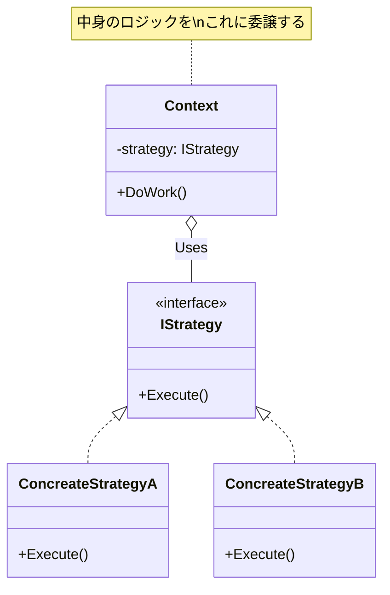

# 第70章：Strategy ①：方針を差し替える🧠🔁

## ねらい 🎯✨





* **割引計算・送料計算・並び替えルール**みたいな「方針（アルゴリズム）」が増えて、`if/switch` がムキムキになる問題を止めます😵‍💫
* “方針を入れ替える”だけで挙動を変えられるようにして、**テストもしやすく**します🧪🌸
* Strategy の採用判断（いつ効く？いつ不要？）を言葉にできるようにします🗣️💡

> 本日時点では、**.NET 10 は LTS**としてサポートされ、C# 14 は **Visual Studio 2026 / .NET 10 SDK**で試せる前提になっています（公式ドキュメント）。([Microsoft][1])
> ※この章の内容は“特定の新機能に依存せず”、基本の設計力として使えるよ☺️✨

---

## 到達目標 🏁😊

* Strategy が解く困りごとを **1文で説明**できる（例：「割引ルールを差し替えたい」）
* 「どこを Strategy にするか」を **“変わる点”として切り出せる**
* 呼び出し側の `if/switch` を **“方針の選択”と“方針の実行”に分離**できる
* テストで「方針の差し替え」ができる（フェイク戦略を注入できる）🧪✨

---

## 手順（やってみよう）🚶‍♀️✨

### 1) まず “if/switch地獄” を1回だけ味わう😵‍💫🔥

題材は「割引計算」にします💸

* 通常：割引なし
* 会員：10%オフ
* セール：20%オフ
  …みたいに増えていくやつです🙂

**（ダメになりやすい例）**：呼び出し側がルール全部を抱える

```csharp
public enum DiscountType
{
    None,
    Member10Percent,
    Sale20Percent,
}

public static class PriceCalculator_Before
{
    public static decimal ApplyDiscount(decimal subtotal, DiscountType type)
    {
        return type switch
        {
            DiscountType.None => subtotal,
            DiscountType.Member10Percent => subtotal * 0.90m,
            DiscountType.Sale20Percent => subtotal * 0.80m,
            _ => throw new ArgumentOutOfRangeException(nameof(type)),
        };
    }
}
```

✅ この時点での “つらさ” はこれ👇

* ルールが増えるたびに `switch` が増える😵
* テストが「分岐網羅ゲーム」になりがち🧪
* “計算の方針”を差し替えたいのに、差し替え口がない🔁

---

### 2) Strategy のコアを決める：変わるのは「割引方針」だけ🧠🔍

Strategy を入れるときの鉄板はこれ👇

* ✅ **変わる点**：割引の計算ルール（アルゴリズム）
* ✅ **変えたくない点**：注文処理の流れ・呼び出し手順（例えば合計を出す手順）

ここでのポイント：
**「割引ルール」を“部品”にして、入れ替え可能にする**🧩✨

---

### 3) “方針の契約（interface）” を作る📜✨

「割引方針は、金額を受け取って、割引後の金額を返す」だけでOK👌
契約は薄く！薄く！が大事です🧅✨

```csharp
public interface IDiscountStrategy
{
    decimal Apply(decimal subtotal);
}
```

---

### 4) 具体的な方針（戦略）を2〜3個だけ作る💡💸

ここで増やしすぎない！まずは最小でOK🙂

```csharp
public sealed class NoDiscountStrategy : IDiscountStrategy
{
    public decimal Apply(decimal subtotal) => subtotal;
}

public sealed class PercentageDiscountStrategy : IDiscountStrategy
{
    private readonly decimal _rate; // 0.10m なら10%引き

    public PercentageDiscountStrategy(decimal rate)
    {
        if (rate < 0m || rate > 1m) throw new ArgumentOutOfRangeException(nameof(rate));
        _rate = rate;
    }

    public decimal Apply(decimal subtotal) => subtotal * (1m - _rate);
}
```

* `NoDiscountStrategy`：割引なし🙂
* `PercentageDiscountStrategy(0.10m)`：10%引き💸
* `PercentageDiscountStrategy(0.20m)`：20%引き🔥

---

### 5) 呼び出し側（Context）を “interface依存” にする🔁🧩

ここが Strategy の本体！✨
呼ぶ側は **「どの割引か」ではなく「割引を適用してね」**だけ言うようにします🙂

```csharp
public sealed class PricingService
{
    private readonly IDiscountStrategy _discount;

    public PricingService(IDiscountStrategy discount)
    {
        _discount = discount;
    }

    public decimal CalculateTotal(decimal subtotal)
    {
        // ここが “変えたくない流れ”
        var discounted = _discount.Apply(subtotal);
        return RoundMoney(discounted);
    }

    private static decimal RoundMoney(decimal value)
        => Math.Round(value, 0, MidpointRounding.AwayFromZero); // 例：円として丸め
}
```

✅ これで何が嬉しい？

* `PricingService` から `switch` が消える🎉
* ルール追加＝新しい Strategy を追加するだけになりやすい✨
* テストで Strategy を差し替えられる🧪

---

### 6) テストで「差し替え」を体験する🧪🌸

MSTest 例です（超ミニ）🙂

```csharp
using Microsoft.VisualStudio.TestTools.UnitTesting;

[TestClass]
public class PricingServiceTests
{
    [TestMethod]
    public void NoDiscount_RoundsTotal()
    {
        var sut = new PricingService(new NoDiscountStrategy());

        var total = sut.CalculateTotal(1000m);

        Assert.AreEqual(1000m, total);
    }

    [TestMethod]
    public void Member10Percent_DiscountApplied()
    {
        var sut = new PricingService(new PercentageDiscountStrategy(0.10m));

        var total = sut.CalculateTotal(1000m);

        Assert.AreEqual(900m, total);
    }
}
```

ポイントはこれ👇

* `PricingService` を変えずに、**Strategy だけ差し替えてテスト**できる🧪✨
* これが「方針を差し替える」の気持ちよさです☺️🎉

---

### 7) “戦略の選び方” はどこに置く？（ここが落とし穴の入口）🧠⚠️

Strategy を入れても、「どの戦略を使う？」の選択が `if/switch` のままだと、そこが別の地獄になりがち😵‍💫

おすすめの考え方👇

* ✅ **選択ロジック**は “入口（外側）” に寄せる
* ✅ “業務ロジック（内側）” は interface に寄せる

たとえば「会員なら10%」みたいな選択は、**注文確定ユースケースの入口**に置いて、`PricingService` は知らない、が自然です🙂

```csharp
public static class DiscountStrategySelector
{
    public static IDiscountStrategy Select(bool isMember, bool isSale)
    {
        if (isSale) return new PercentageDiscountStrategy(0.20m);
        if (isMember) return new PercentageDiscountStrategy(0.10m);
        return new NoDiscountStrategy();
    }
}
```

ここは “外側” なので `if` が残ってもOK👌
**大事なのは、内側（PricingService）に分岐を持ち込まないこと**です🧠✨

---

### 8) .NET標準にも Strategy は普通にいるよ（超チラ見）👀✨

Strategy って「自作のパターン」じゃなく、.NET 標準APIにもよく出てきます🙂
たとえば **並び替え**！

* `IComparer<T>`：比較ルール（方針）を差し替えるインターフェイス([Microsoft Learn][2])
* `Comparison<T>`：比較ルールをデリゲートで渡す方法([Microsoft Learn][3])
* `List<T>.Sort(...)`：指定の比較ルールで並び替えできる([Microsoft Learn][4])

この “標準のStrategy感” は **次章（第71章）でがっつり**やります📏✨

---

## よくある落とし穴 ⚠️😵‍💫

### 落とし穴1：戦略の「選択」が別の `if/switch地獄` になる🔥

* Strategy 本体がキレイでも、選択が散らばると終わりがち😵
* ✅ 対策：選択は “入口に1箇所” に寄せる🗂️✨

### 落とし穴2：戦略が細かすぎて把握不能🧩🧩🧩

* 3行の違いで Strategy を作りすぎると、逆に読めない🥲
* ✅ 目安：**「増え続ける見込みがある方針」だけ** Strategy にする

### 落とし穴3：戦略が状態を持ちすぎて “神戦略” になる👑

* DBアクセス・ログ・外部API呼び出しまで背負い始めると、テストが重くなる😵‍💫
* ✅ まずは「計算」みたいな純粋ロジックで始めるのが安全💖

### 落とし穴4：命名がふわっとして責務が曖昧🌫️

* `DefaultStrategy` とか `StrategyA` とかは、将来の自分が泣く😭
* ✅ “方針の名前” をそのまま使う：`PercentageDiscountStrategy` みたいに📛✨

---

## 演習（10〜30分）🧪🎯

### 演習A：送料の Strategy を作ろう📦🚚

**要件**

* 小計 `subtotal` が 5000円以上なら送料無料🎉
* それ以外は通常送料 500円
* 速達オプションなら +300円（通常送料に追加）

**ヒント**

* Strategy は「送料計算」にする：`IShippingFeeStrategy`
* 選択は入口（セレクタ）に寄せる：`ShippingFeeStrategySelector`
* Context 側は `CalculateTotal(subtotal)` の流れを変えない

**テスト例（期待値）**

* `subtotal=6000` → 送料0
* `subtotal=4000, normal` → 送料500
* `subtotal=4000, express` → 送料800

---

### 演習B：フェイク戦略でテストをラクにする🧪✨

`IDiscountStrategy` の代わりに「固定値を返す戦略」を作って、`PricingService` のテストを1本に簡略化してみてください🙂

```csharp
public sealed class FixedDiscountStrategy : IDiscountStrategy
{
    private readonly decimal _result;
    public FixedDiscountStrategy(decimal result) => _result = result;
    public decimal Apply(decimal subtotal) => _result;
}
```

* これができると「Strategy はテストの味方」って実感しやすいです🧪💖

---

## 自己チェック ✅📝

* [ ] “業務の中心” から `if/switch` が減った（または消えた）🙂
* [ ] 新しい割引ルールを追加しても、**既存の計算クラス（Context）を編集せず**に済みそう？🔁
* [ ] Strategy の契約（interface）が薄くて自然（メソッドが増えすぎてない）📜
* [ ] 戦略の「選択」は 1箇所に寄っている🗂️
* [ ] テストで Strategy を差し替えできた🧪✨

[1]: https://dotnet.microsoft.com/en-us/platform/support/policy/dotnet-core?utm_source=chatgpt.com "NET and .NET Core official support policy"
[2]: https://learn.microsoft.com/ja-jp/dotnet/api/system.collections.generic.icomparer-1?view=net-10.0&utm_source=chatgpt.com "IComparer<T> Interface (System.Collections.Generic)"
[3]: https://learn.microsoft.com/ja-jp/dotnet/api/system.comparison-1?view=net-10.0&utm_source=chatgpt.com "Comparison<T> Delegate (System)"
[4]: https://learn.microsoft.com/en-us/dotnet/api/system.collections.generic.list-1.sort?view=net-10.0&utm_source=chatgpt.com "List<T>.Sort Method (System.Collections.Generic)"
