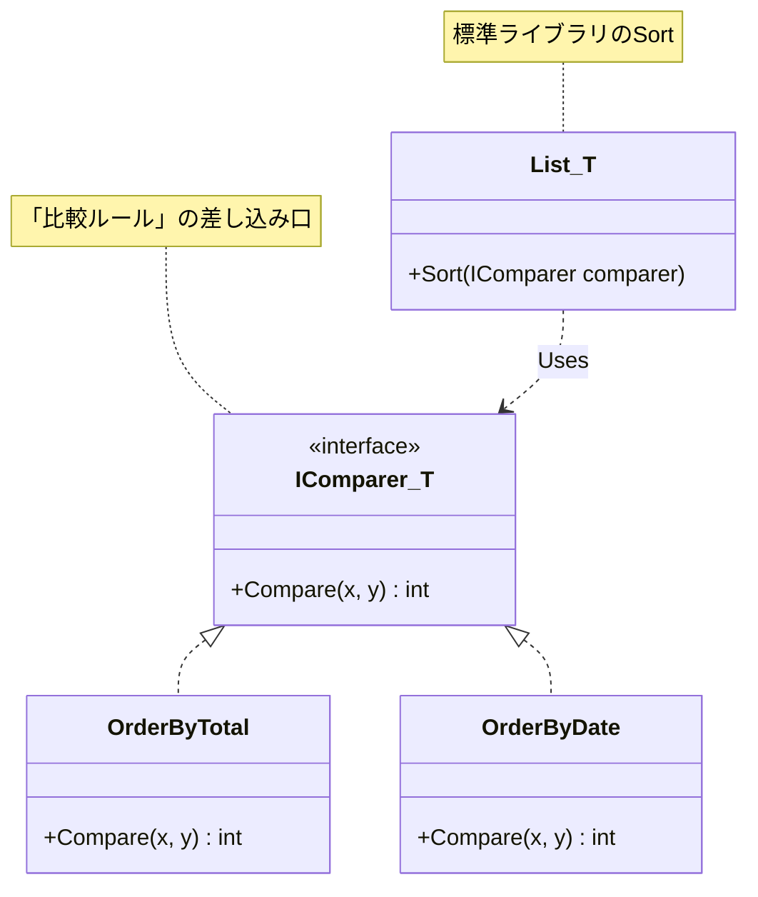

# 第71章：Strategy ②：標準例（IComparer<T> / Comparison<T>）📏

## ねらい 🎯





* 「並び替えルール（比較ルール）を差し替える」っていう Strategy の感覚を、**.NET の定番API**で体感するよ〜🧠🔁
* “自分でStrategy用フレームワーク作る”じゃなくて、**`IComparer<T>` と `Comparison<T>` をそのまま Strategy として使う**練習をするよ💪

---

## 到達目標 🏁

* `IComparer<T>` が **比較ルール（Strategy）**である理由を説明できる🙂 ([Microsoft Learn][1])
* `Comparison<T>`（デリゲート）で **軽量にStrategyを差し替え**できる🙂 ([Microsoft Learn][2])
* `List<T>.Sort(...)` / `OrderBy(..., comparer)` を見て「どこが差し替え点か」見抜ける👀✨ ([Microsoft Learn][3])
* 「安定ソート/不安定ソート」の違いを、**“同点の順番が保証されるか”**で説明できる📌 ([Microsoft Learn][4])

---

## 手順 🧭✨

### 1) まず「Strategyが刺さる場面」を一言で掴む🧠

並び替えって、だいたいこうなるよね👇

* 「金額順にしたい💰」
* 「日付順にしたい📅」
* 「同点なら、こっちを優先したい🥺」

この “ルール部分” が **Strategy（差し替えたい方針）** だよ〜🔁✨

---

### 2) `List<T>.Sort` の差し替え点を“シグネチャ”で読む👀

`List<T>.Sort` は **比較ルールを差し込める**オーバーロードがあるよ🌸 ([Microsoft Learn][3])

* `Sort()`（既定の比較）
* `Sort(IComparer<T> comparer)`（Strategyをオブジェクトで渡す）
* `Sort(Comparison<T> comparison)`（Strategyを関数で渡す）

ポイントはここ👇

* `IComparer<T>` は「比較の作法」を **実装として差し替える口** ([Microsoft Learn][1])
* `Comparison<T>` は「比較の作法」を **関数として差し替える口**（戻り値のルール大事！） ([Microsoft Learn][2])

---

### 3) 例題モデルを用意する（小さくてOK🧁）

「注文」を、並び替えの題材にするよ🛒✨

```csharp
public sealed record Order(
    int Id,
    decimal TotalAmount,
    DateTimeOffset CreatedAt
);
```

---

### 4) Strategy（比較ルール）を `IComparer<Order>` で作る📏🧩

「合計金額の昇順で並べたい」を Strategy にして差し込むよ💰⬆️

```csharp
using System.Collections.Generic;

public sealed class OrderByTotalAmountComparer : IComparer<Order>
{
    public int Compare(Order? x, Order? y)
    {
        // nullの扱いは“契約”なので、ここで決めておくと安全✨
        if (ReferenceEquals(x, y)) return 0;
        if (x is null) return -1;
        if (y is null) return 1;

        return x.TotalAmount.CompareTo(y.TotalAmount);
    }
}
```

`IComparer<T>.Compare(x, y)` は **int を返す**のがルールだよ📌

* 0より小さい → x は y より前
* 0 → 同じ
* 0より大きい → x は y より後 ([Microsoft Learn][1])

そして使う側はこう👇（Strategy差し替え完了！）

```csharp
var orders = new List<Order>
{
    new(1, 1200m, DateTimeOffset.Parse("2026-02-01")),
    new(2,  500m, DateTimeOffset.Parse("2026-02-02")),
    new(3,  800m, DateTimeOffset.Parse("2026-02-03")),
};

orders.Sort(new OrderByTotalAmountComparer());
```

---

### 5) もっと軽量に：`Comparison<Order>`（関数）で渡す⚡

「クラス作るほどでもない」ってときの定番が `Comparison<T>` だよ〜🙂‍↕️✨ ([Microsoft Learn][2])

```csharp
orders.Sort((a, b) => a.TotalAmount.CompareTo(b.TotalAmount));
```

降順にしたいなら、符号をひっくり返すか、`CompareTo` の順を入れ替えるだけ👇

```csharp
orders.Sort((a, b) => b.TotalAmount.CompareTo(a.TotalAmount)); // 降順💰⬇️
```

---

### 6) `Comparer<T>.Create` で「関数 → IComparer」に変換する🪄

APIによっては `IComparer<T>` しか受け付けないことがあるよね。
そんな時に `Comparer<T>.Create(comparison)` が便利✨ ([Microsoft Learn][5])

```csharp
using System.Collections.Generic;

IComparer<Order> comparer =
    Comparer<Order>.Create((a, b) => b.CreatedAt.CompareTo(a.CreatedAt));

orders.Sort(comparer);
```

---

### 7) LINQ でも Strategy を差し替えられる（安定ソートが嬉しい💎）

`OrderBy` は **安定ソート**（同点の順番を保つ）って明記されてるよ📌 ([Microsoft Learn][4])
だから「同点の順序が大事」なら LINQ が気持ちいいこと多い✨

```csharp
// 例：TotalAmountで昇順、同点はCreatedAtで昇順
var sorted = orders
    .OrderBy(o => o.TotalAmount)
    .ThenBy(o => o.CreatedAt)
    .ToList();
```

> 逆に、`List<T>.Sort` や `Array.Sort` は **安定ソートが保証されない**（同点の並びが固定じゃない）よ⚠️ ([Microsoft Learn][6])

---

### 8) “どこがStrategyか”を言葉にする（超重要🗣️✨）

ここでの Strategy はズバリ👇

* **比較ルール**（並び替えの方針）＝ `IComparer<T>` / `Comparison<T>`

そして嬉しいこと👇

* 呼び出し側（並び替えしたい側）は、比較の中身を知らなくてOK🙆‍♀️
* “差し替え”が、引数1個でできるようになる🔁✨

---

## よくある落とし穴 🕳️😵

### 1) `Comparison<T>` を `bool` で返そうとする❌

`Comparison<T>` は **int を返す**ルールだよ！
`a > b` みたいに `true/false` を返すものじゃないよ〜⚠️ ([Microsoft Learn][2])

---

### 2) 同点のとき `0` を返し忘れる😇

同点なのに `1` とか返しちゃうと、ソート結果が不安定になったり、意図とズレたりするよ💥
「同点なら 0」！覚えてね📌 ([Microsoft Learn][2])

---

### 3) “同点の順番”を期待しちゃう⚠️

`List<T>.Sort` / `Array.Sort` は **同点の順番が保証されない**から、
「同点は元の順のままでいてほしい🥺」って要件があるなら、`OrderBy`（安定ソート）や `ThenBy` を検討してね✨ ([Microsoft Learn][4])

---

### 4) `IComparer<T>` と `IEqualityComparer<T>` を混同する🤯

* `IComparer<T>`：並び替え用（大小比較）📏
* `IEqualityComparer<T>`：辞書/集合用（同一判定）🧷

用途が違うよ〜！ ([Microsoft Learn][1])

---

## 演習（10〜30分）🧪🌸

### お題：注文の並び替えルールを3つ作って切り替える🔁🛒

次の3つを実装してね✨

1. 金額昇順（`IComparer<Order>`）💰⬆️
2. 金額降順（`Comparison<Order>`）💰⬇️
3. 作成日時降順（`Comparer<Order>.Create`）📅⬇️

#### 追加ミッション（余裕あったら👑）

* 「金額が同じなら、作成日時が新しい方を先」ルールも作ってみよ🔀✨

  * `Comparison` で二段比較してもOK
  * LINQ の `ThenBy` でもOK（こっちは読みやすいこと多い💕） ([Microsoft Learn][7])

---

## チェック ✅💯

* [ ] `IComparer<T>` が “比較ルールの差し替え口（Strategy）” だと説明できる📏 ([Microsoft Learn][1])
* [ ] `Comparison<T>` の戻り値ルール（負/0/正）を言える🗣️ ([Microsoft Learn][2])
* [ ] 「同点の順番が必要なら安定ソートを選ぶ」判断ができる💎 ([Microsoft Learn][4])
* [ ] “並び替える側”が比較の中身を知らずに済む設計になってる（引数で差し替えてる）🔁✨

[1]: https://learn.microsoft.com/ja-jp/dotnet/api/system.collections.generic.icomparer-1?view=net-10.0&utm_source=chatgpt.com "IComparer<T> Interface (System.Collections.Generic)"
[2]: https://learn.microsoft.com/en-us/dotnet/api/system.comparison-1?view=net-10.0&utm_source=chatgpt.com "Comparison<T> Delegate (System)"
[3]: https://learn.microsoft.com/en-us/dotnet/api/system.collections.generic.list-1.sort?view=net-10.0&utm_source=chatgpt.com "List<T>.Sort Method (System.Collections.Generic)"
[4]: https://learn.microsoft.com/en-us/dotnet/api/system.linq.enumerable.orderby?view=net-10.0&utm_source=chatgpt.com "Enumerable.OrderBy Method (System.Linq)"
[5]: https://learn.microsoft.com/is-is/dotnet/api/system.collections.generic.comparer-1.create?view=net-10.0&viewFallbackFrom=netframework-2.0&utm_source=chatgpt.com "Comparer<T>.Create(Comparison<T>) Method"
[6]: https://learn.microsoft.com/en-us/dotnet/api/system.array.sort?view=net-10.0&utm_source=chatgpt.com "Array.Sort Method (System)"
[7]: https://learn.microsoft.com/ja-jp/dotnet/api/system.linq.enumerable.thenby?view=net-10.0&utm_source=chatgpt.com "Enumerable.ThenBy Method (System.Linq)"
