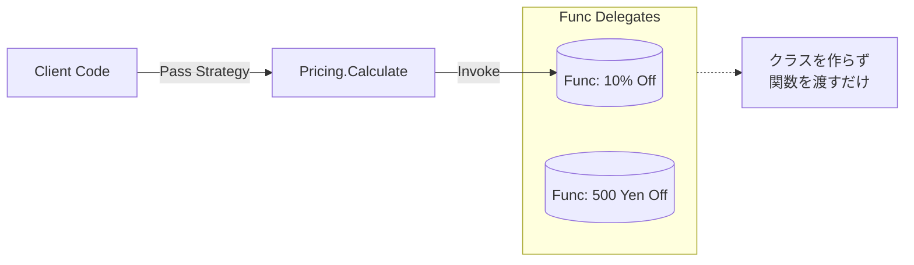

# 第72章：Strategy ③：C#らしく（FuncでStrategyを渡す）⚡

## ねらい 🎯✨





* Strategy（方針の差し替え）を、**クラスを増やさず**にサクッと実現できるようになるよ🙂
* C#の**デリゲート**（`Func` / `Action`）と**ラムダ式**で、「差し替えポイント」を自然に作る感覚をつかむよ🧠💡
* テストで「方針を変えても、本体が壊れない」安心感を作るよ🧪🌸

---

## 到達目標 🏁😊

* 「方針（アルゴリズム）」を **`Func<...>` を引数に渡して**差し替えできる ✅
* 「方針を持つ側（本体）」が、方針の中身（割引/送料など）を**知らなくていい状態**にできる ✅
* MSTestで「方針A/方針Bの結果が変わる」ことを**テストで固定**できる ✅ ([Microsoft Learn][1])

---

## 手順 🧭🧩

### 1) まず「Strategy」を1行で言うと？📌

* **変わりやすい部分（方針）を外から差し替えられるようにする**ことだよ🔁✨
* C#では、その「差し替える方針」を **`Func`（戻り値あり）** として渡すのが超相性いいよ⚡
  `Func` は「ある引数リスト → 戻り値」を表すデリゲート型だよ。([Microsoft Learn][2])

### 2) “本体”は方針を知らない（ここが大事）🙅‍♀️💥

* 「割引率は？」「曜日で変わる？」みたいな判断を、本体に `if/switch` で書き始めると…
  **本体が太って、変更が怖くなる**😵‍💫
* だから本体はこうする👇

  * 「割引を計算する関数」を受け取って
  * その結果だけ使う
    これで本体はスリム✨

### 3) `Func` を引数で受け取る（最小の型）🧷

* 例えば「合計金額から割引額を出す」方針なら
  `Func<decimal, decimal>`（金額 → 割引額）でOKだよ💸

```csharp
public static class Pricing
{
    // baseTotal: 割引前合計
    // discountCalculator: 割引額を返す “方針”（Strategy）
    public static decimal CalculateFinalTotal(decimal baseTotal, Func<decimal, decimal> discountCalculator)
    {
        var discount = discountCalculator(baseTotal);
        return baseTotal - discount;
    }
}
```

* ここで `discountCalculator` が Strategy 本体だよ⚡
  ラムダ式はデリゲート（`Func` など）として呼び出されるよ。([Microsoft Learn][3])

### 4) 呼び出し側で方針を差し替える（これが気持ちいい）🎮✨

```csharp
var baseTotal = 10_000m;

// 方針A：常に10%割引
Func<decimal, decimal> tenPercentOff = total => total * 0.10m;

// 方針B：5,000円以上なら500円引き
Func<decimal, decimal> fixedOff = total => total >= 5_000m ? 500m : 0m;

var a = Pricing.CalculateFinalTotal(baseTotal, tenPercentOff); // 9,000
var b = Pricing.CalculateFinalTotal(baseTotal, fixedOff);      // 9,500
```

* **本体（Pricing）は一切変更なし**で、方針だけ変えられる🎉

### 5) “標準ライブラリにもStrategyはいる”って体感しよ📏✨

たとえば `List<T>.Sort(Comparison<T>)` は、並び替えの方針を `Comparison<T>`（デリゲート）で渡す仕組みだよ。
つまり「**デリゲートでStrategy**」は.NETのど真ん中のやり方💪([Microsoft Learn][4])

### 6) テストで「方針が差し替わる」ことを固定する🧪🌸

```csharp
using Microsoft.VisualStudio.TestTools.UnitTesting;

[TestClass]
public class PricingTests
{
    [TestMethod]
    public void CalculateFinalTotal_TenPercentOff()
    {
        var result = Pricing.CalculateFinalTotal(10_000m, total => total * 0.10m);
        Assert.AreEqual(9_000m, result);
    }

    [TestMethod]
    public void CalculateFinalTotal_FixedOff()
    {
        var result = Pricing.CalculateFinalTotal(10_000m, total => total >= 5_000m ? 500m : 0m);
        Assert.AreEqual(9_500m, result);
    }
}
```

* MSTestの基本フローはこの章の範囲だとこれで十分だよ🧁([Microsoft Learn][1])

### 7) 「Func と Action」使い分けの超ざっくり🍬

* `Func<...>`：**値を返す方針**（割引額、送料、優先度、判定など）
* `Action<...>`：**副作用だけの方針**（ログ出力、通知、計測など）
  `Action` は戻り値なしのデリゲート型だよ。([Microsoft Learn][5])

---

## 落とし穴 🕳️😵‍💫

### 落とし穴1：方針の“選び方”がif地獄になる 🌀

* Strategyで分岐を消したのに、別の場所で
  「どの方針にする？」が `if/switch` 祭りになるやつ😭
* コツ：この章ではまず **「引数で受け取る」**に集中！
  “選ぶ責務”は次章（演習）で整理するよ😉

### 落とし穴2：ラムダが長文になって読めない 📜😵

* ラムダの中に業務ルールを詰め込みすぎると、普通に読みにくい💦
* コツ：

  * 短いならラムダでOK
  * 長くなるなら **ローカル関数**や**メソッド**にして `Func` に渡す（読みやすさUP）✨

### 落とし穴3：キャプチャ（外側の変数を捕まえる）で事故る 🎣

* ラムダが外の変数を参照すると、意図せず値が変わって挙動がズレることがあるよ⚠️
* コツ：テストで「入力→出力」が固定できてるか確認🧪

### 落とし穴4：`null` 方針で落ちる 💥

* `Func` が `null` だと実行時に落ちる！
* コツ：

  * “必須なら” `ArgumentNullException`
  * “任意なら” デフォルト方針を用意（例：割引0円）

---

## 演習（10〜30分）🏋️‍♀️🍀

### お題：割引の方針を2つ作って、同じ本体で計算しよう💸✨

1. `Pricing.CalculateFinalTotal` を作る（上のままでOK）
2. 方針を2つ作る

   * 10%割引
   * 5,000円以上なら500円引き
3. MSTestで2ケースをテストする🧪

### 追加ミニ（できたら）🌟

* `discountCalculator` を省略できるオーバーロードを作ってみよ🙂

  * 省略時は「割引0円」の方針

```csharp
public static decimal CalculateFinalTotal(decimal baseTotal)
    => CalculateFinalTotal(baseTotal, _ => 0m);
```

### AI補助メモ 🤖✍️

* 「`Func<decimal, decimal>` を使うStrategy例を2つ」
* 「MSTestで2ケース作って」
  みたいにお願いして、**出力をそのまま採用せず**
* 方針の責務が重すぎない？
* 本体に判断が混ざってない？
  を目でチェックしてね👀✨

---

## チェック ✅🔍

* 本体（Pricing）は、割引の種類を**知らない**（if/switchがない）？🙂
* 方針は `Func` で差し替えできて、テストで結果が固定できた？🧪
* ラムダが長文になってない？（読めるサイズ？）📏
* “標準の仕組み”でStrategyできてる感覚がつかめた？（`Sort(Comparison<T>)` と似てる！）🎉([Microsoft Learn][4])

---

### 参考（最新の足場）🧷✨

* 現在は **.NET 10 がLTS** として提供されていて、サポート期間も長めだよ（長期運用の基準になりやすい）🛡️([dotnet.microsoft.com][6])

[1]: https://learn.microsoft.com/en-us/dotnet/core/testing/unit-testing-csharp-with-mstest?utm_source=chatgpt.com "Unit testing C# with MSTest and .NET"
[2]: https://learn.microsoft.com/ja-jp/dotnet/api/system.func-1?view=net-10.0&utm_source=chatgpt.com "Func<TResult> Delegate (System)"
[3]: https://learn.microsoft.com/en-us/dotnet/csharp/language-reference/operators/lambda-expressions?utm_source=chatgpt.com "Lambda expressions and anonymous functions - C#"
[4]: https://learn.microsoft.com/en-us/dotnet/api/system.collections.generic.list-1.sort?view=net-10.0&utm_source=chatgpt.com "List<T>.Sort Method (System.Collections.Generic)"
[5]: https://learn.microsoft.com/en-us/dotnet/api/system.action?view=net-10.0&utm_source=chatgpt.com "Action Delegate (System)"
[6]: https://dotnet.microsoft.com/ja-jp/platform/support/policy?utm_source=chatgpt.com "公式の .NET サポート ポリシー | .NET"
