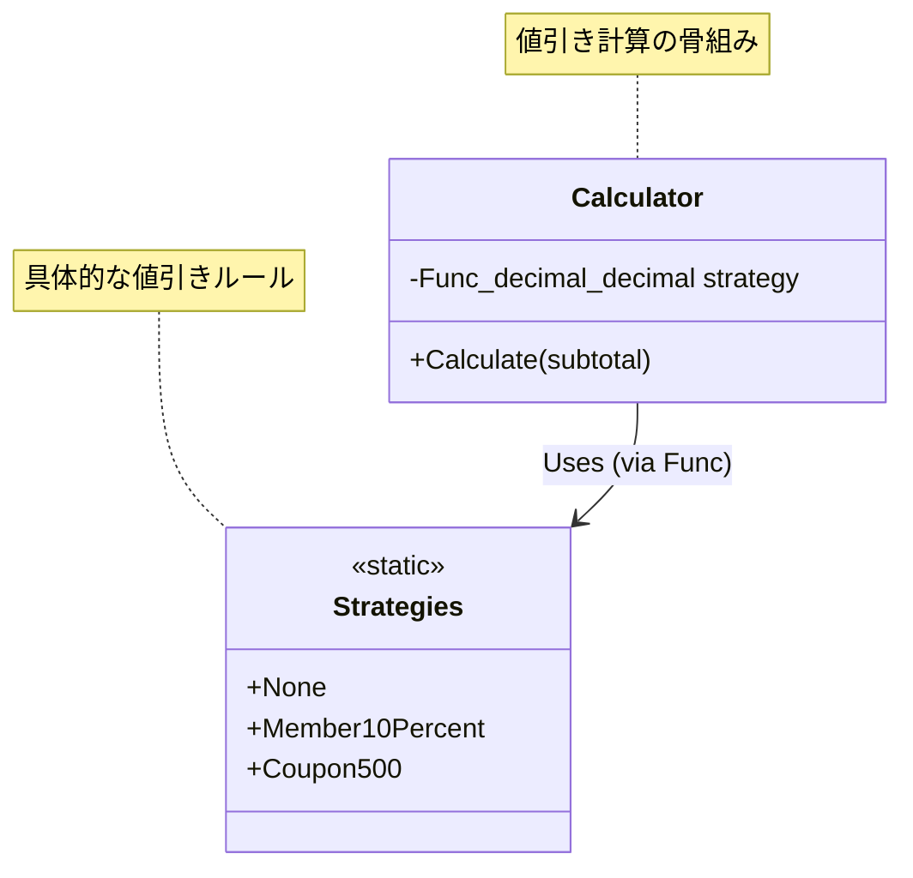

# 第73章：Strategy ④：演習（割引ルールを差し替え）💸

## ねらい 🎯✨





* 「割引ルール（方針）」がコロコロ変わる現場で、`if/switch` 地獄を回避する🌀
* Strategy を “入れるだけ” じゃなくて、「入れない判断」「外す判断」までできるようになる🧠✅
* テストで「差し替えできる安心感」を作る🧪🌸

---

## 到達目標 🏁😊

* 割引ルールを **3種類以上** 用意して、差し替えできる（例：なし／会員10%／クーポン500円）🔁
* “割引の計算” と “どの割引を使うか” を分離できる✂️
* MSTest で **割引が変わっても壊れないテスト** を書ける🧪✨（MSTest は公式チュートリアルあり）([Microsoft Learn][1])
* 「このケースは Strategy いらないかも」が言える👀⚖️

---

## 手順 🧭💻

### 1) まずは「導入前」の素朴実装を作る 🔥😵

最初はわざと `switch` で割引を選ぶよ〜！（“つらさ”を味わうやつ🙃）

```csharp
public enum DiscountKind
{
    None,
    Member10Percent,
    Coupon500Yen
}

public sealed class DiscountCalculator_Before
{
    public decimal CalculateTotal(decimal subtotal, DiscountKind kind)
    {
        var discount = kind switch
        {
            DiscountKind.None => 0m,
            DiscountKind.Member10Percent => subtotal * 0.10m,
            DiscountKind.Coupon500Yen => 500m,
            _ => 0m
        };

        if (discount > subtotal) discount = subtotal; // 値引きしすぎ防止
        return subtotal - discount;
    }
}
```

**ここでの観察ポイント👀**

* ルールが増えるたびに `switch` が太る🍖
* 「期間限定セール」「初回購入」「クーポン併用不可」…って増えたら地獄が見える😇

---

### 2) Strategy（方針の差し替え）にする 🔁🧠

今回は **C#標準の `Func<>`** を Strategy として使うよ⚡
（Strategy を “関数として渡す” のが一番軽くて強い💪✨）

#### ✅ ルール：割引は「小計 → 割引額」を返す

* “割引後合計” を返すより、**割引額**を返す方が、合計計算が安定しやすいよ（併用や上限処理も入れやすい）🧩

```csharp
public sealed class DiscountCalculator
{
    private readonly Func<decimal, decimal> _discountStrategy;

    public DiscountCalculator(Func<decimal, decimal> discountStrategy)
    {
        _discountStrategy = discountStrategy;
    }

    public decimal CalculateTotal(decimal subtotal)
    {
        var discount = _discountStrategy(subtotal);

        if (discount < 0m) discount = 0m;
        if (discount > subtotal) discount = subtotal;

        return subtotal - discount;
    }
}
```

---

### 3) 割引ルール（Strategy）を用意する 💡🎁

```csharp
public static class DiscountStrategies
{
    // 割引なし
    public static readonly Func<decimal, decimal> None = subtotal => 0m;

    // 会員 10% OFF
    public static readonly Func<decimal, decimal> Member10Percent = subtotal => subtotal * 0.10m;

    // クーポン 500円 OFF
    public static readonly Func<decimal, decimal> Coupon500Yen = subtotal => 500m;

    // ついでに：期間限定「3,000円以上なら 300円OFF」
    public static readonly Func<decimal, decimal> Over3000Minus300 = subtotal => subtotal >= 3000m ? 300m : 0m;
}
```

---

### 4) 差し替えを体験する（呼び出し側）🔁✨

同じ `DiscountCalculator` に、方針だけ差し替えて使うよ！

```csharp
var calc1 = new DiscountCalculator(DiscountStrategies.None);
var total1 = calc1.CalculateTotal(2000m); // 2000

var calc2 = new DiscountCalculator(DiscountStrategies.Member10Percent);
var total2 = calc2.CalculateTotal(2000m); // 1800

var calc3 = new DiscountCalculator(DiscountStrategies.Coupon500Yen);
var total3 = calc3.CalculateTotal(2000m); // 1500
```

---

### 5) テストを書く（差し替えできる喜び🧪🌸）

MSTest は公式にチュートリアルがあるので、それに乗るのが早いよ〜🧪✨([Microsoft Learn][1])

```csharp
using Microsoft.VisualStudio.TestTools.UnitTesting;

[TestClass]
public class DiscountCalculatorTests
{
    [TestMethod]
    public void None_NoDiscount()
    {
        var calc = new DiscountCalculator(DiscountStrategies.None);
        Assert.AreEqual(2000m, calc.CalculateTotal(2000m));
    }

    [TestMethod]
    public void Member10Percent_DiscountApplied()
    {
        var calc = new DiscountCalculator(DiscountStrategies.Member10Percent);
        Assert.AreEqual(1800m, calc.CalculateTotal(2000m));
    }

    [TestMethod]
    public void Coupon500Yen_DiscountApplied()
    {
        var calc = new DiscountCalculator(DiscountStrategies.Coupon500Yen);
        Assert.AreEqual(1500m, calc.CalculateTotal(2000m));
    }

    [TestMethod]
    public void DiscountNeverExceedsSubtotal()
    {
        var calc = new DiscountCalculator(DiscountStrategies.Coupon500Yen);
        Assert.AreEqual(0m, calc.CalculateTotal(300m)); // 300円から500円引こうとしても 0円で止まる
    }

    [TestMethod]
    public void Over3000Minus300_Works()
    {
        var calc = new DiscountCalculator(DiscountStrategies.Over3000Minus300);
        Assert.AreEqual(2700m, calc.CalculateTotal(3000m));
        Assert.AreEqual(2999m, calc.CalculateTotal(2999m));
    }
}
```

---

### 6) 「どの割引を使うか」問題：選択ロジックの置き場 🧠🧩

Strategy を入れても、**選ぶところが `if/switch` 地獄** になったら意味ないよね😵‍💫
ここは “小さく” 2パターンだけ紹介するよ👇

#### パターンA：Dictionaryで選ぶ（軽量で強い📦✨）

```csharp
public sealed class DiscountStrategyResolver
{
    private readonly IReadOnlyDictionary<string, Func<decimal, decimal>> _strategies;

    public DiscountStrategyResolver()
    {
        _strategies = new Dictionary<string, Func<decimal, decimal>>
        {
            ["none"] = DiscountStrategies.None,
            ["member10"] = DiscountStrategies.Member10Percent,
            ["coupon500"] = DiscountStrategies.Coupon500Yen,
            ["over3000-300"] = DiscountStrategies.Over3000Minus300
        };
    }

    public Func<decimal, decimal> Resolve(string code)
        => _strategies.TryGetValue(code, out var s) ? s : DiscountStrategies.None;
}
```

#### パターンB：（発展）DIの「キー付きサービス」で選ぶ🔑✨

最近の .NET では **キー付きサービス** が公式に使えるよ（AddKeyedSingleton など）([Microsoft Learn][2])
さらに .NET 10 では AnyKey 周りの互換性変更も入ってるので、雑に使うと例外になる点は注意だよ⚠️([Microsoft Learn][3])
（ここは“沼りやすい”ので、まずは Dictionary で十分おすすめ💖）

---

## よくある落とし穴 🕳️⚠️

* **「戦略の数」が増えすぎ**て把握不能になる😵
  → ルールは “商品価格に関係するもの” だけ、みたいに範囲を決める📌
* **選択条件が別の `if/switch` 地獄**になる🌀
  → 「選ぶ責務」を `Resolver` に隔離する（呼び出し側に置かない）🧱
* **Strategyに状態を持たせて壊れる**（スレッド安全性や使い回し問題）💥
  → まずは **純粋関数（Func）** でやるのが安全🍀
* **“差し替えたい点”が曖昧で導入だけ増える**🐣💦
  → 「何が変わる？」「どこを固定したい？」を1行で言えるまで待つ📝

---

## ミニ演習（10〜30分）⏱️🌸

### 演習1：新しい割引を1つ追加 🎁

次から1つ選んで、Strategy 追加＆テストも書いてね🧪✨

* 「初回購入 15% OFF」🆕
* 「5,000円以上 5% OFF」🛍️
* 「毎月◯日は 200円 OFF」📅

### 演習2：割引の“上限”を入れる 🧯

例：**割引は最大でも 1,000円まで**
（大きい注文で割引しすぎ事故を防ぐやつ！）

### 演習3：AI補助で雛形→人間レビュー🤖👀

OpenAI の Codex系や、Microsoft の Copilot を使うなら、こんな感じで頼むと事故りにくいよ👇

* ✅ 依頼テンプレ（コピペOK）

  * 「既存の `DiscountCalculator(Func<decimal, decimal>)` は変えない」
  * 「新しい割引 Strategy を1つ追加」
  * 「MSTestでテストも追加」
  * 「抽象化・汎用フレームワーク化は禁止」

* ✅ レビュー観点

  * Strategy が **“1個の理由”**で存在してる？（多機能になってない？）
  * テストが **仕様を言葉にできてる**？（数字だけ羅列してない？）
  * “どれを選ぶか” が呼び出し側に漏れてない？（Resolverに閉じてる？）

---

## 自己チェック ✅💖

* [ ] 割引ルールを 3種類以上、**Calculator本体を変えず**に差し替えできた🔁
* [ ] テストが通って、割引追加しても既存が壊れない🧪✨
* [ ] 「選択の責務」を隔離できた（呼び出し側の `if/switch` が太ってない）🧩
* [ ] 「この程度なら `switch` で十分かも」と “導入しない判断” も言える⚖️🙂

---

（参考メモ：今のLTSは .NET 10 で、長期サポートの軸として安心感があるよ📌）([devblogs.microsoft.com][4])

[1]: https://learn.microsoft.com/ja-jp/dotnet/core/testing/unit-testing-csharp-with-mstest?utm_source=chatgpt.com "MSTest と .NET を使用した C# の単体テスト"
[2]: https://learn.microsoft.com/ja-jp/aspnet/core/fundamentals/dependency-injection?view=aspnetcore-10.0&utm_source=chatgpt.com "ASP.NET Core での依存関係の挿入"
[3]: https://learn.microsoft.com/ja-jp/dotnet/core/compatibility/extensions/10.0/getkeyedservice-anykey?utm_source=chatgpt.com "GetKeyedService() と GetKeyedServices() と AnyKey の ..."
[4]: https://devblogs.microsoft.com/dotnet/announcing-dotnet-10/?utm_source=chatgpt.com "Announcing .NET 10"
