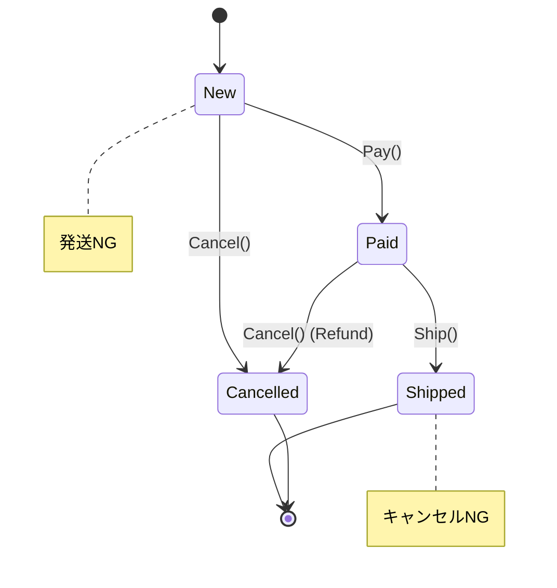

# 第74章：State ①：状態で振る舞いを分ける🚦

## ねらい 🎯





* 「状態が増えるほど `if/switch` が太っていく問題」😵‍💫 をスパッと説明できるようにする
* **State（状態）によって“許される操作”や“振る舞い”が変わる**ケースで、コードを読みやすく保つ感覚をつかむ✨
* まずは **C#の `switch` 式**で耐えられる範囲も知って、「いつStateに行くか」の判断軸を作る🧠

---

## 到達目標 ✅

* 「Stateは何を解決する？」を自分の言葉で言える📣
* `switch` で書く実装と、Stateで分ける実装の“差”を説明できる🔍
* 「Stateにするほどでもない」ケースも判断できる🙆‍♀️

---

## 手順 🧭

### 1) まず “switch地獄” の芽を体験する🌱😇

例題：注文 `Order` が **状態**（New / Paid / Shipped / Cancelled）を持っていて、
`Pay()` / `Ship()` / `Cancel()` の可否が状態で変わる🛒💳📦

まずは素直に `enum` + `switch` で書いてみるよ👇（最初はこれでOK！）

```csharp
public enum OrderStatus
{
    New,
    Paid,
    Shipped,
    Cancelled
}

public sealed class Order
{
    public OrderStatus Status { get; private set; } = OrderStatus.New;

    public void Pay()
    {
        Status = Status switch
        {
            OrderStatus.New => OrderStatus.Paid,
            OrderStatus.Paid => throw new InvalidOperationException("もう支払い済みです。"),
            OrderStatus.Shipped => throw new InvalidOperationException("発送後は支払い操作できません。"),
            OrderStatus.Cancelled => throw new InvalidOperationException("キャンセル済みです。"),
            _ => throw new InvalidOperationException("不明な状態です。")
        };
    }

    public void Ship()
    {
        Status = Status switch
        {
            OrderStatus.Paid => OrderStatus.Shipped,
            OrderStatus.New => throw new InvalidOperationException("未払いは発送できません。"),
            OrderStatus.Shipped => throw new InvalidOperationException("もう発送済みです。"),
            OrderStatus.Cancelled => throw new InvalidOperationException("キャンセル済みです。"),
            _ => throw new InvalidOperationException("不明な状態です。")
        };
    }

    public void Cancel()
    {
        Status = Status switch
        {
            OrderStatus.New => OrderStatus.Cancelled,
            OrderStatus.Paid => OrderStatus.Cancelled, // 返金は次章以降で…の想定
            OrderStatus.Shipped => throw new InvalidOperationException("発送後はキャンセルできません。"),
            OrderStatus.Cancelled => throw new InvalidOperationException("もうキャンセル済みです。"),
            _ => throw new InvalidOperationException("不明な状態です。")
        };
    }
}
```

ここでのポイント💡

* **C#の `switch` 式**は「状態→結果（次の状態）」を **1か所にまとまりやすい**のが良いところ✨ ([Microsoft Learn][1])
* でも…状態が増えたり、操作が増えたり、副作用（ログ・通知・返金処理）が入ると…
  **同じ分岐ルールがあちこちに複製**されていく😱

---

### 2) “switchで耐えられる範囲” を先に決めちゃう📏🙂

まずは判断をラクにしよう！

**switchのままでOKになりやすい条件**✅

* 状態が少ない（だいたい 3〜4 程度）
* 操作が少ない（1〜2個）
* 副作用が少ない（状態を変えるだけ、くらい）
* ルールが頻繁に変わらない

**Stateを考えたくなる条件**🚦

* 操作が増えた（Pay/Ship/Cancel/Refund/…）
* 状態が増えた（OnHold/PartiallyPaid/Returned/…）
* 状態ごとの振る舞いが濃くなった（ログ、通知、返金、在庫…）
* “この状態ではこの操作はこう” が、複数メソッドで繰り返される

ここからが State の出番〜！🧩✨

---

### 3) Stateパターンの登場人物を“超シンプル”に理解する👥

Stateは登場人物が少ないのが嬉しい😊

* **Context（文脈）**：状態を持つ本体（例：`Order`）
* **State（状態）**：状態ごとの振る舞い（例：`NewState` / `PaidState` …）
* Contextは「いまのState」に仕事を丸投げする🏐

> コツ：**「状態によって振る舞いが変わる」を、クラスに分けて“置き場所”を作る**感じ！

---

### 4) 最小の State 実装を書いてみる（“状態クラスは最小限”）🧩✨

まずは **インターフェイス1個**でOK！

```csharp
public interface IOrderState
{
    void Pay(OrderContext order);
    void Ship(OrderContext order);
    void Cancel(OrderContext order);
}
```

Context（注文本体）は「状態を持つ」「状態に委譲する」だけに集中👇

```csharp
public sealed class OrderContext
{
    private IOrderState _state = new NewState();

    public string StatusName => _state.GetType().Name;

    internal void TransitionTo(IOrderState nextState) => _state = nextState;

    public void Pay() => _state.Pay(this);
    public void Ship() => _state.Ship(this);
    public void Cancel() => _state.Cancel(this);
}
```

あとは状態クラスたち（ここが“ルール置き場”）🚦

```csharp
public sealed class NewState : IOrderState
{
    public void Pay(OrderContext order) => order.TransitionTo(new PaidState());

    public void Ship(OrderContext order) =>
        throw new InvalidOperationException("未払いは発送できません。");

    public void Cancel(OrderContext order) => order.TransitionTo(new CancelledState());
}

public sealed class PaidState : IOrderState
{
    public void Pay(OrderContext order) =>
        throw new InvalidOperationException("もう支払い済みです。");

    public void Ship(OrderContext order) => order.TransitionTo(new ShippedState());

    public void Cancel(OrderContext order) => order.TransitionTo(new CancelledState());
}

public sealed class ShippedState : IOrderState
{
    public void Pay(OrderContext order) =>
        throw new InvalidOperationException("発送後は支払い操作できません。");

    public void Ship(OrderContext order) =>
        throw new InvalidOperationException("もう発送済みです。");

    public void Cancel(OrderContext order) =>
        throw new InvalidOperationException("発送後はキャンセルできません。");
}

public sealed class CancelledState : IOrderState
{
    public void Pay(OrderContext order) =>
        throw new InvalidOperationException("キャンセル済みです。");

    public void Ship(OrderContext order) =>
        throw new InvalidOperationException("キャンセル済みです。");

    public void Cancel(OrderContext order) =>
        throw new InvalidOperationException("もうキャンセル済みです。");
}
```

**ここが気持ちいいポイント😍**

* `OrderContext`（呼び出し側）は **状態の分岐を知らなくていい**
* 「新しい状態やルール」を追加するとき、**追加する場所がハッキリ**する
* `if/switch` の“散らばり”が減る✨

---

### 5) テストで「遷移ルール」を固定する🧪💖（MSTest例）

Stateは **ルールが分散する**ので、テストが超大事！💪

```csharp
using Microsoft.VisualStudio.TestTools.UnitTesting;

[TestClass]
public sealed class OrderStateTests
{
    [TestMethod]
    public void New_can_pay_then_ship()
    {
        var order = new OrderContext();

        order.Pay();
        Assert.AreEqual("PaidState", order.StatusName);

        order.Ship();
        Assert.AreEqual("ShippedState", order.StatusName);
    }

    [TestMethod]
    public void New_cannot_ship()
    {
        var order = new OrderContext();

        Assert.ThrowsException<InvalidOperationException>(() => order.Ship());
    }

    [TestMethod]
    public void Shipped_cannot_cancel()
    {
        var order = new OrderContext();
        order.Pay();
        order.Ship();

        Assert.ThrowsException<InvalidOperationException>(() => order.Cancel());
    }
}
```

---

### 6) AI補助（Copilot/Codex）で“雛形だけ”作るコツ🤖✍️

AIはめちゃ便利なんだけど、Stateでやりがちな事故があるので、**頼み方を固定**しよう🧠✨

おすすめプロンプト例👇

* 「`IOrderState` と `New/Paid/Shipped/Cancelled` の4クラスを作って。`OrderContext` は `TransitionTo` だけ持つ。**汎用状態機械は作らない**。例外メッセージは日本語。MSTestも3本つけて。」

レビュー観点（人間の仕事👀）

* 「Contextが太ってない？」
* 「状態クラスが“何でも屋”になってない？」
* 「遷移がどこで起きるか読める？」（`TransitionTo` が散らばり過ぎてない？）

---

### 7) “State と Strategy の違い”を一言で言えるようにする🧠🔁

似てるけど目的が違うよ〜！

* **Strategy**：アルゴリズム（方針）を選びたい（例：割引計算）
* **State**：状態が変わると、許可される操作や振る舞いが変わる（例：未払いは発送できない）🚦

---

### 8) 2026年のC#視点での小ネタ（switch式は強いけど、万能じゃない）🧁

* `switch` 式は「状態→結果」をまとめやすいから、**小規模なら最高**✨ ([Microsoft Learn][1])
* ただし「操作が増える」「副作用が増える」ほど、Stateの“置き場所”が効いてくる🚦
* 2026-02時点の.NETは **.NET 10 がLTS**、.NET 9 はSTSとしてサポート中（最新版の更新が続いてるよ）📦✨ ([Microsoft][2])
* C# 13 は .NET 9 でサポート、という位置づけも押さえておくと安心🙂 ([Microsoft Learn][3])

---

## よくある落とし穴 ⚠️😵

* **汎用状態機械（ステートマシン）を作り始める** 🌀
  → それ、だいたい脱線！まずは“この1ドメインの状態”だけで十分🙆‍♀️
* **状態（State）と enum を二重管理** 🪦
  → どっちが真実かわからなくなる！最初はどちらかに寄せる
* **状態クラスがContextの内部をいじりすぎる** 🔧💥
  → `TransitionTo` と “最小限の操作”だけに絞るのが安全
* **例外メッセージ・契約がバラバラ** 📛
  → テストでメッセージまで固定しないまでも、「どう失敗するか」を統一しよう
* **遷移ルールが散らばって読めない** 🧩💦
  → 章が進んだら「遷移表（表形式）」を作ってズレを防ぐのが効く（次章以降でやる！）

---

## ミニ演習（10〜30分）🧪🌸

### 演習A：状態を1つ増やす（OnHold）🟡

* `OnHoldState`（保留）を追加してね
* ルール例：

  * `Pay()` はOK（Paidへ）
  * `Ship()` はNG
  * `Cancel()` はOK（Cancelledへ）
* MSTest を2本追加して、ルールを固定✅

### 演習B：Stateの生成を軽くする（“new連発”を減らす）🧹

* 状態がステートレスなら、各Stateを `static readonly` で1個だけ持つ形にしてみよう（※小さく！）
* 変更点：`TransitionTo(PaidState.Instance)` みたいにする
* テストがそのまま通ることを確認🎉

### 演習C：switch版とState版で“変更コスト”を比べる🔍

* 「Refund（返金）」を追加する想定で、

  * switch版ならどこが増える？
  * State版ならどこが増える？
    を箇条書きで比較メモしてね📝✨

---

## 自己チェック ✅✅

* 「Stateは **状態で振る舞いが変わる** ときに効く」って言えた？🚦
* switchで耐えられる条件／Stateが欲しくなる条件を1つずつ言えた？📏
* Context（本体）が、状態分岐を知らずに済んでる？（委譲できてる？）🏐
* テストで “遷移ルール” が固定されてる？🧪✨

[1]: https://learn.microsoft.com/en-us/dotnet/csharp/language-reference/operators/switch-expression?utm_source=chatgpt.com "Evaluate a pattern match expression using the `switch ..."
[2]: https://dotnet.microsoft.com/en-us/platform/support/policy/dotnet-core?utm_source=chatgpt.com "NET and .NET Core official support policy"
[3]: https://learn.microsoft.com/en-us/dotnet/csharp/whats-new/csharp-13?utm_source=chatgpt.com "What's new in C# 13"
