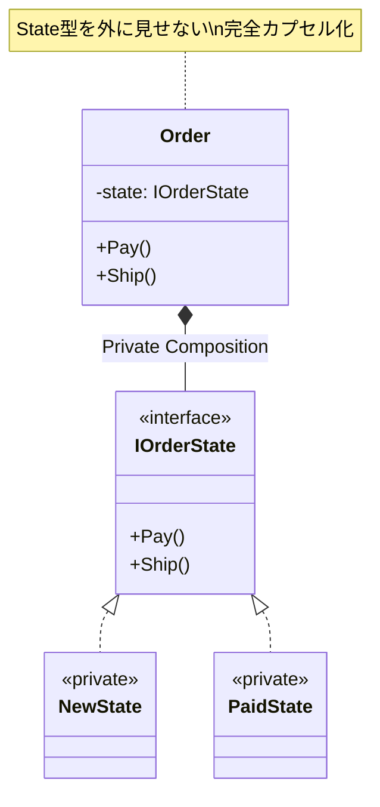

# 第75章：State ②：C#で自然に（状態クラスは最小限）🧩

## ねらい 🎯





* 「Stateパターン＝クラスを増やすこと」じゃなくて、**状態による振る舞いの分岐を、読みやすく・壊れにくくする**感覚をつかむよ〜🧠✨
* まずは **C#のswitch式（パターンマッチング）**で“軽く”解ける範囲を知る🙂🔀 ([Microsoft Learn][1])
* 「ここから先はStateにした方が幸せ！」っていう**境界線**を作る（＝状態クラスは最小限にする）🚦🧩

---

## 到達目標 🏁

* .NETの型が「状態で振る舞いが変わる」ことを、**公式ドキュメント/IntelliSense**で読み取れる👀📚
* **enum + switch式**で済むケース / **Stateクラス**に分けたほうが良いケースを言える🗣️✨
* Stateクラスを作るなら、**publicに増やさず**、**1ファイル内に閉じ込める最小実装**ができる🧩🔒

---

## 手順 👣

### 1) まず .NET の「Stateっぽさ」を読む：`Stream` の寿命（ライフサイクル）💧⏳

.NET のオブジェクトって、実は **状態（使える/閉じた/破棄済み）**で振る舞いが変わるものが多いよ〜🙂
たとえば `Stream.Write` は、閉じた（Disposeした）あとに呼ぶと `ObjectDisposedException` が飛ぶって、公式に書いてある📌⚠️ ([Microsoft Learn][2])

```csharp
using System;
using System.IO;

using var ms = new MemoryStream();
ms.WriteByte(0x2A);   // OK 🙂

ms.Dispose();         // ここで「破棄済み」状態へ🚫

ms.WriteByte(0x2A);   // ObjectDisposedException 💥
```

✅ ここで大事なのは：

* `Stream` が **「内部の状態」を持っていて**
* 利用者は「状態を直接いじる」んじゃなく、**呼び出し結果（例外）で契約を守る**ってこと🧠✨

---

### 2) 「Stateクラスを作らない」選択肢：enum + switch式で軽くやる🔀🪶

Stateパターンは強いけど、**最初からクラス分割すると重くなりがち**😵‍💫
C#は `switch` 式が書きやすいから、まずはこれでOKな範囲が多いよ✨ ([Microsoft Learn][1])

例：注文の状態を enum で持って、許可されない操作は例外にする（最小）🛒🚦

```csharp
public enum OrderStatus
{
    New,
    Paid,
    Shipped,
    Canceled
}

public sealed class Order
{
    public OrderStatus Status { get; private set; } = OrderStatus.New;

    public void Pay()
    {
        Status = Status switch
        {
            OrderStatus.New => OrderStatus.Paid,
            OrderStatus.Paid => throw new InvalidOperationException("もう支払い済みだよ🙂"),
            OrderStatus.Shipped => throw new InvalidOperationException("発送後は支払えないよ📦"),
            OrderStatus.Canceled => throw new InvalidOperationException("キャンセル済みだよ🚫"),
            _ => throw new InvalidOperationException("未知の状態だよ😵")
        };
    }

    public void Cancel()
    {
        Status = Status switch
        {
            OrderStatus.New => OrderStatus.Canceled,
            OrderStatus.Paid => throw new InvalidOperationException("支払い後キャンセルは別フロー（返金）にしよ💸"),
            OrderStatus.Shipped => throw new InvalidOperationException("発送後キャンセルは返品フローだよ📦↩️"),
            OrderStatus.Canceled => OrderStatus.Canceled,
            _ => throw new InvalidOperationException("未知の状態だよ😵")
        };
    }
}
```

💡この方式が向くのは：

* 操作が少ない（2〜3個）
* 状態も少ない（2〜4個）
* 例外メッセージやログが多少散っても、まだ読める🙂

---

### 3) 「ここから State へ」っていう境界線を見つける🚦🧩

次の症状が出てきたら、switch式が急にツラくなるよ〜😇💦

* 状態×操作の組み合わせが増えて、**switchが何個も増殖**する😵‍💫
* 「この状態のときだけやる前処理/後処理」が増えて、**分岐の中が肥大化**する🐘
* 遷移（New→Paid→…）のルールが複雑になり、**どこが正なのか迷子**になる🧭💦
* テストが「分岐の網羅」になって、意図が見えなくなる🧪🌀

このへんが「Stateクラスの出番」✨

---

### 4) Stateクラスは“最小限”で：Orderの中に閉じ込める🔒🧩

ポイントはこれだけ👇✨

* **public に State 型を出さない**（利用者に状態クラスを意識させない）🙅‍♀️
* `Order` が持つのは **「いまの状態オブジェクト」1つだけ**🧩
* 状態クラスは `private sealed` + `static readonly` で**増殖/生成コストを抑える**🧊

```csharp
public sealed class Order
{
    private IOrderState _state = NewState.Instance;

    public string StatusName => _state.Name;

    public void Pay()    => _state.Pay(this);
    public void Ship()   => _state.Ship(this);
    public void Cancel() => _state.Cancel(this);

    private void SetState(IOrderState next) => _state = next;

    private interface IOrderState
    {
        string Name { get; }
        void Pay(Order ctx);
        void Ship(Order ctx);
        void Cancel(Order ctx);
    }

    private sealed class NewState : IOrderState
    {
        public static readonly NewState Instance = new();

        public string Name => "New";

        public void Pay(Order ctx)    => ctx.SetState(PaidState.Instance);
        public void Ship(Order ctx)   => throw new InvalidOperationException("未払いで発送はできないよ💦");
        public void Cancel(Order ctx) => ctx.SetState(CanceledState.Instance);
    }

    private sealed class PaidState : IOrderState
    {
        public static readonly PaidState Instance = new();

        public string Name => "Paid";

        public void Pay(Order ctx)    => throw new InvalidOperationException("もう支払い済みだよ🙂");
        public void Ship(Order ctx)   => ctx.SetState(ShippedState.Instance);
        public void Cancel(Order ctx) => throw new InvalidOperationException("返金フローにしてね💸");
    }

    private sealed class ShippedState : IOrderState
    {
        public static readonly ShippedState Instance = new();

        public string Name => "Shipped";

        public void Pay(Order ctx)    => throw new InvalidOperationException("発送後は支払えないよ📦");
        public void Ship(Order ctx)   => throw new InvalidOperationException("もう発送済みだよ🚚");
        public void Cancel(Order ctx) => throw new InvalidOperationException("返品フローにしてね📦↩️");
    }

    private sealed class CanceledState : IOrderState
    {
        public static readonly CanceledState Instance = new();

        public string Name => "Canceled";

        public void Pay(Order ctx)    => throw new InvalidOperationException("キャンセル済みだよ🚫");
        public void Ship(Order ctx)   => throw new InvalidOperationException("キャンセル済みだよ🚫");
        public void Cancel(Order ctx) { /* 何もしない */ }
    }
}
```

🧠いい感じポイント：

* `Order` の public API は `Pay/Ship/Cancel` だけでシンプル✨
* 状態ごとのルールが、各Stateにまとまるから読みやすい📚
* State型が外に漏れないので、**“パターンのためのAPI”**にならない🙆‍♀️

---

### 5) テストで「状態の契約」を固定する🧪✅

Stateは「正しい遷移」と「禁止操作」が命💖
だからテストは **“遷移表の代わり”**として効くよ〜✨

```csharp
using Microsoft.VisualStudio.TestTools.UnitTesting;
using System;

[TestClass]
public class OrderStateTests
{
    [TestMethod]
    public void New_can_pay_and_becomes_paid()
    {
        var order = new Order();
        order.Pay();
        Assert.AreEqual("Paid", order.StatusName);
    }

    [TestMethod]
    public void New_cannot_ship()
    {
        var order = new Order();
        Assert.ThrowsException<InvalidOperationException>(() => order.Ship());
    }
}
```

---

### 6) ちょい最新トピック：C# / .NET の「今どれ使う？」の目線👀✨

2026年2月時点だと、.NET は **.NET 10 が LTS**で、2025年11月にリリースされてるよ📌（サポート期限も表で追える） ([Microsoft][3])
C# も **C# 14** の新機能が公式にまとまってる（＝「今のC#」の参照先が明確）📚✨ ([Microsoft Learn][4])
（※この章の主役は「switch式/パターンマッチング」「小さなprivate状態クラス」なので、そこが安定して使えるのが大事だよ🙂）

---

### 7) AI補助を使うときの“勝ち筋”🤖🧡

AIにお願いするなら、**最初から「縛り」を書く**のがコツだよ〜✨

* 例プロンプト（コピペOK）👇

  * 「Orderの状態（New/Paid/Shipped/Canceled）をStateパターンで実装して。
    ただし状態クラスは `private sealed` の入れ子で、外に公開しない。
    汎用状態機械フレームワークは禁止。
    MSTestで遷移と禁止操作のテストも最小で付けて。」

* レビュー観点👀✅

  * 状態クラスが public になってない？
  * `Order` の public API が増えてない？（State都合のメソッドが漏れてない？）
  * “遷移”が散らばってない？（`SetState` 経由で一本化できてる？）
  * 例外メッセージが意味不明になってない？（利用者向けの言葉になってる？）

---

## よくある落とし穴 ⚠️

* 「汎用状態機械」を作り始めて、学習が宇宙へ🚀👋（今回は **禁止**だよ〜）
* Stateクラスを public にして、利用側が「状態に依存」し始める😵（逆戻り！）
* 状態遷移が複数箇所に散って、修正漏れが出る🧨
* 例外/戻り値の契約がブレて、呼び出し側が困る😢
* switch式で十分なのに、Stateにしてクラス数だけ増える🐣💦

---

## ミニ演習（10〜30分）🧪🌸

1. `enum + switch式` 版の `Order` を作る🛒🔀
2. 状態と操作を1つ増やす（例：`Refunded` を増やす、`Refund()` を増やす）➕💸
3. switch がしんどくなってきたら、**State入れ子クラス版**へ移行🧩🔒
4. テストは最低これだけ✅

* 正しい遷移ができる
* 禁止操作で例外が出る（メッセージもそれっぽい）

---

## 自己チェック ✅

* 「switch式で十分」な条件を2つ言える？🙂
* 「Stateにした方がいい」兆候を3つ言える？🚦
* Stateクラスが **private** で、利用者に漏れてない？🔒
* `Order` の public API が、状態都合で増えてない？🙅‍♀️
* テストが「遷移表」になっていて、将来の自分を助けてる？🧪✨

[1]: https://learn.microsoft.com/ja-jp/dotnet/csharp/language-reference/operators/switch-expression?utm_source=chatgpt.com "'switch' 式を使用してパターン一致式を評価する - C# reference"
[2]: https://learn.microsoft.com/ja-jp/dotnet/api/system.io.stream.write?view=net-8.0&utm_source=chatgpt.com "Stream.Write メソッド (System.IO)"
[3]: https://dotnet.microsoft.com/ja-jp/platform/support/policy?utm_source=chatgpt.com "公式の .NET サポート ポリシー | .NET"
[4]: https://learn.microsoft.com/en-us/dotnet/csharp/whats-new/csharp-14?utm_source=chatgpt.com "What's new in C# 14"
