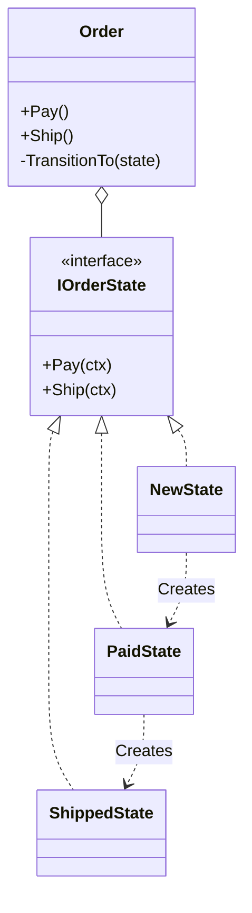

# 第76章：State ③：演習（注文の状態：New→Paid→Shipped）📦🚚

## ねらい 🎯





* 「状態によって許される操作が変わる」せいで **if/switch が増殖する地獄🔥😵** を、Stateパターンでスッキリさせる✨
* 「動く」「テストが通る」「責務が薄い」この3点を守りながら、**最小のState実装**を体に入れる💪😊
* まずは **New → Paid → Shipped** の3状態だけで十分！🌸

この章で触るもの（標準中心）🧰

* `switch` 式（導入前の比較に使う）([Microsoft Learn][1])
* C# のパターンマッチ（`switch` の考え方の背景）([Microsoft Learn][2])
* MSTest（テストで安全にリファクタ）([Microsoft Learn][3])

---

## 到達目標 🥅

* ✅ 「導入前（switch）」→「導入後（State）」に **テストを壊さず**移行できる
* ✅ `Order.Pay()` / `Order.Ship()` の **呼び出し側が状態分岐を知らない**形にできる
* ✅ 不正な遷移（例：NewでShip）を **一貫したルール**で弾ける（例外）🚫
* ✅ 「Stateを入れるべき場面 / 入れない場面」を一言で説明できる🙂

---

## 手順 🧭✨

### 1) まず「導入前」を作る（switch地獄を1回味わう）🔥

状態を `enum` で持って、操作ごとに `switch` で分岐する、よくある形からスタートします。

**OrderStatus.cs**

```csharp
namespace GoF.StateChapter;

public enum OrderStatus
{
    New,
    Paid,
    Shipped
}
```

**Order.Switch.cs（導入前バージョン）**

```csharp
namespace GoF.StateChapter;

public sealed class Order
{
    public OrderStatus Status { get; private set; } = OrderStatus.New;

    public DateTimeOffset? PaidAt { get; private set; }
    public DateTimeOffset? ShippedAt { get; private set; }

    public void Pay(DateTimeOffset? now = null)
    {
        var t = now ?? DateTimeOffset.UtcNow;

        Status = Status switch
        {
            OrderStatus.New => MarkPaid(t),
            OrderStatus.Paid => throw new InvalidOperationException("すでに支払い済みだよ💦"),
            OrderStatus.Shipped => throw new InvalidOperationException("発送後は支払い操作できないよ💦"),
            _ => throw new InvalidOperationException("未知の状態です😵")
        };
    }

    public void Ship(DateTimeOffset? now = null)
    {
        var t = now ?? DateTimeOffset.UtcNow;

        Status = Status switch
        {
            OrderStatus.New => throw new InvalidOperationException("未払いなのに発送はできないよ🚫"),
            OrderStatus.Paid => MarkShipped(t),
            OrderStatus.Shipped => throw new InvalidOperationException("すでに発送済みだよ💦"),
            _ => throw new InvalidOperationException("未知の状態です😵")
        };
    }

    private OrderStatus MarkPaid(DateTimeOffset t)
    {
        PaidAt = t;
        return OrderStatus.Paid;
    }

    private OrderStatus MarkShipped(DateTimeOffset t)
    {
        ShippedAt = t;
        return OrderStatus.Shipped;
    }
}
```

ここ、`switch` 式は「入力に対して最初にマッチしたパターンの式を評価する」っていう仕様で動きます([Microsoft Learn][1])
（今回はパターンマッチの“超基本”として使ってるよ😊）([Microsoft Learn][2])

---

### 2) テストで「今の仕様」を固定する 🧪🔒

リファクタの前に、**仕様をテストでロック**します！（ここ超大事💗）

**OrderTests.Switch.cs**

```csharp
using GoF.StateChapter;
using Microsoft.VisualStudio.TestTools.UnitTesting;

namespace GoF.StateChapterTests;

[TestClass]
public sealed class OrderTests_Switch
{
    [TestMethod]
    public void New_to_Paid_to_Shipped_ok()
    {
        var order = new Order();

        order.Pay(new DateTimeOffset(2026, 2, 6, 0, 0, 0, TimeSpan.Zero));
        Assert.AreEqual(OrderStatus.Paid, order.Status);
        Assert.IsNotNull(order.PaidAt);

        order.Ship(new DateTimeOffset(2026, 2, 6, 1, 0, 0, TimeSpan.Zero));
        Assert.AreEqual(OrderStatus.Shipped, order.Status);
        Assert.IsNotNull(order.ShippedAt);
    }

    [TestMethod]
    public void Ship_from_New_throws()
    {
        var order = new Order();

        Assert.ThrowsException<InvalidOperationException>(() => order.Ship());
    }

    [TestMethod]
    public void Pay_twice_throws()
    {
        var order = new Order();
        order.Pay();

        Assert.ThrowsException<InvalidOperationException>(() => order.Pay());
    }
}
```

---

### 3) 本題：Stateパターンに置き換える 🧩✨

ポイントはこれだけ！👇

* `Order`（文脈＝Context）が **状態オブジェクトに委譲**する
* 状態ごとの分岐（if/switch）を、**状態クラス側に押し込む**
* 状態遷移（New→Paidなど）は、状態クラスが責任を持つ🚦

**Order.State.cs（導入後バージョン：State）**

```csharp
namespace GoF.StateChapter;

public sealed class Order
{
    private IOrderState _state = new NewState();

    public OrderStatus Status => _state.Status;

    public DateTimeOffset? PaidAt { get; private set; }
    public DateTimeOffset? ShippedAt { get; private set; }

    public void Pay(DateTimeOffset? now = null)
        => _state.Pay(this, now ?? DateTimeOffset.UtcNow);

    public void Ship(DateTimeOffset? now = null)
        => _state.Ship(this, now ?? DateTimeOffset.UtcNow);

    // --- ここから下は「状態だけが触っていい」内部処理 💎 ---
    private void TransitionTo(IOrderState next) => _state = next;
    private void MarkPaid(DateTimeOffset t) => PaidAt = t;
    private void MarkShipped(DateTimeOffset t) => ShippedAt = t;

    private interface IOrderState
    {
        OrderStatus Status { get; }
        void Pay(Order order, DateTimeOffset now);
        void Ship(Order order, DateTimeOffset now);
    }

    private sealed class NewState : IOrderState
    {
        public OrderStatus Status => OrderStatus.New;

        public void Pay(Order order, DateTimeOffset now)
        {
            order.MarkPaid(now);
            order.TransitionTo(new PaidState());
        }

        public void Ship(Order order, DateTimeOffset now)
            => throw new InvalidOperationException("未払いなのに発送はできないよ🚫");
    }

    private sealed class PaidState : IOrderState
    {
        public OrderStatus Status => OrderStatus.Paid;

        public void Pay(Order order, DateTimeOffset now)
            => throw new InvalidOperationException("すでに支払い済みだよ💦");

        public void Ship(Order order, DateTimeOffset now)
        {
            order.MarkShipped(now);
            order.TransitionTo(new ShippedState());
        }
    }

    private sealed class ShippedState : IOrderState
    {
        public OrderStatus Status => OrderStatus.Shipped;

        public void Pay(Order order, DateTimeOffset now)
            => throw new InvalidOperationException("発送後は支払い操作できないよ💦");

        public void Ship(Order order, DateTimeOffset now)
            => throw new InvalidOperationException("すでに発送済みだよ💦");
    }
}
```

✅ これで「状態分岐（if/switch）」が `Order` から消えました🎉
呼び出し側はずっと `order.Pay()` / `order.Ship()` のまま！最高〜🥳

---

### 4) テストを「State版」に差し替えて、同じ仕様を満たすか確認 ✅🧪

テストが同じまま通れば勝ち！✨（＝安全にリファクタできた証拠）

**OrderTests.State.cs**

```csharp
using GoF.StateChapter;
using Microsoft.VisualStudio.TestTools.UnitTesting;

namespace GoF.StateChapterTests;

[TestClass]
public sealed class OrderTests_State
{
    [TestMethod]
    public void New_to_Paid_to_Shipped_ok()
    {
        var order = new Order();

        order.Pay(new DateTimeOffset(2026, 2, 6, 0, 0, 0, TimeSpan.Zero));
        Assert.AreEqual(OrderStatus.Paid, order.Status);
        Assert.IsNotNull(order.PaidAt);

        order.Ship(new DateTimeOffset(2026, 2, 6, 1, 0, 0, TimeSpan.Zero));
        Assert.AreEqual(OrderStatus.Shipped, order.Status);
        Assert.IsNotNull(order.ShippedAt);
    }

    [TestMethod]
    public void Ship_from_New_throws()
    {
        var order = new Order();
        Assert.ThrowsException<InvalidOperationException>(() => order.Ship());
    }

    [TestMethod]
    public void Pay_twice_throws()
    {
        var order = new Order();
        order.Pay();
        Assert.ThrowsException<InvalidOperationException>(() => order.Pay());
    }
}
```

MSTest は「多くの人にとって推奨の入り口」として整理されていて、SDK/テンプレで気軽に始められるよ([Microsoft Learn][3])
（既存が古いMSTestV1ならV2へ移行、みたいな整理も公式にあるよ）([Microsoft Learn][4])

---

## よくある落とし穴 😵‍💫⚠️

* **汎用状態機械を作り始める**（目的が変わって迷子👻）
  → 今回は「注文」だけ！3状態だけ！でOK🙆‍♀️
* **状態が Context（Order）のデータをコピーし始める**
  → データは `Order`、振る舞いは State に寄せるのが基本✨
* **例外メッセージがバラバラ**で運用ログが読めない
  → 「どの操作が」「どの状態で」ダメかが分かる文章にする📝
* **状態クラスが太る**（DBアクセスや通知までやりだす）
  → 状態クラスは「遷移とガード」中心。外部I/Oは別の層へ🚫

---

## 演習 🏋️‍♀️🌸

### 演習A（必須）💎

1. **導入前（switch版）**を作る
2. テストを3本書いて **仕様固定**🔒
3. **State版に置き換えて** テストが全部通るまで直す🎯

ゴール：`Order` の public API が **ほぼ増えない**状態で、if/switch が消えてること✨

### 演習B（追加）➕📦

「キャンセル」を足してみよう！😆

* 状態：`Cancelled` を追加
* ルール例：

  * New は Cancel できる
  * Paid は Cancel できない（または返金処理が必要…今回は“できない”でOK）
  * Shipped は Cancel できない

👉 追加メソッド `Cancel()` を `Order` に生やして、State側に委譲してみてね🔁

### 演習C（AI補助）🤖✨（使うなら）

Copilot/Codex に頼むなら、こういう“範囲指定”が安全だよ👇

* 「MSTestで、New→Paid→Shippedの正常系と例外系テストを追加して。既存public APIは変えないで」
* 出力されたら、必ずチェック：

  * ✅ 例外系が `Assert.ThrowsException` になってる？
  * ✅ 不要な抽象（余計なinterface/汎用フレームワーク）増やしてない？
  * ✅ テストが “状態” じゃなく “振る舞い” を見てる？（Pay/Shipの結果）

---

## チェック ✅🧡

* [ ] `Order` の中に **状態分岐（if/switch）が残ってない**
* [ ] 呼び出し側は `order.Pay()` / `order.Ship()` だけで使える（状態の知識ゼロ）🙂
* [ ] 不正遷移は `InvalidOperationException` で落ちる（ルールが一貫）🚫
* [ ] Stateクラスの責務が「遷移・ガード」中心で薄い✨
* [ ] テストが「導入前→導入後」でも同じ意味で通った（＝安全に移行できた）🎉

[1]: https://learn.microsoft.com/en-us/dotnet/csharp/language-reference/operators/switch-expression?utm_source=chatgpt.com "Evaluate a pattern match expression using the `switch ..."
[2]: https://learn.microsoft.com/en-us/dotnet/csharp/fundamentals/functional/pattern-matching?utm_source=chatgpt.com "Pattern matching overview - C#"
[3]: https://learn.microsoft.com/en-us/dotnet/core/testing/unit-testing-mstest-sdk?utm_source=chatgpt.com "MSTest SDK overview - .NET"
[4]: https://learn.microsoft.com/ja-jp/visualstudio/test/mstest-update-to-mstestv2?view=visualstudio&utm_source=chatgpt.com "MSTestV1 から MSTestV2 への更新 - Visual Studio ..."
