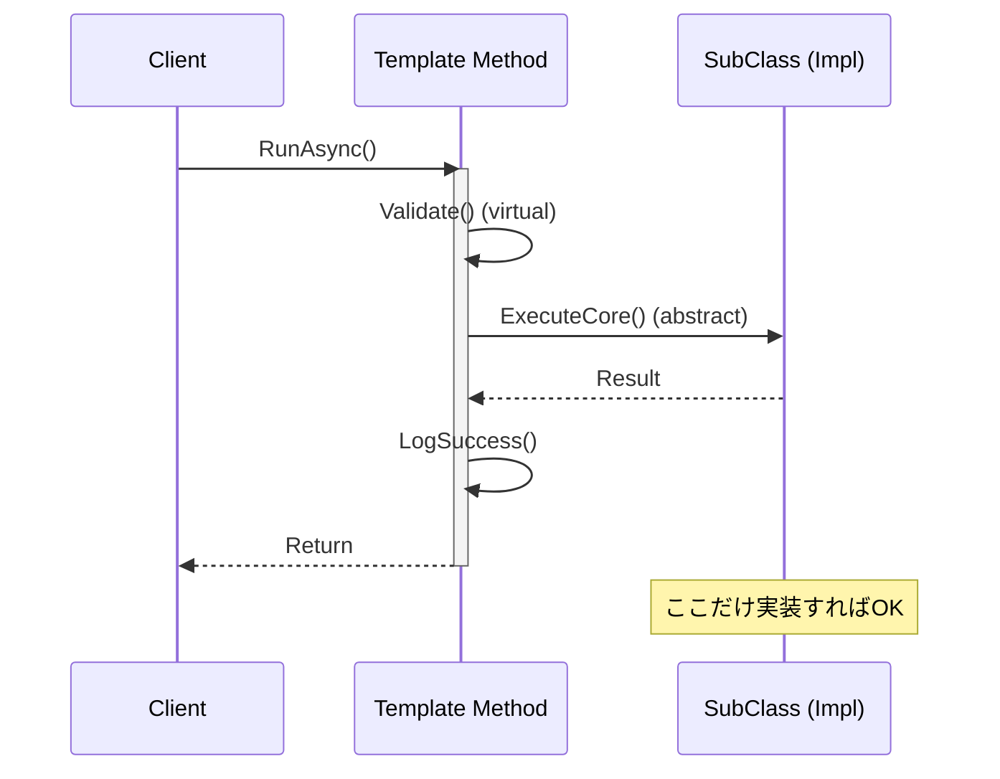

# 第77章：Template Method ①：手順は固定、差分だけ埋める📜

## ねらい 🎯





* 「処理の**手順（順番）は毎回同じ**だけど、途中の一部だけ**差分がある**」みたいな場面で、if/switch地獄を増やさずに整理できるようになる🧠🌸
* 継承を使う設計のときに「**どこまでを共通化して、どこを差し替え点にするか**」の線引きを作れるようになる✂️🙂
* .NETの標準的な“テンプレっぽい作法”も体感して、実務で「これ見たことある！」状態にする👀✨

---

## 到達目標 ✅

* Template Methodを「**固定フロー + フック（差分）**」として説明できる📌
* 「固定したい順番」を**publicメソッド**に閉じ込めて、差分を**protected virtual / abstract**で差し替える形にできる🧩
* “入れるべき場面 / 入れないべき場面”を具体例つきで言える🙆‍♀️🙅‍♀️

---

## 手順 🧭✨

### 1) まず「固定したい順番」を1行で書く 📝

Template Methodは、まずここが命です💡
例）

* 「検証 → 実行 → 成功ログ（→ 失敗ログ）」
* 「読み取り → 変換 → 保存」
* 「前処理 → 本処理 → 後処理」

この“順番”を守りたいなら、Template Method候補🌱

---

### 2) 「差分」は2種類に分ける 🧠🔍

差分って、だいたいこの2つに分かれます👇

* **必須の差分（埋めないと動かない）**
  → `abstract` で強制するのが向いてる💪
* **任意の差分（必要ならちょい足し）**
  → `virtual`（デフォルト実装あり）が向いてる🍰✨

---

### 3) “テンプレ”は public（または internal）で固定する 🔒

Template Methodの基本形はこれ👇

* 呼び出し側が叩くのは **1つの入口メソッド**
* 入口メソッドは **順番を固定**
* 中で呼ぶ “差分メソッド” を `protected` にする（外から勝手に呼ばせない）😌

```csharp
public abstract class OrderWorkflow
{
    // ✅ これが Template Method（手順を固定する入口）
    public async Task RunAsync(Order order, CancellationToken ct = default)
    {
        Validate(order);                 // 任意フック（デフォルトありでもOK）
        await ExecuteCoreAsync(order, ct); // 必須フック（ここは差分）
        await AfterSuccessAsync(order, ct); // 任意フック
    }

    // ✅ 必須の差分：派生クラスが必ず実装する
    protected abstract Task ExecuteCoreAsync(Order order, CancellationToken ct);

    // ✅ 任意の差分：必要なら上書き
    protected virtual void Validate(Order order) { }

    protected virtual Task AfterSuccessAsync(Order order, CancellationToken ct)
        => Task.CompletedTask;
}
```

ポイントはこの2つ💡

* **入口は増やさない**（呼び方がバラけると“手順固定”が壊れる）
* **protectedにして差分を閉じる**（外側が差分メソッドを直呼びし始めると破綻）

---

### 4) .NET標準の「テンプレっぽい作法」を見て“感覚”を掴む 👀✨

#### 例A：Disposeパターンは、めちゃくちゃ Template Method っぽい💡🧹

`IDisposable` の作法として有名な形は、

* 呼び出し側が叩くのは `Dispose()`（固定）
* 中で `Dispose(bool disposing)` を呼ぶ（差分フック）
* `GC.SuppressFinalize(this)` も固定で呼ぶ（後始末の約束）

…という **固定フロー + フック** になってます📌
Microsoft公式の .NET ガイドでも、この形（`Dispose()` と `Dispose(bool)` の組み合わせ）を説明しています。([Microsoft Learn][1])

ミニ雛形👇（学習用にちょい簡略）

```csharp
public abstract class ResourceBase : IDisposable
{
    private bool _disposed;

    public void Dispose()
    {
        Dispose(disposing: true);      // ✅ フック呼び出し（差分ポイント）
        GC.SuppressFinalize(this);     // ✅ 固定の後始末
    }

    protected virtual void Dispose(bool disposing)
    {
        if (_disposed) return;

        if (disposing)
        {
            // managed resources cleanup（任意）
        }

        // unmanaged resources cleanup（必要なら）
        _disposed = true;
    }
}
```

これ、Template Methodの考え方そのものです🙂✨
「公開APIは固定」「派生側は差分だけ」っていう安心設計💕

---

#### 例B：`Stream.CopyTo` も “固定のやり方” を持ってる🧃➡️🧃

`Stream` は「読み込み/書き込み」を抽象化していて、`CopyTo` は “コピーの手順” を提供します。ドキュメント上も「現在のストリームから読み、別のストリームへ書く」動作が明示されています。([Microsoft Learn][2])
さらにソース実装を見ると、内部で `Read(...)` と `Write(...)` を繰り返す形でコピーしてます。([dotnetframework.org][3])

ここも雰囲気は同じ👇

* “コピー手順” は `Stream` 側が握る（固定）
* 実際の `Read/Write` の具体は派生クラス（差分）

---

### 5) Template Method と Strategy の使い分け（超大事）⚖️✨

* **Template Method**：
  「順番を固定したい」＋「継承の形が自然」
  例：共通フローの骨格、Dispose作法、フレームワーク系の拡張点
* **Strategy**：
  「アルゴリズム丸ごと差し替えたい」＋「合成で差し替えたい」
  例：割引計算、並び替えルール、配送計算

迷ったらこう考えるとラクです👇

* 「**順番を守りたい**」→ Template Method 寄り📜
* 「**方針そのものを選びたい**」→ Strategy 寄り🧠🔁

---

## よくある落とし穴 ⚠️😵

1. **フックが増えすぎて、何が起きるかわからない**

   * `BeforeXxx`, `AfterXxx`, `OnXxx` が大量発生すると、読むのがつらい🥺
   * 差し替え点は“最小”が正義👑

2. **継承が深くなってカオス🌀**

   * 2段くらいで止める意識が大事（深い継承ツリーはバグ温床）

3. **差分メソッドを public にしてしまう**

   * 外から `ExecuteCoreAsync()` を直接呼ばれたら「手順固定」が崩壊💥
   * 差分は `protected` で隠すのが基本🙈

4. **“手順の中で例外が起きたらどうする？”が曖昧**

   * 失敗時のログ、後始末、リトライ…
   * ここを放置すると「テンプレのはずが毎回違う」になりがち😇

5. **コンストラクタで virtual を呼ぶ系の罠**

   * “初期化途中の派生クラス” が呼ばれて壊れることがある⚡
   * 基底クラスの ctor からフック呼び出しは原則避ける🙅‍♀️

---

## ミニ演習（10〜30分）🛒⏱️✨

「共通フロー（固定）＋ 差分（フック）」を**最小**で作ってみよう🌸

### お題：注文ワークフローを2種類にする

* 固定フロー：`Validate → ExecuteCore → AfterSuccess`
* 差分：

  * **通常注文**：実行だけする
  * **ギフト注文**：実行後に “ギフトメッセージ記録” を追加する（AfterSuccessを上書き）

ヒント（ベースは第77章のコードをそのまま使ってOK）👇

* `ExecuteCoreAsync` は必須（`abstract`）
* `AfterSuccessAsync` は任意（`virtual`）で、ギフトだけ上書きする🎁✨

「クラスを増やすのが目的」じゃなくて、**呼び出し側が1行で同じ呼び方になる**のがゴールだよ🙂🧡

---

## 自己チェック ✅🧠

* [ ] 呼び出し側は `RunAsync(...)` だけ呼んでる？（途中ステップを直呼びしてない？）
* [ ] “固定したい順番”がコードから一目で読める？📜
* [ ] 差分は `protected` に閉じてる？🔒
* [ ] `abstract`（必須）と `virtual`（任意）の使い分けができてる？✨
* [ ] フックが増えすぎてない？（増えそうなら Strategy や別案を検討できる？）⚖️

[1]: https://learn.microsoft.com/ja-jp/dotnet/standard/garbage-collection/implementing-dispose?utm_source=chatgpt.com "Dispose メソッドを実装する - .NET"
[2]: https://learn.microsoft.com/en-us/dotnet/api/system.io.stream.copyto?view=net-10.0&utm_source=chatgpt.com "Stream.CopyTo Method (System.IO)"
[3]: https://www.dotnetframework.org/default.aspx/4%400/4%400/DEVDIV_TFS/Dev10/Releases/RTMRel/ndp/clr/src/BCL/System/IO/Stream%40cs/1305376/Stream%40cs?utm_source=chatgpt.com "Stream.cs source code in C# .NET"
