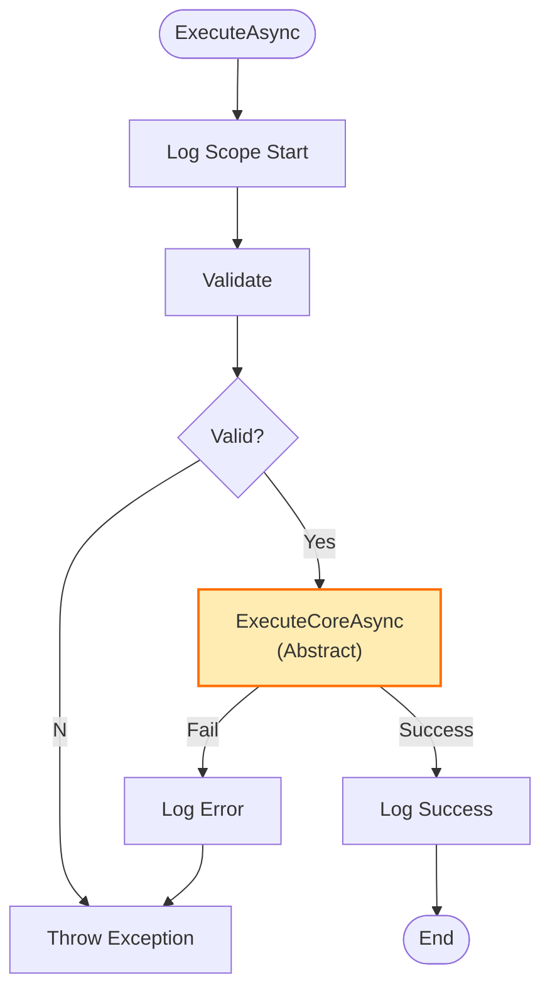

# 第78章：Template Method ②：演習（検証→実行→ログの共通フロー）✅📝

## ねらい 🎯✨





* 「処理の手順（骨組み）は共通 ✅ でも、ところどころ差分がある 🤏」を**綺麗に整理**できるようになるよ〜😺
* 具体的には、どのユースケースでも同じになりがちな
  **検証 → 実行 → ログ（成功/失敗）** の流れを “1か所” に寄せて、差分だけを小さく書けるようにするよ🧩✨
* ついでに、**ログの標準枠（`ILogger`）**を使って、あとから調査しやすい形にするよ🕵️‍♀️📝
  （.NET 10 / SDK 10.0.2 が 2026-01-13 に出てるよ）([Microsoft][1])

---

## 到達目標 🏁🌸

この章が終わったら、次ができるようになるよ〜🙂✨

* Template Method（テンプレートメソッド）を
  **「共通の手順を親に置いて、差分だけ子で埋める」** として説明できる📜✅
* `ExecuteAsync()` みたいな **共通フロー**を 1か所に置き、
  差分は `ExecuteCoreAsync()` だけに押し込められる🧠✨
* `ILogger` の **構造化ログ**＆**スコープ**で、ログに文脈（どの処理？）を載せられる🧵📝([Microsoft Learn][2])
* テスト（MSTest）で「検証に落ちたらコア処理は走らない」を確認できる🧪🌼([Microsoft Learn][3])

---

## 手順 🛠️✨

### 1) “共通の手順” を文章で固定する 📜✅

まずは仕様を 1行で固定しよっ😺

* **共通フロー（骨組み）**

  1. 入力を検証する ✅
  2. 本処理を実行する ⚙️
  3. 成功ログを出す 🎉
  4. 失敗したらエラーログを出して、例外はそのまま投げる 💥

この「順番」を守る役を **親クラス**に任せるのが Template Method だよ🧡

---

### 2) 親クラスに “骨組み（テンプレ）” を書く 🦴✨

ポイントはこれだけ👇

* 外から呼ぶメソッド：`ExecuteAsync()`（ここが “手順固定”）
* 子が埋めるメソッド：`ExecuteCoreAsync()`（ここが “差分”）
* 検証はデフォルト実装を用意して、必要なときだけ上書き（`Validate()`）🙂

```csharp
using System.ComponentModel.DataAnnotations;
using System.Diagnostics;
using Microsoft.Extensions.Logging;

namespace ECommerce.UseCases;

public abstract class UseCaseBase<TRequest, TResult>
    where TRequest : notnull
{
    private readonly ILogger _logger;

    protected UseCaseBase(ILogger logger)
        => _logger = logger;

    public async Task<TResult> ExecuteAsync(TRequest request, CancellationToken ct = default)
    {
        // どのユースケースか分かるようにスコープを付ける🧵
        using var scope = _logger.BeginScope(new Dictionary<string, object?>
        {
            ["useCase"] = GetType().Name
        });

        var sw = Stopwatch.StartNew();
        _logger.LogInformation("Start");

        try
        {
            Validate(request);

            var result = await ExecuteCoreAsync(request, ct).ConfigureAwait(false);

            _logger.LogInformation("Success in {ElapsedMs} ms", sw.ElapsedMilliseconds);
            return result;
        }
        catch (Exception ex)
        {
            _logger.LogError(ex, "Failed in {ElapsedMs} ms", sw.ElapsedMilliseconds);
            throw;
        }
    }

    // ✅デフォルト検証：DataAnnotations（標準）でいくよ〜
    protected virtual void Validate(TRequest request)
    {
        var context = new ValidationContext(request);
        Validator.ValidateObject(request, context, validateAllProperties: true);
    }

    // ✅差分はここだけ！
    protected abstract Task<TResult> ExecuteCoreAsync(TRequest request, CancellationToken ct);
}
```

ログ周りは `Microsoft.Extensions.Logging` の標準枠を使ってるよ📝✨（スコープや構造化ログが公式でも推されてる）([Microsoft Learn][2])

---

### 3) “検証” を標準でやる（DataAnnotations）✅📎

例として「注文確定」の入力を record で作るよ〜🛒✨

```csharp
using System.ComponentModel.DataAnnotations;

namespace ECommerce.UseCases;

public sealed record PlaceOrderRequest(
    [property: Required, EmailAddress] string CustomerEmail,
    [property: Range(1, int.MaxValue)] int ItemCount
);
```

* `[Required]` や `[Range]` は “よくある検証” を短く書けて便利😺✅
* `Validate()` が `Validator.ValidateObject(...)` を呼ぶので、ここは追加コードなしで動くよ✨

---

### 4) 子クラスで “差分だけ” 実装する 🧩🌸

注文確定ユースケースを最小で作るよ〜🎉

```csharp
using Microsoft.Extensions.Logging;

namespace ECommerce.UseCases;

public sealed class PlaceOrderUseCase : UseCaseBase<PlaceOrderRequest, Guid>
{
    public PlaceOrderUseCase(ILogger<PlaceOrderUseCase> logger)
        : base(logger) { }

    protected override Task<Guid> ExecuteCoreAsync(PlaceOrderRequest request, CancellationToken ct)
    {
        // 本当はDB保存とかだけど、今は最小でOK🙂
        var orderId = Guid.NewGuid();
        return Task.FromResult(orderId);
    }
}
```

ここが気持ちいいところ😺✨

* `ExecuteAsync()`（検証→実行→ログ）は書かない
* `ExecuteCoreAsync()` だけ書けば動く
* 「共通フローの統一」が崩れない✅

---

### 5) 動かしてログを見る（`LoggerFactory` + Console）🖥️📝

ログの標準ドキュメントに沿って、コンソール出力を作るよ〜✨([Microsoft Learn][2])

```csharp
using ECommerce.UseCases;
using Microsoft.Extensions.Logging;

using var loggerFactory = LoggerFactory.Create(builder =>
{
    builder
        .SetMinimumLevel(LogLevel.Information)
        .AddSimpleConsole(o =>
        {
            o.SingleLine = true;
            o.TimestampFormat = "HH:mm:ss ";
        });
});

var useCase = new PlaceOrderUseCase(loggerFactory.CreateLogger<PlaceOrderUseCase>());

var ok = await useCase.ExecuteAsync(new PlaceOrderRequest("alice@example.com", 2));
Console.WriteLine($"OrderId = {ok}");

Console.WriteLine("---- invalid case ----");

try
{
    // Email空＆個数0 → ValidationException になるはず💥
    await useCase.ExecuteAsync(new PlaceOrderRequest("", 0));
}
catch (Exception ex)
{
    Console.WriteLine(ex.GetType().Name);
}
```

ログでこういうのが見えたら勝ち🎉

* `Start`
* `Success in ... ms`
* 失敗ケースは `Failed in ... ms` と例外情報💥

---

### 6) テストで “手順が固定されている” を確認する 🧪✅

MSTest の基本（`[TestClass]` / `[TestMethod]`）は公式にも載ってるよ🧁([Microsoft Learn][3])
さらに MSTest.Sdk は「多くの人におすすめ」って整理されてるよ🧪✨([Microsoft Learn][4])

ここでは「検証に落ちたら、コア処理が走らない」をテストするよ〜🙂

```csharp
using System.ComponentModel.DataAnnotations;
using ECommerce.UseCases;
using Microsoft.Extensions.Logging;
using Microsoft.VisualStudio.TestTools.UnitTesting;

namespace ECommerce.Tests;

[TestClass]
public class TemplateMethodTests
{
    [TestMethod]
    public async Task ExecuteAsync_WhenInvalidRequest_DoesNotRunCore()
    {
        var logger = new ListLogger();

        var useCase = new SpyUseCase(logger);

        await Assert.ThrowsExceptionAsync<ValidationException>(async () =>
        {
            await useCase.ExecuteAsync(new PlaceOrderRequest("", 0));
        });

        Assert.IsFalse(useCase.CoreRan, "検証で落ちたのにコア処理が走ってるのはNG💦");
    }

    private sealed class SpyUseCase : UseCaseBase<PlaceOrderRequest, string>
    {
        public bool CoreRan { get; private set; }

        public SpyUseCase(ILogger logger) : base(logger) { }

        protected override Task<string> ExecuteCoreAsync(PlaceOrderRequest request, CancellationToken ct)
        {
            CoreRan = true;
            return Task.FromResult("OK");
        }
    }

    // テスト用の最小ILogger（ログは捨てる/必要なら貯める）
    private sealed class ListLogger : ILogger
    {
        public IDisposable BeginScope<TState>(TState state) where TState : notnull => NullScope.Instance;
        public bool IsEnabled(LogLevel logLevel) => true;
        public void Log<TState>(LogLevel logLevel, EventId eventId, TState state, Exception? exception,
            Func<TState, Exception?, string> formatter)
        {
            // 今回は“手順”だけ検証したいので何もしない🙂
        }

        private sealed class NullScope : IDisposable
        {
            public static readonly NullScope Instance = new();
            public void Dispose() { }
        }
    }
}
```

---

### 7) AI（Copilot / Codex）に頼むなら、こう頼む 🤖🪄

目的は **「差分だけ」** を書かせることだよ😺✨
（テンプレの骨組みまで AI に作らせると、勝手にフック増やして迷子になりがち💦）

**プロンプト例（そのまま貼ってOK）**

* 「C# で `UseCaseBase<TRequest,TResult>` が既にある。`PlaceOrderUseCase` の `ExecuteCoreAsync` だけを実装して。検証やログは触らない。例外は握りつぶさない。」
* 「MSTestで、検証に失敗したら `ExecuteCoreAsync` が呼ばれないことを確認するテストを書いて。」

**レビュー観点（3つだけ）👀✅**

* “共通フロー” を子が壊せない構造になってる？
* `ExecuteCoreAsync` が肥大化してない？（業務の塊になってない？）
* 例外を握りつぶしてない？（ログして throw してる？）

---

## 落とし穴 🕳️😵

* **継承が増えすぎる問題**
  Template Method は気持ちいいけど、何でも継承にするとツリーが増えて迷子😇
  👉「手順が固定」かつ「差分が小さい」時だけが得意だよ✅
* **フック（`virtual`）を増やしすぎる**
  “差し替えポイント” を増やすほど理解コストが爆上がり💥
  👉 最初は `Validate()` と `ExecuteCoreAsync()` くらいで十分🙂
* **例外の扱いが曖昧**
  失敗してるのに `return default;` みたいなのは事故る😱
  👉 基本はログして `throw;`（再スロー）でOK✅
* **ログがうるさすぎる/少なすぎる**
  成功ログは1行、失敗は例外付き、くらいが読みやすい📝✨
  （スコープで文脈を付けるのがコツ🧵）([Microsoft Learn][2])

---

## 演習 🎮🧁

### 演習A（基本）✅

1. この章の `UseCaseBase<TRequest,TResult>` をプロジェクトに追加
2. `PlaceOrderUseCase` を作って動かす
3. わざと不正入力を入れて、`ValidationException` が出るのを確認💥

### 演習B（差分追加）➕🧩

同じ共通フローのまま、別ユースケースを1個追加してみよ〜😺
例：`CancelOrderUseCase`（キャンセル）

* 入力の検証は DataAnnotations
* コア処理はダミーでOK（`Task.CompletedTask` とか）

### 演習C（テスト）🧪✨

* 「検証に落ちたらコア処理が走らない」テストを追加✅
* できたら「正常時はコア処理が1回だけ走る」テストも追加🎉

---

## チェック ✅✅✅

* `ExecuteAsync()` の中に **検証→実行→ログ** がまとまってる？🧠
* 子クラスは **`ExecuteCoreAsync()` だけ**書けば済んでる？🧩
* 例外は握りつぶさず `throw;` してる？💥
* ログに “どの処理か” が載ってる？（スコープなど）🧵([Microsoft Learn][2])
* MSTestで「検証NGならコア処理が走らない」を確認できた？🧪([Microsoft Learn][3])

[1]: https://dotnet.microsoft.com/en-US/download/dotnet/10.0?utm_source=chatgpt.com "Download .NET 10.0 (Linux, macOS, and Windows) | .NET"
[2]: https://learn.microsoft.com/ja-jp/dotnet/core/extensions/logging?utm_source=chatgpt.com "C# でのログ記録 - .NET | Microsoft Learn"
[3]: https://learn.microsoft.com/en-us/dotnet/core/testing/unit-testing-csharp-with-mstest?utm_source=chatgpt.com "Unit testing C# with MSTest and .NET"
[4]: https://learn.microsoft.com/en-us/dotnet/core/testing/unit-testing-mstest-sdk?utm_source=chatgpt.com "MSTest SDK overview - .NET"
