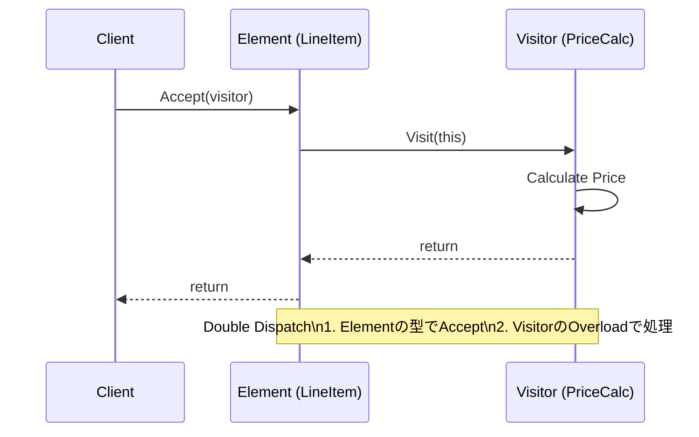

# 第79章：Visitor ①：構造と操作を分離する🧳

## ねらい 🎯✨





* 「**データ構造（ツリー/Composite）** はあまり変えたくないけど、**やりたい処理（操作）がどんどん増える**」問題をスッキリさせる 🧹🌳
* Visitorの“本質”＝**構造と操作を分ける**、を言葉で説明できるようにする 🗣️💡
* C#だと何が代替案になるか（switch式のパターンマッチ等）も一緒に整理する 🧠🔀

---

## 到達目標 🏁😊

* 「増えるのは **操作**？それとも **要素（型）**？」を見分けて、Visitorを採用する/しないを判断できる ✅
* Visitorの登場人物（Element / Visitor / ConcreteVisitor）を、**責務**つきで説明できる 👀📌
* 最小のVisitor実装（double dispatch）を読んで、「何が嬉しいか」を説明できる 🎁✨

---

## 手順 🧭🧩

### 1) まずは“増えるのはどっち？”チェック ✅🔍

Visitorはざっくりこういう時に効きます👇

* ✅ **要素（構造のノード型）は固定**（増えにくい）
* ✅ **操作が増える**（合計計算・表示・検証・エクスポート・ログ…みたいに）

逆に、こういう時はつらいです👇

* ❌ **要素（ノード型）が増えやすい**（新しいノードが頻繁に追加）
  → Visitorは“全Visitor修正”になりがち💦

---

### 2) 「switch式でやる」素朴な書き方を見て、痛みを確認 😵‍💫🔁

C#はswitch式が強いので、最初はこう書きがち👇（読みやすい！…けど、操作が増えると同じswitchが増殖しやすい）

```csharp
// ノード（例：注文の内訳がツリーになってる想定）
public interface IOrderNode { }

public sealed record LineItem(string Name, decimal UnitPrice, int Quantity) : IOrderNode;
public sealed record ShippingFee(decimal Amount) : IOrderNode;
public sealed record PercentDiscount(decimal Rate) : IOrderNode; // 例: 0.10m = 10%
public sealed record OrderGroup(IReadOnlyList<IOrderNode> Children) : IOrderNode;

// 操作① 合計を出す
public static decimal CalcTotal(IOrderNode node) => node switch
{
    LineItem li       => li.UnitPrice * li.Quantity,
    ShippingFee sf    => sf.Amount,
    PercentDiscount d => 0m, // ここでは割引は「別処理」にしてるとする（例）
    OrderGroup g      => g.Children.Sum(CalcTotal),
    _                 => throw new NotSupportedException()
};

// 操作② レシート文字列を作る（別のswitchが必要になりがち）
public static string ToReceipt(IOrderNode node) => node switch
{
    LineItem li    => $"{li.Name} x{li.Quantity} = {li.UnitPrice * li.Quantity}",
    ShippingFee sf => $"送料 = {sf.Amount}",
    PercentDiscount d => $"割引 = {d.Rate:P0}",
    OrderGroup g   => string.Join(Environment.NewLine, g.Children.Select(ToReceipt)),
    _              => throw new NotSupportedException()
};
```

switch式自体はとても良いです（C#の言語機能としても推奨される書き方の一つ）([Microsoft Learn][1])
ただ、**操作が増えるたびに switch が増える**と、だんだん「どこを直せば？」になりやすいんですね😵‍💫🌀

---

### 3) Visitorの登場人物を“1行で”覚える 🧳🧠

* **Element（要素）**：訪問される側。`Accept(visitor)` を持つ 🏠
* **Visitor（訪問者）**：要素ごとの処理口。`Visit(LineItem)` みたいに型別メソッドを持つ 🧑‍💼
* **ConcreteVisitor（具体訪問者）**：実際の操作（合計計算/レシート生成など）を実装する ✍️🧾

ポイントはこれ👇
**要素側が visitor を呼ぶ**ことで、型ごとの処理が自然に分岐する（= double dispatch）🔁✨

---

### 4) 最小のVisitor実装に置き換える（操作を増やしやすくする）🧩✨

同じ「注文ノード構造」で、**操作（Visitor）だけ追加できる**形にしてみます👇

```csharp
public interface IOrderNode
{
    void Accept(IOrderNodeVisitor visitor);
}

public interface IOrderNodeVisitor
{
    void Visit(LineItem node);
    void Visit(ShippingFee node);
    void Visit(PercentDiscount node);
    void Visit(OrderGroup node);
}

public sealed class LineItem : IOrderNode
{
    public string Name { get; }
    public decimal UnitPrice { get; }
    public int Quantity { get; }

    public LineItem(string name, decimal unitPrice, int quantity)
        => (Name, UnitPrice, Quantity) = (name, unitPrice, quantity);

    public void Accept(IOrderNodeVisitor visitor) => visitor.Visit(this);
}

public sealed class ShippingFee : IOrderNode
{
    public decimal Amount { get; }
    public ShippingFee(decimal amount) => Amount = amount;
    public void Accept(IOrderNodeVisitor visitor) => visitor.Visit(this);
}

public sealed class PercentDiscount : IOrderNode
{
    public decimal Rate { get; } // 0.10m = 10%
    public PercentDiscount(decimal rate) => Rate = rate;
    public void Accept(IOrderNodeVisitor visitor) => visitor.Visit(this);
}

public sealed class OrderGroup : IOrderNode
{
    public IReadOnlyList<IOrderNode> Children { get; }
    public OrderGroup(IReadOnlyList<IOrderNode> children) => Children = children;
    public void Accept(IOrderNodeVisitor visitor) => visitor.Visit(this);
}
```

ここからが本番！「操作」をVisitorで増やします👇

**操作①：合計（割引は最後にまとめて適用する簡易例）💰**

```csharp
public sealed class TotalPriceVisitor : IOrderNodeVisitor
{
    public decimal Subtotal { get; private set; }
    public decimal DiscountRateSum { get; private set; } // 簡易に“率を足す”例
    public decimal Shipping { get; private set; }

    public decimal Total => (Subtotal * (1m - DiscountRateSum)) + Shipping;

    public void Visit(LineItem node) => Subtotal += node.UnitPrice * node.Quantity;
    public void Visit(ShippingFee node) => Shipping += node.Amount;
    public void Visit(PercentDiscount node) => DiscountRateSum += node.Rate;

    public void Visit(OrderGroup node)
    {
        foreach (var child in node.Children)
            child.Accept(this);
    }
}
```

**操作②：レシート文字列 🧾✨**

```csharp
using System.Text;

public sealed class ReceiptVisitor : IOrderNodeVisitor
{
    private readonly StringBuilder _sb = new();
    public string Text => _sb.ToString();

    public void Visit(LineItem node)
        => _sb.AppendLine($"{node.Name} x{node.Quantity} = {node.UnitPrice * node.Quantity}");

    public void Visit(ShippingFee node)
        => _sb.AppendLine($"送料 = {node.Amount}");

    public void Visit(PercentDiscount node)
        => _sb.AppendLine($"割引 = {node.Rate:P0}");

    public void Visit(OrderGroup node)
    {
        foreach (var child in node.Children)
            child.Accept(this);
    }
}
```

**使う側（呼び出し側）はこうなる 🧠👍**

```csharp
var order = new OrderGroup(new IOrderNode[]
{
    new LineItem("りんご", 120m, 2),
    new LineItem("みかん", 80m, 5),
    new PercentDiscount(0.10m),
    new ShippingFee(500m),
});

var totalV = new TotalPriceVisitor();
order.Accept(totalV);

var receiptV = new ReceiptVisitor();
order.Accept(receiptV);

Console.WriteLine($"合計: {totalV.Total}");
Console.WriteLine(receiptV.Text);
```

✅ **操作（Visitor）を増やすだけなら、ノード側（構造）をほぼ触らない**のが嬉しい！🎉
（例：監査ログVisitor、JSON出力Visitor、検証Visitor…を追加しやすい）

---

### 5) 「C#だとVisitorってどこで現役なの？」を知って安心する 🛟😊

Visitorは“教科書の昔話”じゃなくて、C#の標準・定番APIで今も普通に出ます👇

* **式ツリー**を歩き回るための `ExpressionVisitor`（標準）
  → 式ツリーを「走査・調査・コピー」する用途で継承して使う設計です([Microsoft Learn][2])
* **Roslyn（C#コンパイラAPI）**の構文木を歩く `CSharpSyntaxWalker`（定番）
  → 構文木を深さ優先で訪問して、ノード種類ごとのメソッドをoverrideする形です([Microsoft Learn][3])

「うわ、Visitorむずそう…😇」ってなっても大丈夫！
次章では **ExpressionVisitor で“標準のVisitor”を実際に触って**、感覚を掴みます🧠✨

---

### 6) AI補助の使い方（雛形はAI、判断は人間）🤖🧑‍🏫

Visitorは雛形が多いのでAIが得意です✨
ただし“過剰抽象化”しやすいので、プロンプトに釘を刺すのがコツ🔨😤

例（そのまま使ってOK）👇

* 「C#でVisitorパターンの最小例を作って。`IOrderNode` と `IOrderNodeVisitor` で、ノードは `LineItem/ShippingFee/PercentDiscount/OrderGroup` の4つ。**汎用フレームワーク化しない**。`Accept` と `Visit` 以外の仕組みは足さない。MSTestで簡単なテストも1本。」

---

## よくある落とし穴 ⚠️😵

* **要素（ノード型）追加が多い案件で採用して地獄**
  → 新ノード追加のたびに *全Visitorを修正*…💥
* **Visitorが状態を持ちすぎて“神クラス”化**
  → 「合計計算」だけのはずが、検証も出力も…って混ぜない！🧹
* **“Visitorという名前を付けること”が目的化**
  → 大事なのは「操作が増えた時に、どこを足すかが明確」ってこと🌟
* **C#のswitch式で十分な場面までVisitorにする**
  → 操作が2〜3個で増える予定も薄いなら、switch式のほうが読みやすいことも多いよ🙂([Microsoft Learn][1])

---

## 演習（10〜30分）🧪🌸

1. **“操作が増える痛み”を体験する**😵‍💫

* さっきの素朴版（switch式）で、操作をもう1個追加してみてね
  例：`Validate()`（数量が0以上か、割引率が0〜1か など）

2. **Visitor版に移植する**🧳✨

* `ValidationVisitor` を1つ追加して、エラーを `List<string>` に貯める
* ルール例：

  * `LineItem.Quantity <= 0` はNG🙅‍♀️
  * `PercentDiscount.Rate < 0 || Rate > 1` はNG🙅‍♀️

3. **比較メモを書く**📝

* 「操作を1個増やす」時、どっちが楽だった？（switch式 vs Visitor）
* 「ノード型を1個増やす」時、どっちが楽そう？（switch式 vs Visitor）

---

## 自己チェック ✅😊

* 「増えるのは操作？要素？」をまず確認した？🔍
* Visitorで増やすべき“操作”が具体的に言える？（例：出力、検証、監査…）🧾
* `Accept(visitor)` → `visitor.Visit(this)` の流れを説明できる？🔁
* 「今回はswitch式で十分」って判断もできる？🙂✨

[1]: https://learn.microsoft.com/en-us/dotnet/csharp/language-reference/operators/switch-expression?utm_source=chatgpt.com "Evaluate a pattern match expression using the `switch ..."
[2]: https://learn.microsoft.com/ja-jp/dotnet/api/system.linq.expressions.expressionvisitor?view=net-10.0&utm_source=chatgpt.com "ExpressionVisitor Class (System.Linq.Expressions)"
[3]: https://learn.microsoft.com/ja-jp/dotnet/api/microsoft.codeanalysis.csharp.csharpsyntaxwalker?view=roslyn-dotnet-4.9.0&utm_source=chatgpt.com "CSharpSyntaxWalker クラス"
