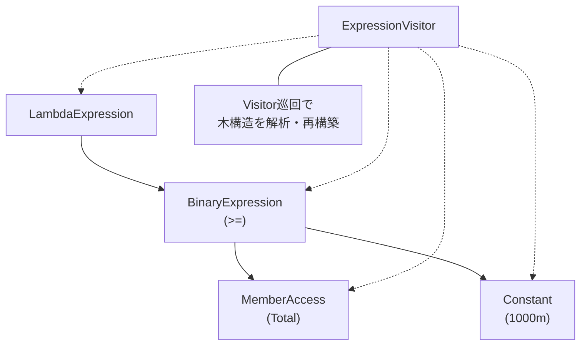

# 第80章：Visitor ②：標準例（ExpressionVisitor）で学ぶ🧠✨

## ねらい 🎯





* Visitorパターンが「固定された構造（ツリー）に対して、操作を増やしたい」時に強い理由を、**.NET標準の `ExpressionVisitor`** で体感する🧩
* 「式ツリー（Expression Tree）」が **コードをデータとして持つ仕組み** だと理解して、読む・数える・書き換えるの基本をつかむ🌳🔍
* “標準の仕組み”の読み方（F12で定義へジャンプ→責務を見抜く）を身につける📚✨

---

## 到達目標 ✅

* `ExpressionVisitor` が「走査・調査・コピー（書き換え）」のための土台だと説明できる🙂 ([Microsoft Learn][1])
* 式ツリーが **immutable（不変）** なので、変更したいときは **新しいツリーを作る** 必要があると理解できる🧊🔁 ([Microsoft Learn][2])
* `VisitXxx(...)` をオーバーライドして、**(1)数える** と **(2)定数を書き換える** ができる🛠️✨
* `Compile()` して動作確認できる（式ツリー→デリゲート）⚙️🚀 ([Microsoft Learn][3])

---

## 手順 🧭✨

### 1) 式ツリーってなに？（超ミニ）🌳

式ツリーは「コードを木構造として表したデータ」だよ🧾
たとえば `Expression<Func<int,bool>>` にラムダを代入すると、**デリゲートじゃなく“木”** が作られる感じ🌱 ([Microsoft Learn][2])

* うれしいこと🎁

  * 木を **読む**（条件は何？どんなメソッド呼んでる？）
  * 木を **書き換える**（条件に `&& !IsDeleted` を足す等）
  * 木を **別の形に変換**（SQLに変換…みたいな世界）

> 2026-02時点メモ📝：.NET 10 は LTS として公開されていて、サポート期限も明確だよ（長く使う前提の基盤にしやすい）⏳✨ ([Microsoft Learn][1])

---

### 2) `ExpressionVisitor` を「定義へジャンプ」で眺める 👀📚

`ExpressionVisitor` の役目はシンプルで、**式ツリーを走査して、調べたり、コピー（必要なら一部差し替え）したり** するための“訪問者”だよ🧳✨ ([Microsoft Learn][1])

ポイントはここ👇

* 式ツリーは **immutable（不変）** だから、ノードを“直接書き換え”はしない🧊
* 変えたいときは「元ツリーをたどりつつ、新しいツリーを組み立てる」🔁
* 何も変えなければ **同じインスタンスが返る**（ムダに新しいのを作らない）🧠✨ ([Microsoft Learn][4])

---

### 3) まずは「読む」：ノード数を数える Visitor 🧮🌳

対象の例として、超ミニの注文モデルでいくよ🍰🛒

```csharp
using System;
using System.Collections.Generic;
using System.Linq.Expressions;

public sealed record Order(int Id, decimal Total, bool IsDeleted);

public sealed class NodeCountVisitor : ExpressionVisitor
{
    public int TotalVisited { get; private set; }
    public Dictionary<ExpressionType, int> ByType { get; } = new();

    public override Expression? Visit(Expression? node)
    {
        if (node is null) return null;

        TotalVisited++;

        var type = node.NodeType;
        ByType[type] = ByType.TryGetValue(type, out var c) ? c + 1 : 1;

        return base.Visit(node); // ★ここで「子ノードへ進む」
    }
}
```

使ってみる👇

```csharp
using System;
using System.Linq.Expressions;

Expression<Func<Order, bool>> expr =
    o => o.Total >= 1000m && !o.IsDeleted;

var counter = new NodeCountVisitor();
counter.Visit(expr);

Console.WriteLine(counter.TotalVisited);
foreach (var kv in counter.ByType)
{
    Console.WriteLine($"{kv.Key}: {kv.Value}");
}
```

ここで分かること💡

* “条件式”が、`Binary`（AndAlso / GreaterThanOrEqual）とか `MemberAccess`（プロパティ参照）とかのノードでできてる🌳
* Visitorは **構造（式ツリー）を固定して、操作（数える）だけ足せる** のが強い🧳✨

---

### 4) 次は「書き換える」：定数を差し替える Visitor 🔁💸

「`1000m` を `2000m` に変える」みたいな“わかりやすい書き換え”をやってみよ〜🪄

```csharp
using System;
using System.Linq.Expressions;

public sealed class ReplaceDecimalConstantVisitor : ExpressionVisitor
{
    private readonly decimal _from;
    private readonly decimal _to;

    public ReplaceDecimalConstantVisitor(decimal from, decimal to)
    {
        _from = from;
        _to = to;
    }

    protected override Expression VisitConstant(ConstantExpression node)
    {
        if (node.Type == typeof(decimal) &&
            node.Value is decimal d &&
            d == _from)
        {
            return Expression.Constant(_to, typeof(decimal));
        }

        return base.VisitConstant(node);
    }
}
```

実行して差を確認👇（式ツリーは `Compile()` して動かせるよ⚙️） ([Microsoft Learn][3])

```csharp
using System;
using System.Linq.Expressions;

Expression<Func<Order, bool>> expr =
    o => o.Total >= 1000m && !o.IsDeleted;

var rewritten = (Expression<Func<Order, bool>>)
    new ReplaceDecimalConstantVisitor(1000m, 2000m).Visit(expr)!;

var f1 = expr.Compile();
var f2 = rewritten.Compile();

var order = new Order(1, total: 1500m, isDeleted: false);

Console.WriteLine(f1(order)); // True（>=1000）
Console.WriteLine(f2(order)); // False（>=2000）
```

ここがVisitorっぽさの核心🥹✨

* 構造（式ツリー）のクラス群はそのまま
* 操作（定数差し替え）だけ別クラスで追加
* しかも immutable だから、**“新しい式”が返る** 感覚がめちゃ大事🧊🔁 ([Microsoft Learn][2])

---

### 5) AI補助（Copilot/Codex）でやるなら 🤖✍️（ミスりがちな所だけ押さえる）

AIに `ExpressionVisitor` を書かせるときのコツは「絶対に守る契約」を先に縛ることだよ🪢

* こう書くと安全度UP⬆️

  * 「`ExpressionVisitor` を継承し、`VisitConstant` だけを override」
  * 「式ツリーは不変なので、差し替えが必要なときだけ `Expression.Constant` を返す」
  * 「それ以外は `base.VisitConstant(node)`」
  * 「MSTest で期待値を1つ書く」🧪✨

---

## よくある落とし穴 ⚠️😵

* `base.VisitXxx(...)` を呼ばずに、子ノードを辿れず“途中で止まる”🛑
* 書き換えたのに、戻り値を受け取らず「元の式のまま動かしてた」😇
* `Expression<Func<...>>` と `Func<...>` を混同（前者は木、後者は実行コード）🌳⚙️ ([Microsoft Learn][2])
* `Compile()` を毎回呼んで重くする（同じ式なら使い回しを考える）🐢
* 「何でも式ツリーでやろう」として複雑化（普通の `if` でよい場面も多い）🌀

---

## ミニ演習（10〜30分）🧪🌸

### 演習A：ノードの種類トップ3を出す🏆

* `NodeCountVisitor` の結果 `ByType` を、件数降順で上位3つ表示してみよ📊✨
* 「この条件式、どんなノードが多い？」が見えてくるよ👀

### 演習B：`!o.IsDeleted` を“自動で付ける”🏷️

* 目標：`Expression<Func<Order,bool>>` を受け取って、
  返り値の式が **必ず `&& !o.IsDeleted` を含む** ようにする🔒
* ヒント：`VisitLambda` を override して `node.Body` の前に `AndAlso` を合成する🧩

  * ただし「すでに含まれてたら二重に足さない」は発展でOK🙆‍♀️

### 演習C：テスト1本で守る🛡️

* 1500円の注文が、

  * 元の式だと `True`
  * 書き換え後（2000円しきい値）だと `False`
    を確認するテストを書いてね🧪✨ ([Microsoft Learn][5])

---

## 自己チェック ✅✅

* 式ツリーは immutable なので「変更＝新しい式を作る」って言える？🧊🔁 ([Microsoft Learn][2])
* `ExpressionVisitor` が「走査しながら調査 or 差し替えできる」って説明できる？🧳✨ ([Microsoft Learn][1])
* `VisitConstant` を override して「特定の定数だけ差し替え」できた？💎
* `Compile()` で動作差分を確認できた？⚙️🚀 ([Microsoft Learn][3])

[1]: https://learn.microsoft.com/en-us/dotnet/api/system.linq.expressions.expressionvisitor?view=net-10.0 "ExpressionVisitor Class (System.Linq.Expressions) | Microsoft Learn"
[2]: https://learn.microsoft.com/en-us/dotnet/csharp/advanced-topics/expression-trees/ "Expression Trees - C# | Microsoft Learn"
[3]: https://learn.microsoft.com/en-us/dotnet/csharp/advanced-topics/expression-trees/expression-trees-execution "Executing Expression Trees - C# | Microsoft Learn"
[4]: https://learn.microsoft.com/en-us/dotnet/visual-basic/programming-guide/concepts/expression-trees/how-to-modify-expression-trees "How to: Modify Expression Trees - Visual Basic | Microsoft Learn"
[5]: https://learn.microsoft.com/ja-jp/dotnet/api/system.linq.expressions.expression-1.compile?view=net-10.0 "Expression<TDelegate>.Compile Method (System.Linq.Expressions) | Microsoft Learn"
