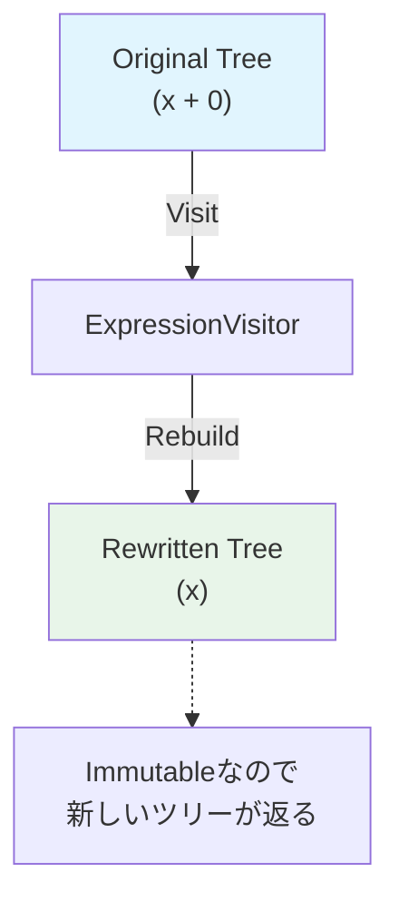

# 第81章：Visitor ③：演習（式ツリーの解析：ノード数える/書き換える）🧾🔍

## ねらい 🎯✨





Visitor って、「**データ構造（構造）はそのまま**にして、あとから **やりたい処理（操作）** をどんどん増やせる」考え方だよ〜🙂🧳
今回はその練習として、C#の **式ツリー（Expression Tree）** を題材にするよ！🧠⚡
式ツリーは「コード（式）を、ノードがつながった木構造として扱う」仕組みで、各ノードは `Expression` の派生型で表されるのがポイント🌳🧩 ([Microsoft Learn][1])

やることは2つ！✌️

1. ノード数を数える（解析）🔢
2. 式ツリーを書き換える（変換）🪄

---

## 到達目標 ✅🌸

* `Expression<Func<int,int>>` を作って、式ツリーの形をイメージできる 🧠🌳
* `ExpressionVisitor` を継承して、**全ノードを走査**してカウントできる 🔍🔢
* `ExpressionVisitor` で **式ツリーを書き換えて**、結果が同じになることをテストで保証できる 🪄🧪
* 「Visitorが向いてるケース/しんどいケース」を1行で言える 🙂✍️

（今回触る標準API）

* `System.Linq.Expressions`（式ツリー）🧾
* `ExpressionVisitor`（Visitorのど真ん中！）🧳 ([Microsoft Learn][2])

---

## 手順 🧭✨

### 1) “式ツリー”を1本つくる 🧾🙂

まずは超シンプルな式！
`x => (x + 1) * 2` を式ツリーとして持つよ〜🧁

```csharp
using System;
using System.Linq.Expressions;

Expression<Func<int, int>> expr = x => (x + 1) * 2;

Console.WriteLine(expr);                 // 見た目チェック👀
Console.WriteLine(expr.Body.NodeType);   // Multiply とか出るよ🔎
```

式ツリーは「ノード（Expression）が木みたいに繋がってる」ので、ノード単位で見たり触ったりできるのが強み🌳✨ ([Microsoft Learn][1])

---

### 2) Visitorで “ノード数を数える” 🔢🧳

`ExpressionVisitor` は「式ツリーを走査するためのベースクラス」なので、継承して使うよ〜💡 ([Microsoft Learn][2])
ここでは `Visit(Expression? node)` をオーバーライドして、**訪問した回数をカウント**するよ🔍

```csharp
using System.Linq.Expressions;

public sealed class NodeCountingVisitor : ExpressionVisitor
{
    public int Count { get; private set; }

    public override Expression? Visit(Expression? node)
    {
        if (node is null) return null;

        Count++;                 // ここで数えるよ🔢✨
        return base.Visit(node); // 子ノードへ続くよ🌳
    }
}
```

使ってみる！💨

```csharp
Expression<Func<int, int>> expr = x => (x + 1) * 2;

var counter = new NodeCountingVisitor();
counter.Visit(expr);

Console.WriteLine(counter.Count);
```

---

### 3) テストで “数えた結果” を固定する 🧪✅

「動いたっぽい」だけだと不安なので、MSTestで固めるよ〜🧷🧪
この式だと、ざっくり **Lambda / Parameter / Multiply / Add / Parameter / Const(1) / Const(2)** で **7回** になるのを期待値にしてみる🙂🔢
（※パラメータは “引数リスト側” と “式本体側” の両方で訪問されるので、回数が増えるのが地味ポイントだよ⚠️）

```csharp
using Microsoft.VisualStudio.TestTools.UnitTesting;
using System;
using System.Linq.Expressions;

[TestClass]
public class ExpressionVisitorTests
{
    [TestMethod]
    public void NodeCountingVisitor_CountsAllVisitedNodes()
    {
        Expression<Func<int, int>> expr = x => (x + 1) * 2;

        var counter = new NodeCountingVisitor();
        counter.Visit(expr);

        Assert.AreEqual(7, counter.Count);
    }
}
```

---

### 4) Visitorで “式ツリーを書き換える” 🪄🔧

次は本番！
`(x + 0) * 1` みたいな式を、**同じ意味のままスッキリ**させたい😆✨

やりたい簡約ルール（まずはint限定でOK）👇

* `x + 0` → `x`
* `0 + x` → `x`
* `x * 1` → `x`
* `1 * x` → `x`
* `x * 0` / `0 * x` → `0`

`BinaryExpression`（二項演算）を狙って `VisitBinary` をオーバーライドするよ🎯

```csharp
using System;
using System.Linq.Expressions;

public sealed class SimplifyArithmeticVisitor : ExpressionVisitor
{
    protected override Expression VisitBinary(BinaryExpression node)
    {
        // まず子を先に簡約してから、自分を簡約するよ🌳✨
        var visited = (BinaryExpression)base.VisitBinary(node);

        if (visited.NodeType == ExpressionType.Add)
        {
            if (IsIntConstant(visited.Right, 0)) return visited.Left;
            if (IsIntConstant(visited.Left, 0)) return visited.Right;
        }

        if (visited.NodeType == ExpressionType.Multiply)
        {
            if (IsIntConstant(visited.Right, 1)) return visited.Left;
            if (IsIntConstant(visited.Left, 1)) return visited.Right;

            if (IsIntConstant(visited.Right, 0) || IsIntConstant(visited.Left, 0))
                return Expression.Constant(0);
        }

        return visited;
    }

    private static bool IsIntConstant(Expression expr, int value)
        => expr is ConstantExpression { Value: int v } && v == value;
}
```

---

### 5) 書き換えた結果が “同じ意味” かをテストする 🧪💖

式ツリーは最後に `Compile()` して実行できるよ〜🚀
（式ツリーを delegate にして動かす感じ！） ([Microsoft Learn][3])

```csharp
using Microsoft.VisualStudio.TestTools.UnitTesting;
using System;
using System.Linq.Expressions;

[TestClass]
public class SimplifyArithmeticVisitorTests
{
    [TestMethod]
    public void SimplifyArithmeticVisitor_SimplifiesExpression()
    {
        Expression<Func<int, int>> expr = x => (x + 0) * 1;

        var simplified = (Expression<Func<int, int>>)new SimplifyArithmeticVisitor().Visit(expr)!;

        // 形のチェック（スッキリしてる？）👀✨
        Assert.AreEqual(ExpressionType.Parameter, simplified.Body.NodeType);

        // 意味のチェック（同じ値が出る？）🧪✅
        var f1 = expr.Compile();
        var f2 = simplified.Compile();

        foreach (var x in new[] { -2, 0, 5, 123 })
        {
            Assert.AreEqual(f1(x), f2(x));
        }
    }
}
```

---

### 6) AI補助（Copilot/Codex）を “安全に” 使うコツ 🤖🧷

Visitorは「コードが正しくても、意味が壊れる」事故が起きがち😵‍💫⚠️
AIに頼むなら、プロンプトに **制約** を入れると安定するよ✨

例👇

* 「`ExpressionVisitor` を継承して `VisitBinary` だけで実装して」
* 「int の Add/Multiply だけ対応」
* 「`Compile()` で同値テストも書いて」
* 「独自フレームワークは作らない（標準だけ）」

このへんを入れると、余計な抽象化が増えにくいよ🙂🪄

---

## 落とし穴 ⚠️😵

* **“意味が同じ” の確認が甘い**：見た目がスッキリしても挙動が壊れてることあるよ💥 → `Compile()` してテスト必須🧪 ([Microsoft Learn][3])
* **型がズレる**：`Expression.Constant(0)` は int だけ想定。decimalやdouble混ざると破綻しやすい💦
* **演算子の種類が多い**：`AddChecked` / `MultiplyChecked` / Nullable / 演算子オーバーロード…沼がある😇
* **Visitorの弱点**：構造（要素の種類）が増えると、Visitor側も全部追従が必要になりがち（辛くなるやつ）🧳💦

---

## 演習 🏃‍♀️💨

次のどれか1つだけやればOK！🌸（欲張らないの大事🙂）

1. **ノード数カウンタ強化** 🔢✨

   * `NodeType` ごとの回数も集計して、最後に一覧を出す（例：Addが何回、Constantが何回）📊
2. **簡約ルールを1個追加** 🪄

   * `x - 0 → x` を追加してみる（`ExpressionType.Subtract`）➖
3. **“二重否定” を消す** 😵→🙂

   * `x => !!(x > 0)` を `x => (x > 0)` に簡約（bool限定）✅

---

## チェック ✅🧡

* `ExpressionVisitor` を継承して、`Visit` か `VisitBinary` をオーバーライドできた？🧳
* “解析（数える）” と “変換（書き換える）” を分けて考えられた？🔍🪄
* 書き換え後に `Compile()` して **同値テスト** できた？🧪✨ ([Microsoft Learn][3])
* Visitorが向くのは「構造は固定寄りで、操作が増える」ケース…って言えた？🙂👍

[1]: https://learn.microsoft.com/en-us/dotnet/csharp/advanced-topics/expression-trees/expression-trees-interpreting?utm_source=chatgpt.com "Interpret Expressions - C# | Microsoft Learn"
[2]: https://learn.microsoft.com/ja-jp/dotnet/api/system.linq.expressions.expressionvisitor?view=net-10.0&utm_source=chatgpt.com "ExpressionVisitor Class (System.Linq.Expressions)"
[3]: https://learn.microsoft.com/da-dk/dotNet/api/system.linq.expressions.expression-1.compile?view=net-6.0&utm_source=chatgpt.com "Expression<TDelegate>.Compile Method (System.Linq. ..."
