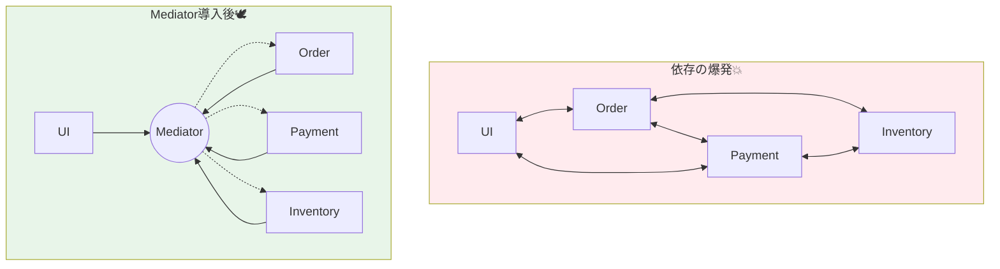

# 第82章：Mediator ①：依存の爆発を中央で整理🕊️

## ねらい 🎯✨





* 画面やサービス同士が直接参照し合って、**依存がぐちゃぐちゃに増える問題**（依存の爆発💥）を説明できるようになる
* **Mediatorが「部品同士の会話」を中央（仲介役）に集める**考え方だと掴む
* C#ではデファクトの **MediatR** を前提に、「使う／使わない」の判断軸を作る🙂🧭
  （MediatRは NuGet で配布され、`AddMediatR` で登録して使う形が定番だよ、という“現場の型”を知る）([NuGet][1])

---

## 到達目標 🏁🌸

* 「なぜ辛い？ → 何が爆発する？ → どう直す？」を、30秒で言える🗣️✨
* 次の判断ができる✅

  * **Mediatorが効く状況**：部品同士の参照が増えて、変更が連鎖する／差し替えが怖い😵‍💫
  * **まだ要らない状況**：小さいアプリで依存が少ない／単純な直呼びで十分🙂
* MediatRの基本用語を覚える📌

  * `IMediator` / `ISender`（リクエスト送信✉️）
  * `INotification`（通知📣）
  * `IRequestHandler` / `INotificationHandler`（受ける側🙋‍♀️）

---

## 手順 🧩➡️✨

### 1) 「依存の爆発」って何が起きてるの？💥😵

たとえば注文まわりで、こんな“直結”が増えると辛くなるよね👇

* 画面（UI） → `OrderService`
* `OrderService` → `PaymentService` / `InventoryService` / `NotificationService`
* さらに `NotificationService` が在庫や会員情報にも触りだす…
* すると「Aを直したらBも直す、Cも…」が連鎖する🫠🔁

**症状あるある** 🍵

* コンストラクタ引数が増えすぎる（“全部知ってる人”が生まれる）😇
* 追加機能（例：監査ログ📝）のたびに既存クラスを編集する羽目になる
* テストがしんどい（モック地獄🧟‍♀️）

ここでのポイントは超シンプル👇

> **部品同士が直接話しすぎると、関係が増え続ける** → 変更が怖くなる

---

### 2) Mediatorの考え方 🕊️🧠

Mediatorはこうするパターンだよ👇

* 部品A「Bにお願いしたい！」
* 部品AはBに直接言わない
* **中央（Mediator）にだけ言う**
* Mediatorが「じゃあBさんお願い〜」と振り分ける

つまり✨

* **部品同士の“直結”を減らす**（依存を1本にまとめる）
* **追加機能を“差し込み”しやすくする**（既存を壊しにくい）🔧

---

### 3) C#での定番：MediatR を使う（基本だけ）🤝✨

MediatRは「アプリ内メッセージ（リクエスト／通知）」を仲介してくれる定番ライブラリだよ。
最新版のひとつとして **v14.0.0（2025-12-03リリース）** が確認できる。([Jimmy Bogard][2])

そして嬉しいのがこれ👇

* `IServiceCollection` に **`AddMediatR` で登録**できる（Microsoft系の標準DIと直結）([NuGet][1])

> ちなみに昔よく見た `MediatR.Extensions.Microsoft.DependencyInjection` は **アーカイブされていて、機能は本体に統合**されてるよ📦🧹（混乱ポイント！）([GitHub][3])

---

### 4) 最小の形で「仲介」を体験しよう🧪✨

ここでは **注文確定 = 1つのユースケース**を「リクエスト」にするよ✉️

* 画面は `IMediator.Send(...)` するだけ
* 実際の処理は `IRequestHandler` に集約
* 画面は `PaymentService` も `InventoryService` も知らなくてOK🙂👍

```csharp
// ✅ リクエスト（= ユースケースの呼び出し）
// 「注文して！」という“用件”だけを表す
using MediatR;

public sealed record PlaceOrderCommand(int OrderId) : IRequest<PlaceOrderResult>;

public sealed record PlaceOrderResult(bool Success, string Message);
```

```csharp
// ✅ ハンドラ（= 実行役）
// ここに処理の流れを集める（ただし肥大化させないのがコツ）
using MediatR;

public sealed class PlaceOrderHandler : IRequestHandler<PlaceOrderCommand, PlaceOrderResult>
{
    private readonly PaymentService _payment;
    private readonly InventoryService _inventory;

    public PlaceOrderHandler(PaymentService payment, InventoryService inventory)
    {
        _payment = payment;
        _inventory = inventory;
    }

    public async Task<PlaceOrderResult> Handle(PlaceOrderCommand request, CancellationToken ct)
    {
        // 例：在庫引当 → 決済 の順にする（簡略）
        if (!await _inventory.ReserveAsync(request.OrderId, ct))
            return new(false, "在庫が足りないよ〜💦");

        if (!await _payment.PayAsync(request.OrderId, ct))
            return new(false, "決済に失敗しちゃった…😢");

        return new(true, "注文OK🎉");
    }
}
```

```csharp
// ✅ DI登録（最小イメージ）
// AddMediatR で「ハンドラ探してね」を登録する
using MediatR;
using Microsoft.Extensions.DependencyInjection;

var services = new ServiceCollection();

services.AddMediatR(cfg =>
    cfg.RegisterServicesFromAssemblyContaining<PlaceOrderHandler>());

services.AddTransient<PaymentService>();
services.AddTransient<InventoryService>();

var provider = services.BuildServiceProvider();
var mediator = provider.GetRequiredService<IMediator>();

var result = await mediator.Send(new PlaceOrderCommand(OrderId: 123));
Console.WriteLine(result.Message);
```

この形の美味しさはここ🍰✨

* 画面（呼び出し側）は **`IMediator` だけ知ってればいい**
* “注文確定の処理”は **ハンドラに閉じ込められる**
* 将来、処理の一部を別の部品に差し替えたくなっても、**直結が少ない**から怖くない🙂🛡️

---

### 5) 「いつ使う？」の判断軸（超重要）🧭✨

Mediatorが効きやすいサイン🚥

* 画面やユースケースが増えて、呼び出しが蜘蛛の巣みたい🕸️
* 追加機能（監査ログ📝、通知🔔、検証✅）が増えて、既存クラスを毎回いじってる
* 「誰が誰を呼ぶか」が散らばって、追うのがしんどい😵‍💫

逆に、まだ直呼びでOKなサイン🙂

* 依存が少なく、変更が連鎖しない
* “メッセージ化”すると逆に遠回りで分かりづらい

---

## よくある落とし穴 🕳️🐾

1. **Mediatorが神クラス化** 😇➡️😱
   「全部ここに書こう！」ってやると、結局“巨大サービス”が爆誕する…
   ➡️ 対策：**ユースケース単位（1リクエスト=1目的）**に分ける🎯

2. **粒度がふわふわ** ☁️
   `DoSomethingCommand` みたいな名前が増えると、設計が霧の中…🌫️
   ➡️ 対策：**動詞＋目的語**で命名（例：`PlaceOrder` / `CancelOrder`）📝✨

3. **“中央” = 何でも知っていい、と誤解** 🙅‍♀️
   Mediatorは「通信の中心」だけど「業務知識の中心」ではないよ⚠️
   ➡️ 対策：業務のルールはドメイン／サービスへ、Mediatorは“つなぐ”寄りに

4. **古いDI拡張パッケージで混乱** 😵
   `MediatR.Extensions.Microsoft.DependencyInjection` を入れようとして迷子
   ➡️ 対策：基本は **MediatR本体 + AddMediatR** でOK（拡張は本体に統合）([GitHub][3])

---

## 演習（10〜30分）🛠️⏱️

### 演習A：直結を1回わざと作る💥➡️直す✨

1. `OrderConsole`（適当なConsoleアプリでOK）を作る
2. まずは **直結版**：`OrderApp` が `PaymentService` と `InventoryService` を直接呼ぶ
3. 次に **Mediator版**：`OrderApp` は `IMediator.Send(new PlaceOrderCommand(...))` だけにする
4. Gitコミットを2つに分ける📌

   * `before: direct calls`
   * `after: introduce MediatR`

### 演習B：AI補助プロンプト（コピペ用）🤖🪄

* 目的：雛形はAI、設計の良し悪しは人間が決める👀✨

```text
C#でMediatRを使い、PlaceOrderCommand + Handler の最小例を作って。
条件:
- 余計な抽象化や汎用フレームワーク化はしない
- 依存は PaymentService, InventoryService の2つだけ
- 呼び出し側は IMediator しか知らない形にする
- 命名は PlaceOrder* 系で揃える
```

---

## チェック ✅🌟

* 呼び出し側（UI/Console）が **`IMediator` 以外の具体サービスを参照してない** ✅
* 「在庫チェックの仕様変更」が起きても、**呼び出し側が巻き込まれない** ✅
* 新しい処理（例：監査ログ📝）を足すとき、**既存の呼び出し側を触らずに済む未来**が見える ✅
* 迷ったら言える👇

  * 「今つらいのは、部品同士が直結して依存が増えてるから」
  * 「Mediatorは会話を中央に集めて、直結を減らす」

---

### おまけメモ 📌🗓️

* .NETは **.NET 10 が LTS として 2025-11-11 にリリース**、**2026-01-13 時点で 10.0.2** が確認できるよ（“今の最新版”の目安として）([Microsoft][4])
* MediatRの利用例や登録方法は、GitHub上のREADMEにもまとまってる（`AddMediatR` / `RegisterServicesFromAssemblyContaining` など）([GitHub][5])

[1]: https://www.nuget.org/packages/mediatr/ "
        NuGet Gallery
        \| MediatR 14.0.0
    "
[2]: https://www.jimmybogard.com/automapper-16-0-0-and-mediatr-14-0-0-released-with-net-10-support/?utm_source=chatgpt.com "AutoMapper 16.0.0 and MediatR 14.0.0 Released with . ..."
[3]: https://github.com/jbogard/MediatR.Extensions.Microsoft.DependencyInjection?utm_source=chatgpt.com "jbogard/MediatR.Extensions.Microsoft.DependencyInjection"
[4]: https://dotnet.microsoft.com/ja-jp/platform/support/policy?utm_source=chatgpt.com "公式の .NET サポート ポリシー | .NET"
[5]: https://github.com/LuckyPennySoftware/MediatR "GitHub - LuckyPennySoftware/MediatR: Simple, unambitious mediator implementation in .NET"
