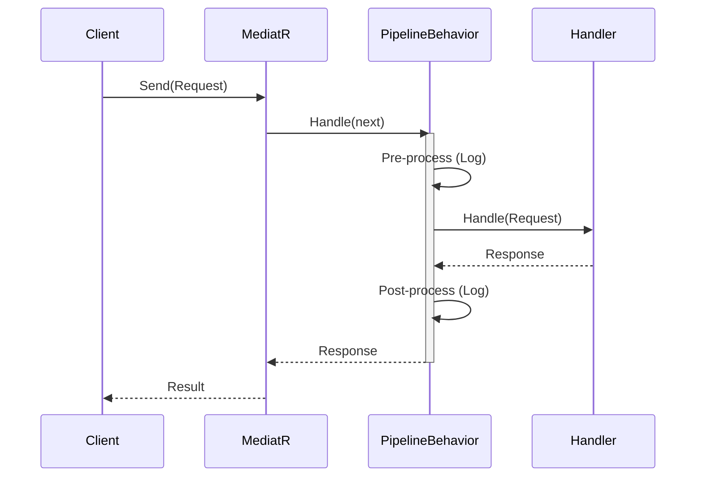

# 第83章：Mediator ②：デファクト（MediatR）を使う🤝✨

## ねらい 🎯





* **Mediator（仲介役）** を、.NET界隈の定番ライブラリ **MediatR** で体験するよ😊
* 「呼び出し側が何を知らなくてよくなるの？」を、**DI + ハンドラ + パイプライン**で“目で見て”理解する✨
* ついでに、**「Request（1個のハンドラ）」と「Notification（複数ハンドラ）」の違い**もスッキリさせる🧠🌟

---

## 到達目標 ✅

* `AddMediatR` でハンドラを登録して、`IMediator.Send(...)` で呼び出せる 🤝
* **呼び出し側がハンドラの具象クラスを一切知らない**状態を作れる 🙈✨
* `IPipelineBehavior` を1つ入れて、**横断関心（ログなど）を“外側”に逃がせる** 🌈
* 「MediatRの“便利さ”と“やりすぎ危険”」の境界を言葉にできる ⚖️

---

## 手順 🧩🛠️

### 1) MediatRの“いま”を知る（2026-02-06時点）🗞️✨

* MediatRは **v14.0.0** が公開されていて、.NET 10対応のリリースが出てるよ 📦🌟 ([NuGet][1])
* また、最近の流れとして **商用（Commercial）まわりの扱い**があるので、導入時に「ライセンスキー設定が必要になるケース」を必ず確認してね🔑⚠️（NuGetページに `SetLicenseKey(...)` の例が載ってるよ） ([NuGet][2])
* 参考：.NET自体は **.NET 10 がLTS**、2026-02-06時点で **10.0.2（2026-01-13）** が最新パッチとして案内されてるよ🧡 ([Microsoft][3])

### 2) NuGetで MediatR を追加する 📦✨

Visual Studioでプロジェクトを右クリック → **NuGet パッケージの管理** → **MediatR** を追加！

PowerShellでやるならこんな感じ（※プロジェクトのフォルダで）👇

```powershell
dotnet add package MediatR
```

> ちなみに昔は `MediatR.Extensions.Microsoft.DependencyInjection` が別リポジトリだったけど、今は移動済み（古いほうはアーカイブ）だよ〜🗂️ ([GitHub][4])

### 3) “最小のRequest/Handler”を作る（まずは Send だけ）🚀

ここでは「注文確定っぽい操作」を **Request（＝1個のハンドラ）** でやるよ💡
ポイントは、**呼び出し側が `PlaceOrderHandler` を一切知らない**こと😊

```csharp
using MediatR;

public sealed record PlaceOrderCommand(Guid OrderId, decimal Total)
    : IRequest<PlaceOrderResult>;

public sealed record PlaceOrderResult(bool Success, string Message);
```

ハンドラ（処理本体）はこれ👇

```csharp
using MediatR;
using Microsoft.Extensions.Logging;

public sealed class PlaceOrderHandler
    : IRequestHandler<PlaceOrderCommand, PlaceOrderResult>
{
    private readonly ILogger<PlaceOrderHandler> _logger;

    public PlaceOrderHandler(ILogger<PlaceOrderHandler> logger)
        => _logger = logger;

    public Task<PlaceOrderResult> Handle(PlaceOrderCommand request, CancellationToken cancellationToken)
    {
        _logger.LogInformation("OrderId={OrderId}, Total={Total}", request.OrderId, request.Total);

        if (request.Total <= 0)
            return Task.FromResult(new PlaceOrderResult(false, "合計金額が0以下はダメだよ💦"));

        return Task.FromResult(new PlaceOrderResult(true, "注文確定OK〜🎉"));
    }
}
```

### 4) DIに MediatR を登録して起動する（`AddMediatR`）🔌✨

`AddMediatR` はこんな感じで **アセンブリからハンドラ登録**してくれるよ〜便利！🥳
（公式の例として `RegisterServicesFromAssemblyContaining<...>()` が案内されてる） ([NuGet][2])

```csharp
using MediatR;
using Microsoft.Extensions.DependencyInjection;
using Microsoft.Extensions.Hosting;
using Microsoft.Extensions.Logging;

var builder = Host.CreateApplicationBuilder(args);

builder.Services.AddLogging(x => x.AddConsole());

// ★ここがMediatR登録（このProgramがいるアセンブリ内のハンドラをスキャン）
builder.Services.AddMediatR(cfg =>
{
    cfg.RegisterServicesFromAssemblyContaining<Program>();

    // （必要なら）ライセンスキー設定が必要なケースもあるよ⚠️
    // cfg.SetLicenseKey(Environment.GetEnvironmentVariable("MEDIATR_LICENSE_KEY"));
});

using var host = builder.Build();

var mediator = host.Services.GetRequiredService<IMediator>();

var result = await mediator.Send(new PlaceOrderCommand(Guid.NewGuid(), 1200m));
Console.WriteLine($"{result.Success} / {result.Message}");
```

> 💡ここでの“勝ちポイント”
> 呼び出し側（Program）は **Handlerを知らない** → でも処理できる🎉
> 「依存の爆発」を “仲介役（Mediator）” に寄せてスッキリさせる感じだよ🕊️✨

### 5) “Notification（複数ハンドラ）”も軽く触る 📣✨

Requestは基本 **1ハンドラ**。
一方で Notificationは **複数ハンドラOK**（「注文が確定した！」をいろんな人が購読するイメージ）💌✨

```csharp
using MediatR;

public sealed record OrderPlaced(Guid OrderId, decimal Total) : INotification;
```

```csharp
using MediatR;
using Microsoft.Extensions.Logging;

public sealed class SendEmailOnOrderPlaced : INotificationHandler<OrderPlaced>
{
    private readonly ILogger<SendEmailOnOrderPlaced> _logger;
    public SendEmailOnOrderPlaced(ILogger<SendEmailOnOrderPlaced> logger) => _logger = logger;

    public Task Handle(OrderPlaced notification, CancellationToken cancellationToken)
    {
        _logger.LogInformation("メール通知したよ📧 OrderId={OrderId}", notification.OrderId);
        return Task.CompletedTask;
    }
}

public sealed class WriteAuditLogOnOrderPlaced : INotificationHandler<OrderPlaced>
{
    private readonly ILogger<WriteAuditLogOnOrderPlaced> _logger;
    public WriteAuditLogOnOrderPlaced(ILogger<WriteAuditLogOnOrderPlaced> logger) => _logger = logger;

    public Task Handle(OrderPlaced notification, CancellationToken cancellationToken)
    {
        _logger.LogInformation("監査ログを書いたよ📝 OrderId={OrderId}", notification.OrderId);
        return Task.CompletedTask;
    }
}
```

呼び出し側はこう👇

```csharp
await mediator.Publish(new OrderPlaced(Guid.NewGuid(), 1200m));
```

> ここまでできると、第84章の「複数ハンドラへ」の気持ちよさが見えてくるよ〜😆✨

### 6) “横断関心”は `IPipelineBehavior` に逃がす（ログ/計測/検証など）🌈🧼

MediatRの強みの1つがこれ！
`IPipelineBehavior<TRequest, TResponse>` は **Request（Send）に対して**前後処理を挟める仕組みだよ（※Notificationじゃなくて Request 側だよ） ([github-wiki-see.page][5])

まずはビヘイビアを1個作る👇

```csharp
using MediatR;
using Microsoft.Extensions.Logging;

public sealed class LoggingBehavior<TRequest, TResponse>
    : IPipelineBehavior<TRequest, TResponse>
    where TRequest : notnull
{
    private readonly ILogger<LoggingBehavior<TRequest, TResponse>> _logger;

    public LoggingBehavior(ILogger<LoggingBehavior<TRequest, TResponse>> logger)
        => _logger = logger;

    public async Task<TResponse> Handle(
        TRequest request,
        RequestHandlerDelegate<TResponse> next,
        CancellationToken cancellationToken)
    {
        _logger.LogInformation("➡️ Request: {RequestType}", typeof(TRequest).Name);

        var response = await next();

        _logger.LogInformation("✅ Response: {ResponseType}", typeof(TResponse).Name);
        return response;
    }
}
```

登録（`AddOpenBehavior`）👇

```csharp
builder.Services.AddMediatR(cfg =>
{
    cfg.RegisterServicesFromAssemblyContaining<Program>();
    cfg.AddOpenBehavior(typeof(LoggingBehavior<,>));
});
```

> ✅ ビヘイビアの実行順は「登録順と逆（最後に登録したものが外側）」って覚えると事故りにくいよ🧠✨ ([github-wiki-see.page][5])

### 7) Visual Studioで“ここだけ読めばいい”ポイントを押さえる 🔍👀

迷子にならない読書ポイントはここ👇

* `IMediator`：**Send / Publish** が見える（できることの全体像）
* `IRequestHandler<,>`：Request → Response の契約
* `INotificationHandler<>`：イベント購読（複数OK）
* `IPipelineBehavior<,>`：横断関心を挟む“外側の輪”

「全部読まない」！ここだけでOKだよ🙆‍♀️✨

---

## 落とし穴 ⚠️😵

1. **Mediatorを“何でも屋の神様”にしちゃう** 🙏💥

* 「全部Sendで投げとけばいいじゃん！」ってなると、逆に追跡が難しくなるよ〜🥲
* 目安：**アプリ層の入口（UseCase）**に寄せるのが安全✨

2. **ハンドラが太る（ビジネスロジック全部詰め込み）** 🍔💦

* ハンドラは“交通整理”くらいにして、実処理は専用クラスへ分けると綺麗✨

3. **Request と Notification の使い分けがグチャる** 🍝😵

* Request：基本1ハンドラ（結果が欲しい）
* Notification：複数ハンドラ（お知らせしたい）
  ここを混ぜると設計の会話が崩れるよ⚠️

4. **パイプラインに詰めすぎる** 🎒💦

* ログ/計測/簡単な検証くらいは最高だけど、
  “業務の本体”をパイプラインに入れだすと読めなくなるよ〜😇

5. **ライセンス/導入条件を見落とす** 🔑⚠️

* `SetLicenseKey(...)` が必要な構成もあるので、導入時にNuGetページの案内を必ずチェックしてね！ ([NuGet][2])

---

## 演習 🏃‍♀️💨

### 演習A：Request（Send）を1本通す🎯

* `PlaceOrderCommand` を作る
* `PlaceOrderHandler` で「合計が0以下なら失敗」を返す
* `mediator.Send(...)` で結果表示 🎉

### 演習B：Notification（Publish）で“2人に通知”📣📣

* `OrderPlaced : INotification` を作る
* `INotificationHandler<OrderPlaced>` を **2つ**作る（例：メール担当/監査担当）
* `Publish(...)` で両方動くのをログで確認✨

### 演習C：パイプラインでログを挟む🌈

* `LoggingBehavior<,>` を追加
* Sendの前後にログが出るのを確認（「外側の輪」感を味わう）🔁✨

---

## チェック ✅🧡

* [ ] 呼び出し側が **Handler名を一切書かずに**処理できてる？🙈
* [ ] Request（Send）と Notification（Publish）の違いを説明できる？🗣️
* [ ] `IPipelineBehavior` が「横断関心の置き場所」って理解できた？🌈
* [ ] 便利さに酔って「何でもMediator」になりそうな兆候、言語化できる？⚠️
* [ ] 導入時に **バージョン/ライセンス設定**の確認ポイントを押さえた？🔑 ([NuGet][1])

[1]: https://www.nuget.org/packages/mediatr/?utm_source=chatgpt.com "MediatR 14.0.0"
[2]: https://www.nuget.org/packages/mediatr/ "
        NuGet Gallery
        \| MediatR 14.0.0
    "
[3]: https://dotnet.microsoft.com/en-us/platform/support/policy/dotnet-core ".NET and .NET Core official support policy | .NET"
[4]: https://github.com/jbogard/MediatR.Extensions.Microsoft.DependencyInjection "GitHub - jbogard/MediatR.Extensions.Microsoft.DependencyInjection: MediatR extensions for Microsoft.Extensions.DependencyInjection"
[5]: https://github-wiki-see.page/m/jbogard/MediatR/wiki/Behaviors " Behaviors - LuckyPennySoftware/MediatR GitHub Wiki "
