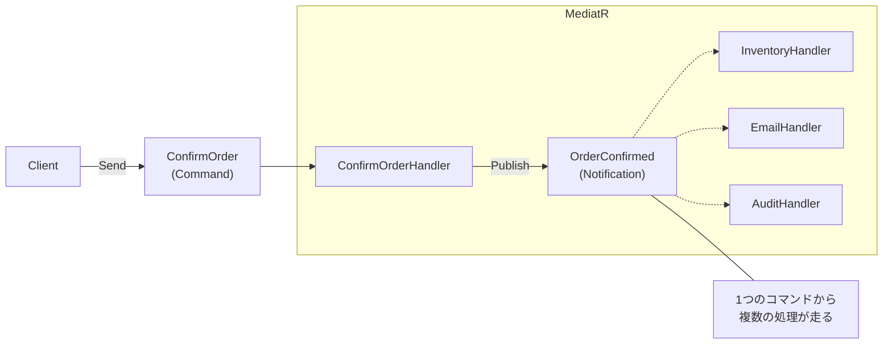

# 第84章：Mediator ③：演習（注文確定コマンド→複数ハンドラへ）📨🎯

## ねらい 🎯💡





* 「注文確定」という**1つの入口**から、在庫引当・通知・監査ログ…みたいな**複数の後処理**を“疎結合”で追加できるようになる 🧩✨
* 依存が増えても、呼び出し側（UI/Controller/Console）が**太らない**形を体験する 🏋️‍♀️➡️🪶
* MediatRの「1ハンドラのリクエスト」と「複数ハンドラの通知」の違いを、手を動かして理解する ✋🧠 ([GitHub][1])

---

## 到達目標 🏁🌸

* ✅ `IMediator.Send()` で「注文確定」を実行できる
* ✅ その後に `Publish()` で「注文確定イベント」を流して、**複数ハンドラ**が動くようにできる ([GitHub][1])
* ✅ テストで「確定された」「在庫が予約された」「メールが送られた」「監査ログが増えた」を確認できる 🧪✨
* ✅ 「Mediator神クラス化」や「例外で後続が止まる」など、事故ポイントを説明できる ⚠️🧯

---

## 手順 🧭✨

### 1) “Mediatorなし”の辛さを1分で味見する 😵‍💫🔥

まずは「注文確定のたびに、呼び出し側（サービス）がいろいろ抱える」状態をイメージしよう👇

```csharp
public sealed class PlaceOrderService
{
    private readonly IOrderRepository _orders;
    private readonly IInventoryService _inventory;
    private readonly IEmailSender _email;
    private readonly IAuditWriter _audit;

    public PlaceOrderService(
        IOrderRepository orders,
        IInventoryService inventory,
        IEmailSender email,
        IAuditWriter audit)
    {
        _orders = orders;
        _inventory = inventory;
        _email = email;
        _audit = audit;
    }

    public async Task ConfirmAsync(Guid orderId, CancellationToken ct)
    {
        var order = await _orders.FindAsync(orderId, ct)
            ?? throw new InvalidOperationException("注文がないよ😢");

        order.Confirm();
        await _orders.SaveAsync(order, ct);

        await _inventory.ReserveAsync(orderId, ct);
        await _email.SendOrderConfirmedAsync(orderId, ct);
        await _audit.WriteAsync($"Confirmed: {orderId}", ct);
    }
}
```

😇 追加機能が増えるほど、このクラスがどんどん太っていく…！

---

### 2) パッケージ（最新版のやり方）📦✨

MediatR は NuGet で **14.0.0** が公開されていて、`IServiceCollection` への登録も本体側でサポートされています ([NuGet][2])
昔よく見た `MediatR.Extensions.Microsoft.DependencyInjection` は **deprecated（非推奨）** になっていて、「機能は本体に統合されたよ」という扱いです ([NuGet][3])

PowerShell（プロジェクトのフォルダで）👇

```powershell
dotnet add .\ShopApp\ShopApp.csproj package MediatR
dotnet add .\ShopApp\ShopApp.csproj package Microsoft.Extensions.DependencyInjection
dotnet add .\ShopApp\ShopApp.csproj package Microsoft.Extensions.Logging.Console
```

---

### 3) “メッセージ”を2種類に分ける（ここが超重要）🧠✨

MediatR にはざっくり2タイプあります👇（この章のキモ！）

* **Request（IRequest）**：基本は **1つのハンドラ** が処理する（コマンド/クエリ向き）
* **Notification（INotification）**：**複数ハンドラ** に配れる（イベント向き） ([GitHub][1])

今回のゴール「注文確定コマンド → 複数ハンドラ」はこうするよ👇
**Send（コマンド）→（中で）Publish（イベント）→ 複数ハンドラ** 🎯

---

### 4) 実装：最小のECドメイン（小さく！）🛒🍰

`Order` は必要最低限だけ！

```csharp
public enum OrderStatus { New, Confirmed }

public sealed class Order
{
    public Guid Id { get; }
    public decimal TotalAmount { get; }
    public OrderStatus Status { get; private set; } = OrderStatus.New;

    public Order(Guid id, decimal totalAmount)
    {
        Id = id;
        TotalAmount = totalAmount;
    }

    public void Confirm()
    {
        if (Status != OrderStatus.New)
            throw new InvalidOperationException("この注文、もう確定済みだよ⚠️");
        Status = OrderStatus.Confirmed;
    }
}
```

---

### 5) インフラは“薄く”インターフェイスで用意（テストしやすく）🧪✨

```csharp
public interface IOrderRepository
{
    Task<Order?> FindAsync(Guid orderId, CancellationToken ct);
    Task SaveAsync(Order order, CancellationToken ct);
}

public interface IInventoryService
{
    Task ReserveAsync(Guid orderId, CancellationToken ct);
}

public interface IEmailSender
{
    Task SendOrderConfirmedAsync(Guid orderId, CancellationToken ct);
}

public interface IAuditWriter
{
    Task WriteAsync(string message, CancellationToken ct);
}
```

---

### 6) MediatRのメッセージ定義（recordでOK）🧾✨

**(A) コマンド（1ハンドラ）**

```csharp
using MediatR;

public sealed record ConfirmOrderCommand(Guid OrderId) : IRequest<Guid>;
```

**(B) イベント（複数ハンドラ）**

```csharp
using MediatR;

public sealed record OrderConfirmed(Guid OrderId, decimal TotalAmount) : INotification;
```

---

### 7) コマンドハンドラ（確定して、イベントをPublish）📨➡️📣

```csharp
using MediatR;

public sealed class ConfirmOrderHandler : IRequestHandler<ConfirmOrderCommand, Guid>
{
    private readonly IOrderRepository _orders;
    private readonly IMediator _mediator;

    public ConfirmOrderHandler(IOrderRepository orders, IMediator mediator)
    {
        _orders = orders;
        _mediator = mediator;
    }

    public async Task<Guid> Handle(ConfirmOrderCommand request, CancellationToken ct)
    {
        var order = await _orders.FindAsync(request.OrderId, ct)
            ?? throw new InvalidOperationException("注文がないよ😢");

        order.Confirm();
        await _orders.SaveAsync(order, ct);

        await _mediator.Publish(new OrderConfirmed(order.Id, order.TotalAmount), ct);

        return order.Id;
    }
}
```

ポイント👉

* 「在庫」「メール」「監査」はここに書かない！✋💦
* ここは **“確定する”だけ** に寄せると、後で強い 💪✨

---

### 8) 通知ハンドラ（ここが“複数”になる場所）🔔✨

通知は複数ハンドラが持てるよ、がMediatRの基本仕様だよ ([GitHub][1])

**在庫引当ハンドラ** 📦

```csharp
using MediatR;

public sealed class ReserveInventoryOnOrderConfirmed : INotificationHandler<OrderConfirmed>
{
    private readonly IInventoryService _inventory;

    public ReserveInventoryOnOrderConfirmed(IInventoryService inventory)
    {
        _inventory = inventory;
    }

    public Task Handle(OrderConfirmed notification, CancellationToken ct)
        => _inventory.ReserveAsync(notification.OrderId, ct);
}
```

**メール送信ハンドラ** ✉️

```csharp
using MediatR;

public sealed class SendEmailOnOrderConfirmed : INotificationHandler<OrderConfirmed>
{
    private readonly IEmailSender _email;

    public SendEmailOnOrderConfirmed(IEmailSender email)
    {
        _email = email;
    }

    public Task Handle(OrderConfirmed notification, CancellationToken ct)
        => _email.SendOrderConfirmedAsync(notification.OrderId, ct);
}
```

**監査ログハンドラ** 📝

```csharp
using MediatR;

public sealed class WriteAuditOnOrderConfirmed : INotificationHandler<OrderConfirmed>
{
    private readonly IAuditWriter _audit;

    public WriteAuditOnOrderConfirmed(IAuditWriter audit)
    {
        _audit = audit;
    }

    public Task Handle(OrderConfirmed notification, CancellationToken ct)
        => _audit.WriteAsync($"OrderConfirmed: {notification.OrderId} amount={notification.TotalAmount}", ct);
}
```

---

### 9) DI登録（AddMediatRで自動登録）🧩🔌

MediatR は `AddMediatR(cfg => cfg.RegisterServicesFromAssemblyContaining<...>())` で、ハンドラ類をまとめて拾ってくれます ([NuGet][2])

```csharp
using MediatR;
using Microsoft.Extensions.DependencyInjection;
using Microsoft.Extensions.Logging;

namespace ShopApp;

public static class Program
{
    public static async Task Main()
    {
        var services = new ServiceCollection();

        services.AddLogging(b => b.AddConsole());

        // ここがMediatorの入口🕊️✨
        services.AddMediatR(cfg => cfg.RegisterServicesFromAssemblyContaining<Program>());

        // 依存（今回は最小のインメモリ実装を登録）
        services.AddSingleton<IOrderRepository, InMemoryOrderRepository>();
        services.AddSingleton<IInventoryService, InMemoryInventoryService>();
        services.AddSingleton<IEmailSender, InMemoryEmailSender>();
        services.AddSingleton<IAuditWriter, InMemoryAuditWriter>();

        var provider = services.BuildServiceProvider();

        // デモ用に注文を1件作る🍰
        var orders = provider.GetRequiredService<IOrderRepository>();
        var orderId = Guid.NewGuid();
        await orders.SaveAsync(new Order(orderId, 1200m), CancellationToken.None);

        // 呼び出し側は「Send」だけ！スッキリ〜✨
        var mediator = provider.GetRequiredService<IMediator>();
        await mediator.Send(new ConfirmOrderCommand(orderId));

        Console.WriteLine("注文確定おわり🎉（在庫・メール・監査は通知で走ってるよ）");
    }
}
```

---

## よくある落とし穴 ⚠️😵‍💫

1. **「Sendで複数ハンドラ動かしたい！」と迷う**
   `IRequest` は原則 **1ハンドラ**、複数に配りたいなら `INotification` が本命だよ 📣✨ ([GitHub][1])

2. **通知ハンドラの“順序”に依存しちゃう** 🔁⚠️
   通知は「誰が先でもいい」前提で設計するのが安全！
   （必要なら設計を見直して、順序が必要なものは“まとめて”1つの処理に寄せるのもアリ🙆‍♀️）

3. **通知ハンドラで例外が出ると、後続が止まることがある** 🧯💥
   MediatRは通知の配り方（publisher）を差し替えられて、逐次/並列などの話が出てきます（= “順序や例外の扱いは設計事項”） ([GitHub][1])
   最初は「例外が出たら失敗として返す」でOK。大きくなったら“リトライ/Outbox/冪等性”を検討しよ🌱

4. **Mediatorが“なんでも知ってる神クラス”になっちゃう** 👑😇
   「すべての判断をMediatorでやる」じゃなくて、

* コマンドハンドラ：ユースケースの最小
* 通知ハンドラ：後処理を分散
  この形を守るとキレイ✨

---

## 演習 🧪🌷（30〜60分）

### 演習1：インメモリ実装を作って“動作確認”🧸✨

下のような最小インメモリを作って、まずは動かす！

```csharp
using System.Collections.Concurrent;

public sealed class InMemoryOrderRepository : IOrderRepository
{
    private readonly ConcurrentDictionary<Guid, Order> _store = new();

    public Task<Order?> FindAsync(Guid orderId, CancellationToken ct)
        => Task.FromResult(_store.TryGetValue(orderId, out var o) ? o : null);

    public Task SaveAsync(Order order, CancellationToken ct)
    {
        _store[order.Id] = order;
        return Task.CompletedTask;
    }
}

public sealed class InMemoryInventoryService : IInventoryService
{
    public ConcurrentBag<Guid> Reserved { get; } = new();

    public Task ReserveAsync(Guid orderId, CancellationToken ct)
    {
        Reserved.Add(orderId);
        return Task.CompletedTask;
    }
}

public sealed class InMemoryEmailSender : IEmailSender
{
    public ConcurrentBag<Guid> Sent { get; } = new();

    public Task SendOrderConfirmedAsync(Guid orderId, CancellationToken ct)
    {
        Sent.Add(orderId);
        return Task.CompletedTask;
    }
}

public sealed class InMemoryAuditWriter : IAuditWriter
{
    public ConcurrentBag<string> Entries { get; } = new();

    public Task WriteAsync(string message, CancellationToken ct)
    {
        Entries.Add(message);
        return Task.CompletedTask;
    }
}
```

---

### 演習2：MSTestで“複数ハンドラが走った”を確認 ✅🧪

テストでやることはこれ👇

* `Send(ConfirmOrderCommand)` する
* それぞれのインメモリに「痕跡」が残ってるか確認する 🎯

```csharp
using MediatR;
using Microsoft.Extensions.DependencyInjection;
using Microsoft.VisualStudio.TestTools.UnitTesting;

[TestClass]
public sealed class MediatorChapter84Tests
{
    [TestMethod]
    public async Task ConfirmOrder_PublishesNotification_And_AllHandlersRun()
    {
        var services = new ServiceCollection();

        services.AddMediatR(cfg => cfg.RegisterServicesFromAssemblyContaining<ConfirmOrderHandler>());

        var orders = new InMemoryOrderRepository();
        var inventory = new InMemoryInventoryService();
        var email = new InMemoryEmailSender();
        var audit = new InMemoryAuditWriter();

        services.AddSingleton<IOrderRepository>(orders);
        services.AddSingleton<IInventoryService>(inventory);
        services.AddSingleton<IEmailSender>(email);
        services.AddSingleton<IAuditWriter>(audit);

        var provider = services.BuildServiceProvider();
        var mediator = provider.GetRequiredService<IMediator>();

        var orderId = Guid.NewGuid();
        await orders.SaveAsync(new Order(orderId, 3000m), CancellationToken.None);

        await mediator.Send(new ConfirmOrderCommand(orderId));

        // 1) 在庫
        CollectionAssert.Contains(inventory.Reserved.ToArray(), orderId);

        // 2) メール
        CollectionAssert.Contains(email.Sent.ToArray(), orderId);

        // 3) 監査ログ
        Assert.IsTrue(audit.Entries.Any(e => e.Contains(orderId.ToString())));
    }
}
```

---

### 演習3：AI補助で“雛形だけ”作って、人間が仕上げる 🤖✍️✨

AIに投げるときは「余計な抽象化しないでね」を最初に釘刺ししてね🔨

**おすすめプロンプト例**👇

* 「C# / MediatR を使って ConfirmOrderCommand と Handler、OrderConfirmed Notification と3つの NotificationHandler を作って。
* 余計な基底クラス/汎用フレームワークは禁止。
* record を使ってメッセージは不変。
* ハンドラは薄く、依存は最小。
* 例外は握りつぶさない。」

レビューはここだけ見ればOK👀✅

* “確定”と“後処理”が分離できてる？
* コマンドハンドラが太ってない？
* 通知ハンドラ同士が依存してない？（順序前提になってない？）

---

## 自己チェック ✅💖

* [ ] 呼び出し側が `IMediator.Send()` だけになってスッキリした？🧼✨
* [ ] 「注文確定の後処理」を **通知ハンドラとして追加**できた？➕🔔
* [ ] `IRequest`（1ハンドラ）と `INotification`（複数ハンドラ）を言葉で説明できる？🗣️💡 ([GitHub][1])
* [ ] 通知ハンドラが“順序依存”になってない？（なってたら設計を戻す！）🔁⚠️
* [ ] テストで「在庫・メール・監査」が全部動いた証拠を取れた？🧪🎉

[1]: https://github.com/LuckyPennySoftware/MediatR/wiki "Home · LuckyPennySoftware/MediatR Wiki · GitHub"
[2]: https://www.nuget.org/packages/MediatR/14.0.0?utm_source=chatgpt.com "MediatR 14.0.0"
[3]: https://www.nuget.org/packages/mediatr.extensions.microsoft.dependencyinjection/?utm_source=chatgpt.com "MediatR.Extensions.Microsoft.DependencyInjection 11.1.0"
