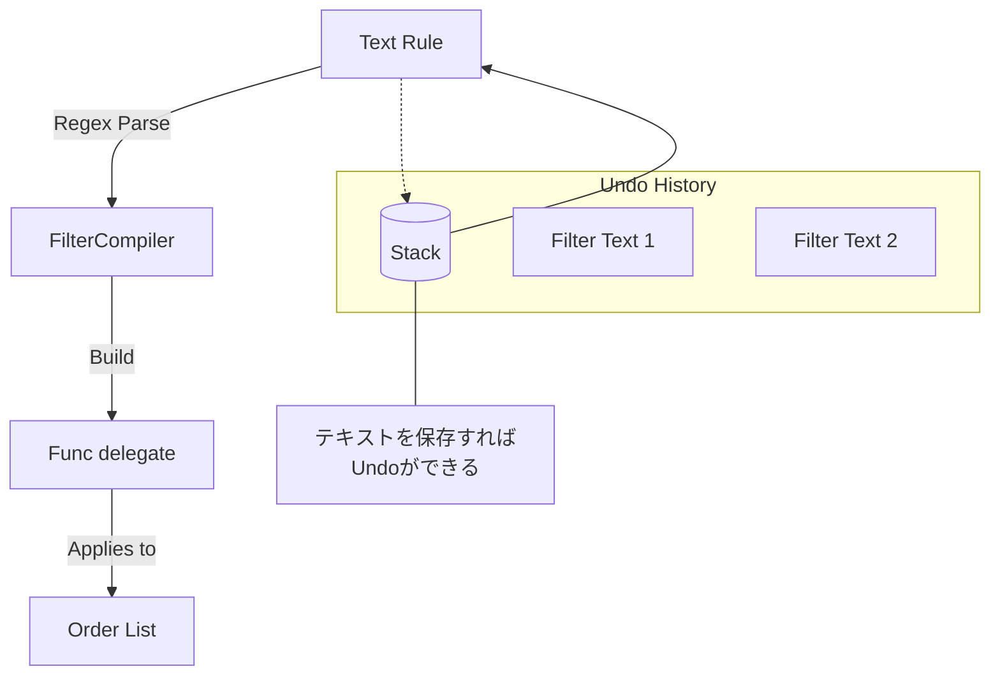

# 第85章：（発展）Interpreter / Memento：標準寄せで“触るだけ”🧠🌱

## ねらい 🎯





* Interpreter（インタプリタ）と Memento（メメント）を、「使いどころだけ分かる」レベルでサクッと体験するよ✨
* “自作言語を作る”みたいな沼に落ちずに、.NET標準の **Regex（正規表現）** や **式ツリー** を入口にして「それっぽさ」を掴むよ🧩
* Undo（取り消し）みたいな “戻れる設計” を、Mementoで安全にできるようになるよ🔙💡

---

## 到達目標 ✅

* Interpreter / Memento を、それぞれ **1分で説明**できる（何が嬉しい？いつ要らない？）😊
* “小さすぎるルール文” を **Regexで解釈（Interpreterっぽく）** して、注文をフィルタできる🧾🔍
* フィルタ条件を変更しても、**Undoで前の状態へ戻せる（Memento）** 🔁
* MSTestで「動いてる証拠（テスト）」を作れる🧪✨

---

## 手順 🧭✨

### 1) まず結論：Interpreterは “作る” より “使う” が正解寄り 😇

Interpreterは本来「文法（ルール）をオブジェクトで表現して評価する」パターンなんだけど、実務で一から作ると重くなりがち💦
なので今回は、.NETの **Regex**（テキストをルールとして解釈する道具）を使って “触るだけ” にするよ🙆‍♀️
Regexの性能面は、できるなら **GeneratedRegex（ソース生成）** を使うのが推奨だよ🚀（起動が速く、トリミングにも有利）([Microsoft Learn][1])

> ちなみに今どきは .NET 10（LTS）＋ C# 14 が最新ラインだよ📌([Microsoft][2])

---

### 2) “小さすぎるルール文” を決める（沼回避）🧯

今回は文法を **これだけ** に制限するよ👇（小さく勝つ！🏆）

* ルールは **AND だけ**（OR やカッコは無し）
* 条件は2種類だけ

  * total（合計金額）: `> >= < <= =`
  * status（状態）: `=`
* 例：

  * `total >= 5000 and status = Paid`
  * `status = New`
  * `total < 1000`

これで “解釈して判定する” 感覚が十分に掴めるよ😊✨

---

### 3) Interpreterっぽい部分：文字列ルール → 判定関数（Func<Order,bool>）へ 🔄

やることはこう👇

1. 文字列を `and` で分割する
2. それぞれをRegexで解析（field / op / value を抜く）
3. 条件ごとに predicate（判定関数）を作る
4. 全部を `&&` 的に合成する（全部trueなら採用）

---

### 4) Mementoっぽい部分：Undoできるように “前の状態” を保存する 📦🔙

Undoは簡単で、**「変更前の状態」を積む**だけだよ✨

* 現在のフィルタ文字列を `Stack` に保存（＝Memento）
* 新しいフィルタに更新
* Undoしたら、Stackから取り出して戻す

ポイントはこれ👇

* 「過去の状態」があとで変わらないように、**不変（immutable）** に保存するのが安全🛡️
  → record / record struct が相性いいよ💕

---

### 5) 実装（最小）を書いて動かす 🧑‍💻✨

下のコードをそのまま貼ってOK！（クラスは1ファイルでも分けてもOK）👍
※ GeneratedRegex を使ってるよ（RegexOptions.Compiled より推奨）([Microsoft Learn][1])

```csharp
using System;
using System.Collections.Generic;
using System.Globalization;
using System.Text.RegularExpressions;

public enum OrderStatus
{
    New,
    Paid,
    Shipped
}

public sealed record Order(decimal Total, OrderStatus Status);

// Interpreterっぽい役：文字列ルールを「評価できる形」にする
public static partial class OrderFilterCompiler
{
    // "and" で分割（大文字小文字無視）
    [GeneratedRegex(@"\s+and\s+", RegexOptions.IgnoreCase | RegexOptions.CultureInvariant)]
    private static partial Regex AndSplitter();

    // 例: total >= 5000, status = Paid
    [GeneratedRegex(
        @"^\s*(?<field>total|status)\s*(?<op>>=|<=|=|>|<)\s*(?<value>[A-Za-z0-9_\.]+)\s*$",
        RegexOptions.IgnoreCase | RegexOptions.CultureInvariant)]
    private static partial Regex TermPattern();

    public static Func<Order, bool> Compile(string? filterText)
    {
        if (string.IsNullOrWhiteSpace(filterText))
            return static _ => true; // 何もなければ全件OK✨

        var terms = AndSplitter().Split(filterText.Trim());
        var predicates = new List<Func<Order, bool>>(terms.Length);

        foreach (var raw in terms)
        {
            var term = raw.Trim();
            var m = TermPattern().Match(term);
            if (!m.Success)
                throw new FormatException($"フィルタの書き方が分からないよ🥺: '{term}'");

            var field = m.Groups["field"].Value.ToLowerInvariant();
            var op = m.Groups["op"].Value;
            var value = m.Groups["value"].Value;

            predicates.Add(BuildPredicate(field, op, value));
        }

        return order =>
        {
            foreach (var p in predicates)
            {
                if (!p(order)) return false;
            }
            return true;
        };
    }

    private static Func<Order, bool> BuildPredicate(string field, string op, string value)
    {
        return field switch
        {
            "total" => BuildTotalPredicate(op, value),
            "status" => BuildStatusPredicate(op, value),
            _ => throw new FormatException($"未対応フィールドだよ🥺: {field}")
        };
    }

    private static Func<Order, bool> BuildTotalPredicate(string op, string value)
    {
        if (!decimal.TryParse(value, NumberStyles.Number, CultureInfo.InvariantCulture, out var n))
            throw new FormatException($"total の数値が読めないよ🥺: {value}");

        return op switch
        {
            ">"  => o => o.Total >  n,
            ">=" => o => o.Total >= n,
            "<"  => o => o.Total <  n,
            "<=" => o => o.Total <= n,
            "="  => o => o.Total == n,
            _ => throw new FormatException($"total の演算子が未対応だよ🥺: {op}")
        };
    }

    private static Func<Order, bool> BuildStatusPredicate(string op, string value)
    {
        if (op != "=")
            throw new FormatException($"status は '=' だけ対応だよ🥺: {op}");

        if (!Enum.TryParse<OrderStatus>(value, ignoreCase: true, out var st))
            throw new FormatException($"status が未対応だよ🥺: {value}");

        return o => o.Status == st;
    }
}

// Mementoっぽい役：状態を保存してUndoできるようにする
public sealed class FilterEditor
{
    private readonly Stack<FilterMemento> _undo = new();

    public string CurrentText { get; private set; } = "";
    public Func<Order, bool> CurrentPredicate { get; private set; } = static _ => true;

    public void SetFilter(string newText)
    {
        // 変更前を保存（これが Memento 📦）
        _undo.Push(new FilterMemento(CurrentText));

        CurrentText = newText ?? "";
        CurrentPredicate = OrderFilterCompiler.Compile(CurrentText);
    }

    public bool Undo()
    {
        if (!_undo.TryPop(out var m))
            return false;

        CurrentText = m.Text;
        CurrentPredicate = OrderFilterCompiler.Compile(CurrentText);
        return true;
    }

    // 必要ならメモリ対策で「最大N件」などの制限を入れてね🧠💦
}

public readonly record struct FilterMemento(string Text);
```

---

### 6) テストで “動く証拠” を作る 🧪🌸

```csharp
using Microsoft.VisualStudio.TestTools.UnitTesting;

[TestClass]
public class InterpreterMementoChapter85Tests
{
    [TestMethod]
    public void Compile_Filter_Works()
    {
        var filter = OrderFilterCompiler.Compile("total >= 5000 and status = Paid");

        Assert.IsTrue(filter(new Order(6000, OrderStatus.Paid)));
        Assert.IsFalse(filter(new Order(4000, OrderStatus.Paid)));
        Assert.IsFalse(filter(new Order(6000, OrderStatus.New)));
    }

    [TestMethod]
    public void Memento_Undo_Works()
    {
        var editor = new FilterEditor();

        editor.SetFilter("status = New");
        Assert.IsTrue(editor.CurrentPredicate(new Order(1, OrderStatus.New)));
        Assert.IsFalse(editor.CurrentPredicate(new Order(1, OrderStatus.Paid)));

        editor.SetFilter("status = Paid");
        Assert.IsTrue(editor.CurrentPredicate(new Order(1, OrderStatus.Paid)));
        Assert.IsFalse(editor.CurrentPredicate(new Order(1, OrderStatus.New)));

        var undone = editor.Undo();
        Assert.IsTrue(undone);

        Assert.IsTrue(editor.CurrentPredicate(new Order(1, OrderStatus.New)));
        Assert.IsFalse(editor.CurrentPredicate(new Order(1, OrderStatus.Paid)));
    }
}
```

---

### 7) もう一歩だけ（知識メモ）🧠✨：式ツリーは “Interpreterの上位互換っぽさ” がある

式ツリー（System.Linq.Expressions）は「コードを木構造として表す」仕組みだよ🌳
これを使うと、ルールを delegate だけじゃなく **構造（AST）として保持**できるから、最適化・変換・可視化がしやすいの😊
（まさに Interpreter の「文法を構造で持つ」感覚に近い！）([Microsoft Learn][3])

ただし今回は “触るだけ” なので、実装はここまででOK🙆‍♀️✨

---

## よくある落とし穴 ⚠️😵

* **OR とカッコを入れた瞬間、難易度が跳ね上がる**（優先順位・パーサ地獄）🌀
* Regexで全部解決しようとして **読めない正規表現モンスター** になる👾
* Mementoで「参照（参照型）をそのまま保存」して、あとで変更されて **過去が壊れる**💥
* Undoスタックを無限にして **メモリが増え続ける**🧠💦（上限を決めよ！）
* エラーメッセージが雑で、ユーザー入力（ルール文）のデバッグが地獄😇

---

## 演習 🏋️‍♀️✨（10〜30分）

1. **機能追加（軽め）**

* ルールに `total = 5000` を増やす（もう入ってるならOK）✅
* `status = Shipped` も通ることをテスト追加🧪

2. **Undoの上限をつける**

* 「最新20件まで」みたいに制限してみよ📦🔟
  ヒント：Pushする前に数を見て、古いのを捨てる仕組みを入れる（工夫してね😊）

3. **エラー文を優しくする**

* 例：`status = Unknown` のときに
  「New / Paid / Shipped のどれかだよ〜」みたいに案内する💬💕

---

## 自己チェック ✅🧡

* Interpreter：**「文字列ルールを解釈して評価する」** が説明できる？🧠
* Memento：**「変更前の状態を不変で保存してUndoする」** が説明できる？📦🔙
* “自作言語を作らずに” 小さく始める判断ができた？🧯✨
* テストがあって、変更しても安心できる？🧪🌸

---

[1]: https://learn.microsoft.com/ja-jp/dotnet/standard/base-types/regular-expression-source-generators?utm_source=chatgpt.com ".NET 正規表現ソース ジェネレーター"
[2]: https://dotnet.microsoft.com/en-us/platform/support/policy/dotnet-core?utm_source=chatgpt.com "NET and .NET Core official support policy"
[3]: https://learn.microsoft.com/en-us/dotnet/csharp/advanced-topics/expression-trees/?utm_source=chatgpt.com "Expression Trees - C# | Microsoft Learn"
